# Overthrone Architecture

The framework is split across 10 crates in a Rust workspace. Each crate owns a specific
phase of the attack lifecycle. They communicate through function calls (not IPC or
network — everything runs in-process). The CLI crate is the entry point; everything
else is a library it calls into.

There's no "core dispatcher service" or centralized event bus. The flow is:

```
CLI → pilot → [reaper, hunter, forge, relay] → core (protocols)
                                            → scribe (output)
```

The `overthrone-core` crate is the dependency of everything. Every other crate imports
it for protocol types, crypto primitives, and data structures. The CLI imports every
crate. The viewer is standalone (serves a web GUI, imports core for graph types).

---

## 1. Top-Level Crate Map

This is the big picture — every crate, its job, and who it talks to.

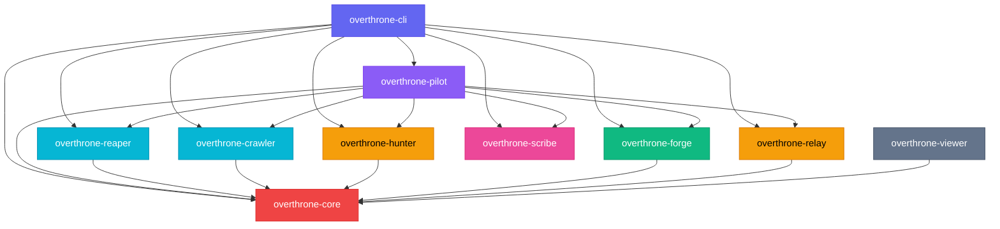

Core is the dependency everyone shares. Pilot coordinates multi-step operations
(session management, wizard-guided workflows) but every crate can also be called
directly from the CLI. Viewer is a standalone web server that only imports core
for graph data types.

---

## 2. overthrone-core — The Absolute Unit

Core is the protocol engine. It has no dependencies on other Overthrone crates. Every
other crate depends on it. It owns the network protocols, crypto, attack graph, post-
exploitation modules, C2 integrations, and ADCS exploit logic.

### 2a. Module Map

Core has ~130 source files organized into subdirectories by domain:

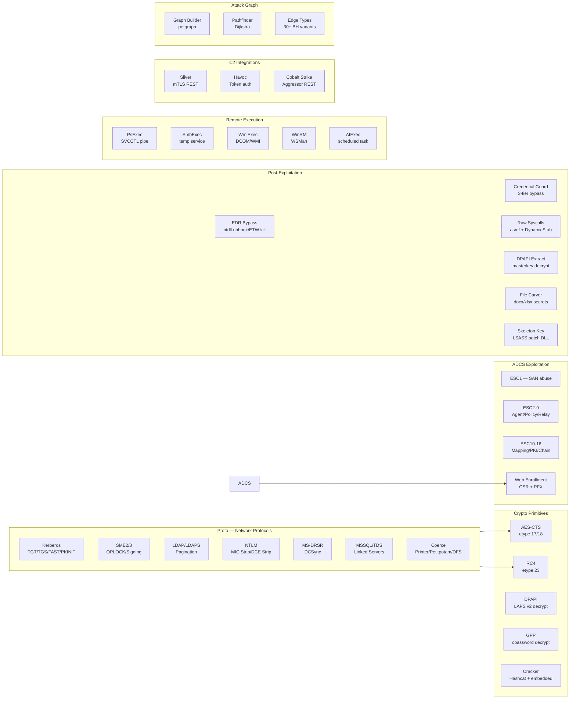

### 2b. How Protocols Flow

Every protocol follows the same pattern. Here's the general flow using Kerberos as an
example — SMB, LDAP, and MSSQL work the same way under the hood:

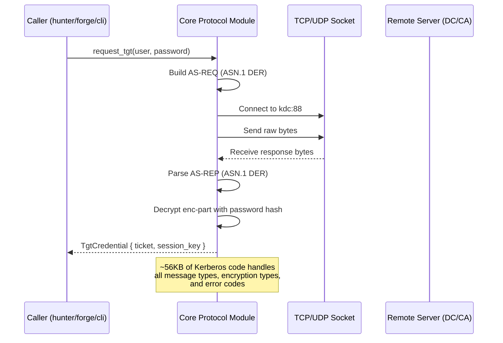

Core owns all the ASN.1 parsing, encryption, and wire format handling. Callers never
touch raw bytes. Every protocol library in core is pure Rust — no shelling out, no
P/Invoke, no C dependencies.

### 2c. Attack Graph Flow

The graph is built from LDAP enumeration data. It uses `petgraph` under the hood with
a custom edge-weight model:

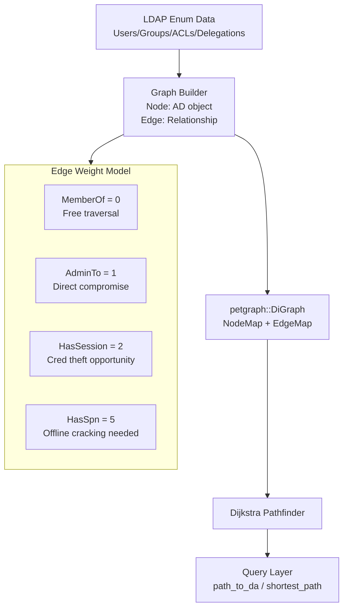

### 2d. Post-Exploitation: EDR & Credential Guard

The post-exploitation layer has three tiers of credential access, tried in order:

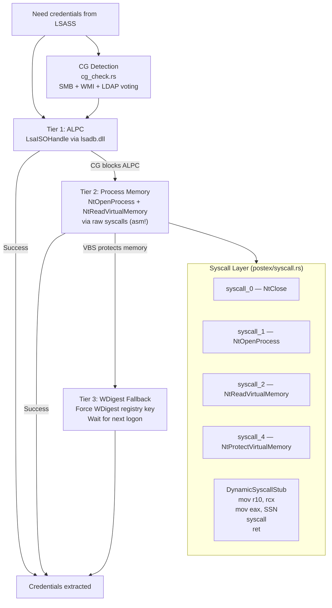

### 2e. ADCS Exploitation (ESC1-16)

The ADCS module covers the entire ESC spectrum. Exploits are broken into individual
files but share a common enrollment pipeline:

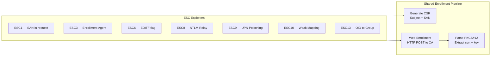

ESC4, ESC5, and ESC7 generate LDAP/registry modification commands for the operator
(they require additional privileges to modify template ACLs or CA permissions). ESC8
is special — it doesn't enroll directly, it coordinates with the relay crate to
capture NTLM auth and relay it to the CA web enrollment page.

---

## 3. overthrone-reaper — The Collector

Reaper is the enumeration crate. It talks LDAP to the domain controller, asks nicely
for everything, and returns structured data. No modification — read-only.

### 3a. Enumeration Flow

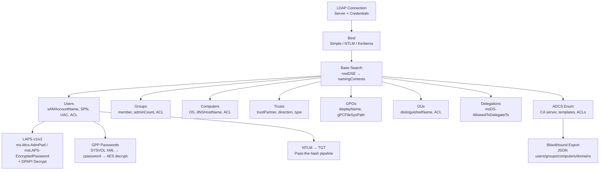

### 3b. Snaffler Flow

The Snaffler module crawls SMB shares looking for interesting files:

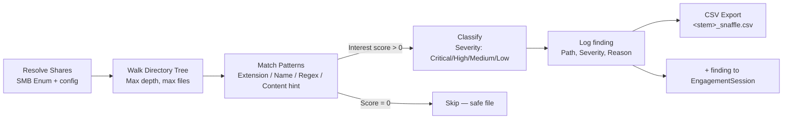

Under the hood it uses `smbclient` (Linux) or the built-in SMB2 client (cross-platform)
depending on availability. The pattern matching is unit-tested (`file_matches_pattern`
— 23 tests now) but the end-to-end SMB share crawling is not (requires a real file
server).

---

## 4. overthrone-hunter — The Overachiever

Hunter contains the attack primitives. It never modifies AD objects (that's forge's
job) but it requests tickets, cracks hashes, and identifies misconfigurations.

### 4a. Kerberoasting Pipeline

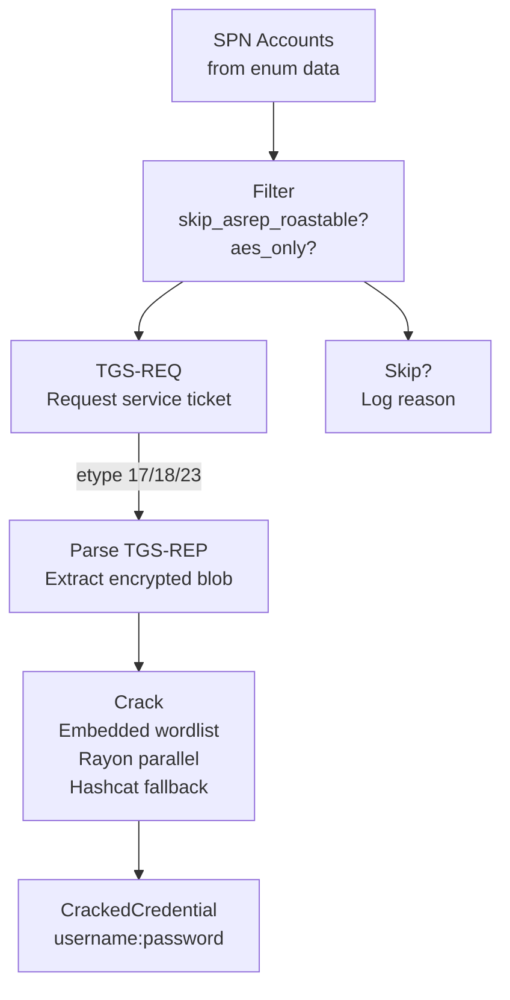

Kerberoasting requests come in three flavors: RC4 (etype 23, fast to crack),
AES128 (etype 17), and AES256 (etype 18, slow to crack). The `downgrade_to_rc4`
flag changes what encryption type hunter requests — the KDC will downgrade if the
account supports it.

### 4b. Delegation Chain Automation

Delegation attacks are multi-step. Hunter automates the whole chain:

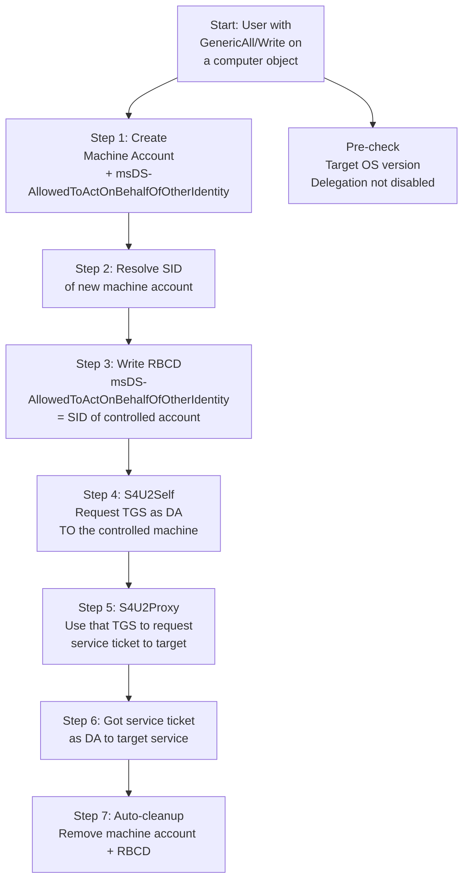

The whole pipeline is ~628 lines in `delegation_chain.rs`. Every step has error
handling and rolls back cleanly if something fails mid-chain.

---

## 5. overthrone-crawler — The Explorer

Crawler maps trust relationships, analyzes cross-domain attack paths, and now has
network-level OPSEC features for evading detection during reconnaissance.

### 5a. Cross-Domain Trust Mapping

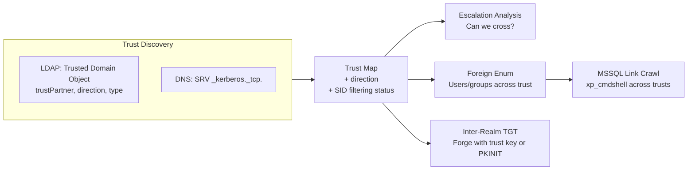

### 5b. Network OPSEC Features

These are the newer additions that help crawler blend in:

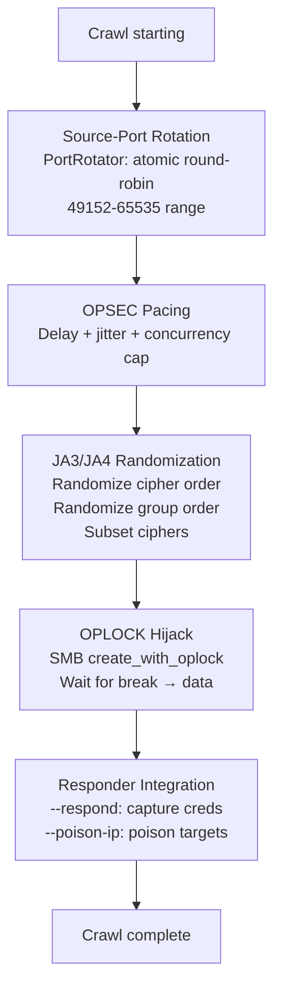

The port rotator (`PortRotator` in `pacing.rs`) doesn't need admin rights — it uses
ports >= 1024. The JA3/JA4 module is feature-gated behind `tls_fingerprint` because
it pulls in `rustls` as a dependency. The Responder integration is feature-gated
behind `responder` because it depends on the relay crate's poisoner.

---

## 6. overthrone-forge — The Blacksmith

Forge is the persistence crate. It fakes Kerberos tickets, abuses AD CS, and leaves
backdoors. Every function takes a config and returns a result — no side effects,
no println.

### 6a. Ticket Forging Pipeline

Different ticket types need different inputs but share a common PAC construction:

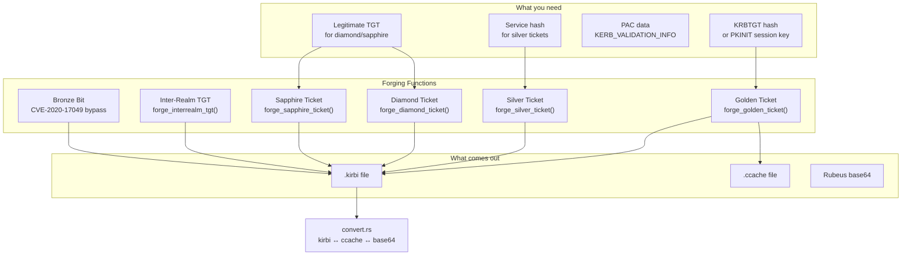

The `Enhanced Diamond` variant parses the legitimate TGT's PAC, locates the KDC
checksum (type 7), and preserves it — the forged ticket carries a checksum that
looks like it was issued by the real KDC. `Sapphire` goes further: it decrypts
the service ticket from S4U2Self, extracts the KDC-issued PAC, and wraps it in
a new TGT encrypted with krbtgt.

### 6b. ADCS Dispatcher Flow

The ADCS dispatcher tries exploits in a priority order (when set to Auto mode):

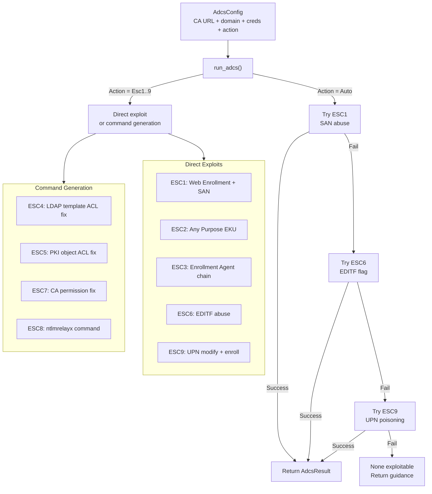

For ESC4/5/7/8, the dispatcher can't directly exploit (needs additional access or
a relay setup), so it prints the commands the operator should run.

---

## 7. overthrone-pilot — The Orchestrator

Pilot coordinates multi-step workflows and manages session persistence across
invocations. It provides the wizard-guided interaction mode, hostile-DC detection,
session save/resume, and an optional Q-learning advisor. Unlike the other crates,
pilot is never strictly required — every crate can be called directly from the CLI
— but it bridges the gap between single-shot commands and sustained operations.

### 7a. Session Lifecycle

Every engagement produces state that can be saved, inspected, and resumed:

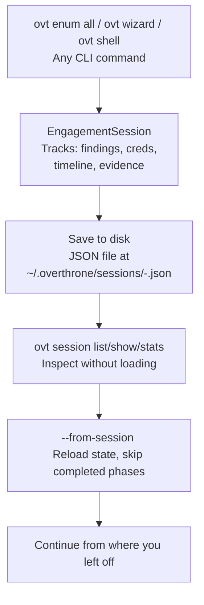

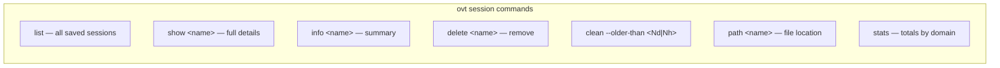

The session file stores the full `EngagementState`: enumeration data, cracked
credentials, generated reports, and timeline. When resumed via `--from-session`,
pilot checks what data already exists and skips any completed work.

### 7b. Wizard-Guided Mode

The wizard provides an interactive workflow that walks the operator through each
phase with prompts, suggestions, and rollback on failure:

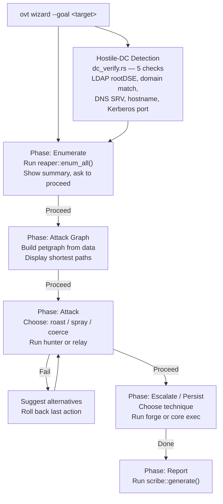

### 7c. Optional Q-Learning Advisor

The reinforcement learning engine provides action recommendations but never
executes automatically — the operator always decides:

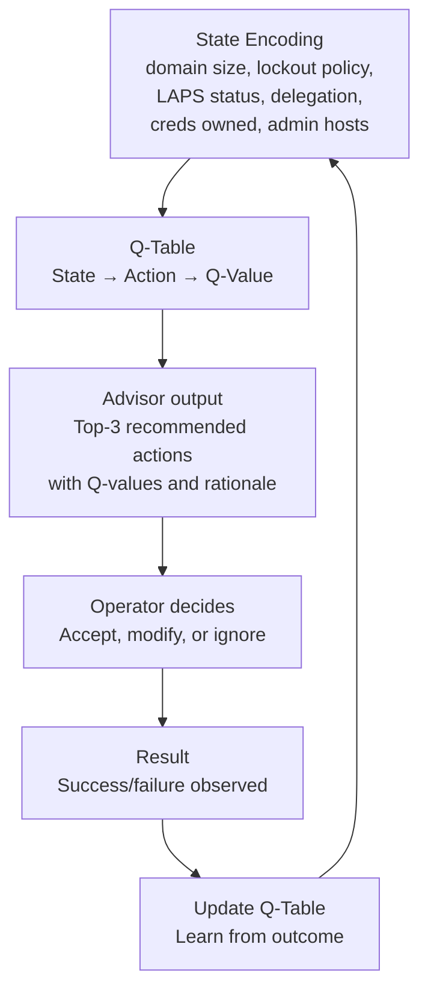

The Q-learner is compiled by default. It remembers across sessions when saving
the Q-table to disk. This is entirely optional — the wizard and all manual
commands work identically without it.

---

## 8. overthrone-relay — The Interceptor

Relay captures NTLM authentication from one protocol and forwards it to another.
It also handles network poisoning (LLMNR/NBT-NS/mDNS) to trigger authentication.

### 8a. Relay Engine Flow

The core relay path is the same regardless of source/target protocol:

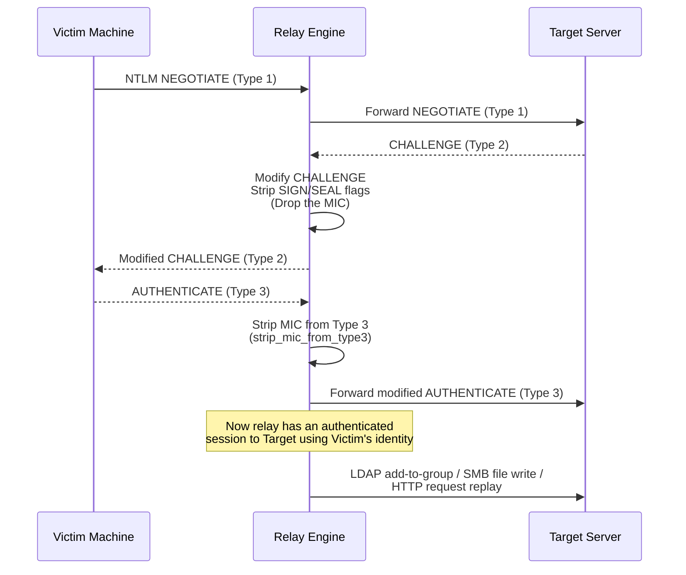

The engine handles multiple protocol combinations:

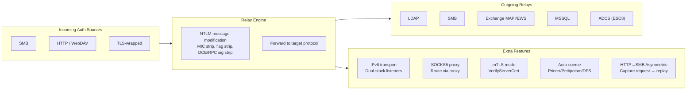

### 8b. HTTP→SMB Asymmetric Relay

This is the newer, more sophisticated relay type. It captures the full HTTP request,
extracts the NTLM token, and replays the request as an authenticated NTLM request
to the target:

```mermaid
flowchart TD
    CAPTURE["Victim sends HTTP request<br/>to relay listener"] --> READ["read_full_request()<br/>Content-Length aware body read"]
    READ --> EXTRACT["extract_ntlm_token()<br/>Parse Authorization: NTLM header"]
    EXTRACT --> CLASSIFY["is_http_target()<br/>Is target HTTP/S?"]
    CLASSIFY -->|Yes: HTTP target| REPLAY["replay_authenticated_request()<br/>Replay full HTTP request<br/>with relayed NTLM auth"]
    CLASSIFY -->|No: SMB/LDAP/MSSQL| OK["Return 200 OK<br/>relay succeeded"]
```

### 8c. Poisoning Flow

The poisoner listens for broadcast name resolution queries and answers them:

```mermaid
flowchart TD
    LISTEN["Listen on UDP:137 (NBT-NS)<br/>UDP:5355 (LLMNR)<br/>UDP:5353 (mDNS)"] --> QUERY["Incoming query<br/>'Who is FILESERVER?'"]
    QUERY --> SPOOF["Spoofed response<br/>'FILESERVER is at <attacker_ip>'"]
    SPOOF --> VICTIM["Victim connects to attacker<br/>SMB / HTTP / WPAD"]
    VICTIM --> CAPTURE_START["NTLM auth captured → Relay Engine"]

    QUERY --> FILTER["Filter logic<br/>Don't poison:<br/>- Domain controllers<br/>- Configured exclusions<br/>- Same subnet as querier"]
    FILTER --> SPOOF
```

---

## 9. overthrone-scribe — The Chronicler

Scribe takes an `EngagementSession` (a struct full of findings, credentials, and
timeline data) and turns it into a formatted report.

### 9a. Report Generation Pipeline

```mermaid
flowchart LR
    SESSION["EngagementSession<br/>+ Findings<br/>+ Credentials<br/>+ Timeline<br/>+ Evidence"] --> MAPPER["Mapper<br/>MITRE ATT&CK<br/>technique IDs"]
    SESSION --> NARRATIVE["Narrative<br/>Human-readable<br/>attack story"]

    MAPPER --> RENDERER["Report Renderer"]
    NARRATIVE --> RENDERER

    RENDERER -->|Format = Markdown| MD["markdown.rs<br/>Technical report<br/>+ remediation"]
    RENDERER -->|Format = JSON| JSON["JSON export<br/>Machine-readable"]
    RENDERER -->|Format = PDF| PDF["pdf.rs<br/>printpdf renderer<br/>Executive summary"]

    RENDERER --> EVIDENCE["Evidence hashing<br/>sha256 on each EvidenceItem"]
    RENDERER --> TIMELINE["Timeline view<br/>timeline_by_day()"]
```

All three output formats share the same input data. The markdown report is the most
detailed (full technical breakdown). The PDF is shorter (executive summary with
findings and risk scores). The JSON is for programmatic consumption (SIEMs,
ticketing systems).

---

## 10. overthrone-cli — The Interface

The CLI crate is a binary-only crate (no lib.rs). It parses command-line arguments
with clap and dispatches to the appropriate crate. It also hosts the TUI and the
interactive shell.

### 10a. Command Dispatch

```mermaid
flowchart TD
    MAIN["main.rs<br/>7,241 lines<br/>Clap definitions"] --> DISPATCH["Match subcommand"]

    DISPATCH -->|"ovt wizard"| WIZARD["commands/wizard.rs → pilot::wizard()"]
    DISPATCH -->|"ovt enum *"| ENUM["commands/enum_commands/* → reaper"]
    DISPATCH -->|"ovt kerberos *"| KRB["→ hunter"]
    DISPATCH -->|"ovt adcs"| ADCS["→ core::adcs"]
    DISPATCH -->|"ovt forge"| FORGE["→ forge::run_forge()"]
    DISPATCH -->|"ovt graph *"| GRAPH["graph_view.rs / tree_viewer.rs → core::graph"]
    DISPATCH -->|"ovt relay"| RELAY["→ relay"]
    DISPATCH -->|"ovt ntlm *"| NTLM["→ relay::http_asymmetric / relay::relay"]
    DISPATCH -->|"ovt report"| REPORT["→ scribe"]
    DISPATCH -->|"ovt config *"| CONFIG["commands/config.rs → cli_config.rs"]
    DISPATCH -->|"ovt config profile *"| PROFILE["commands/config.rs → profile system"]
    DISPATCH -->|"ovt session *"| SESSION["commands/session.rs → pilot::session"]
    DISPATCH -->|"ovt shell"| SHELL["interactive_shell.rs"]
    DISPATCH -->|"ovt tui"| TUI["tui/runner.rs"]
    DISPATCH -->|"ovt doctor"| DOCTOR["commands/doctor.rs"]

    subgraph SHELLDETAIL["Interactive Shell (3,263 lines)"]
        REPL["rustyline REPL<br/>Tab completion<br/>History<br/>Syntax highlighting"]
        MODULES["Forge modules<br/>golden / silver / diamond / skeleton<br/>use → set → run"]
        REMOTE["Remote shell types<br/>WinRM / SMB / WMI"]
    end

    SHELL --> REPL
    SHELL --> MODULES
    SHELL --> REMOTE

    subgraph CONFIGDETAIL["Config System (1,111 lines)"]
        TOML["TOML loading<br/>XDG-aware paths"]
        PROFILE_SYS["Profile system<br/>Named profiles<br/>OT_CONFIG / OT_PROFILE env"]
        MERGE["Config merge order<br/>CLI flag > env > profile > config > default"]
    end

    CONFIG --> TOML
    CONFIG --> PROFILE_SYS
    CONFIG --> MERGE
```

### 10b. TUI Architecture

The TUI has 6 modules that work together via ratatui:

```mermaid
flowchart TD
    START["ovt tui"] --> RUNNER["runner.rs<br/>Terminal setup (crossterm)<br/>30 FPS render loop"]
    RUNNER --> APP["app.rs<br/>Application state<br/>Tab management"]
    APP --> UI["ui.rs<br/>Layout + widget rendering"]
    APP --> EVENT["event.rs<br/>Keyboard / mouse handling"]

    APP --> GRAPH["graph_view.rs<br/>1,741 lines<br/>Node/edge rendering<br/>Attack graph visualization"]

    GRAPH --> QUIT["q → quit<br/>? → help"]
```

The TUI can run in two modes: live crawler mode (connects to a DC and shows
enumeration progress in real-time) and view-only mode (loads a graph from a JSON
file and lets you explore it).

---

## 11. overthrone-viewer — The Window

The viewer is a standalone web server. It's the only crate that runs as a long-lived
process (the CLI commands exit after they finish). It serves a browser-based graph
GUI.

### 11a. Web Stack

```mermaid
flowchart TD
    USER["Browser<br/>Three.js WebGL"] --> TLS["TLS Terminator<br/>rustls TlsListener"]
    TLS --> AUTH["Auth Middleware<br/>Bearer token or Basic auth<br/>Always-on"]
    AUTH --> CSRF["CSRF Middleware<br/>X-CSRF-Token check on<br/>POST/PUT/DELETE"]
    CSRF --> CORS["CORS<br/>Loopback only<br/>localhost / 127.0.0.1 / ::1"]
    CORS --> RATE["Rate Limiter<br/>Per-user + per-IP<br/>Token bucket"]
    RATE --> ROUTER["Axum Router<br/>Static files + API"]
    ROUTER --> SESSION["Session Store<br/>48-char tokens<br/>8-hour TTL<br/>Multi-user HashMap"]

    subgraph GraphAPI["Graph Endpoints"]
        NODES["/api/nodes<br/>Search + filter"]
        PATHS["/api/paths<br/>Shortest path finder"]
        DETAILS["/api/details<br/>Node + edge detail"]
        STATS["/api/stats<br/>Graph statistics"]
    end

    ROUTER --> GraphAPI

    subgraph Security["Security Features"]
        RANDOM_CREDS["Random credentials on launch<br/>12-char user, 24-char pass<br/>32-char CSRF token"]
        LOOPBACK_BIND["Refuse non-loopback bind<br/>without TLS"]
        TLS_CLIENT["mTLS client cert verification<br/>WebPkiClientVerifier"]
    end

    Security --> TLS
    Security --> AUTH
```

The viewer loads graph data from JSON files (Overthrone exports or BloodHound JSON
collections). It indexes the data and serves it via REST endpoints. The browser
renders the graph using Three.js (migrated from D3.js for GPU-accelerated WebGL
performance). The canvas starts blank — the operator searches for nodes and renders
chunks with configurable budgets (50 to ALL nodes).

---

## 12. Full Tool Flow Structure

This section maps the complete flow from CLI invocation through crate dispatch,
protocol wire calls, to result output. Every crate is callable directly — there
is no required orchestration layer. The operator picks the tools they need.

### 12a. CLI Command Tree → Crate Dispatch

Every `ovt` command resolves to a specific crate function. The tree below shows
every top-level subcommand, its crate target, and the key entry point:

```mermaid
flowchart TD
    CLI["ovt &lt;command&gt;"] -->|enum| REAPER["overthrone-reaper"]
    CLI -->|graph| GRAPH["core::graph"]
    CLI -->|kerberos| HUNTER["overthrone-hunter"]
    CLI -->|adcs| CORE_ADCS["core::adcs"]
    CLI -->|forge| FORGE["overthrone-forge"]
    CLI -->|ntlm / relay| RELAY["overthrone-relay"]
    CLI -->|exec / dump / scan| CORE["overthrone-core"]
    CLI -->|report| SCRIBE["overthrone-scribe"]
    CLI -->|session| PILOT["overthrone-pilot"]
    CLI -->|config| CONFIG["cli_config.rs"]
    CLI -->|shell| SHELL["interactive_shell.rs"]
    CLI -->|tui| TUI["tui/runner.rs"]
    CLI -->|doctor| DOCTOR["commands/doctor.rs"]
    CLI -->|snaffler| REAPER_SNAFF["reaper::snaffler"]
    CLI -->|crack| CORE_CRACK["core::crypto::cracker"]
    CLI -->|powerview| REAPER_PV["reaper::powerview"]
    CLI -->|wizard| PILOT_WIZ["pilot::wizard"]
    CLI -->|move| CRAWLER["overthrone-crawler"]
    CLI -->|spray| HUNTER_SPRAY["hunter::spray"]
    CLI -->|module| CORE_MOD["core::plugin"]
    CLI -->|azure| CORE_AZ["core::azure_ad"]
    CLI -->|completions| CLI_SELF["cli::completions"]
```

```mermaid
flowchart LR
    subgraph reaper_cmds["ovt enum subcommands"]
        ENUM_ALL["ovt enum all<br/>reaper::enum_all()"]
        ENUM_PRE["ovt enum pre<br/>Null-session probe"]
        ENUM_ANON["ovt enum anonymous<br/>RootDSE probe"]
        ENUM_LAPS["ovt enum laps<br/>LAPS v1 + v2"]
        ENUM_POLICY["ovt enum policy<br/>Lockout / password"]
        ENUM_ADCS["ovt enum adcs<br/>ADCS templates"]
        ENUM_BH["ovt enum bloodhound<br/>JSON export"]
    end

    subgraph hunter_cmds["ovt kerberos subcommands"]
        KRB_ROAST["ovt kerberos roast<br/>TGS request + crack"]
        KRB_ASREP["ovt kerberos asrep-roast<br/>No-preauth capture"]
        KRB_USERENUM["ovt kerberos user-enum<br/>Zero-knowledge enum"]
        KRB_RBCD["ovt kerberos rbcd<br/>RBCD abuse chain"]
        KRB_DELEG["ovt kerberos delegation<br/>Constrained/unconstrained"]
    end

    subgraph forge_cmds["ovt forge subcommands"]
        FORGE_GOLDEN["golden<br/>forge_golden_ticket()"]
        FORGE_SILVER["silver<br/>forge_silver_ticket()"]
        FORGE_DIAMOND["diamond<br/>forge_diamond_ticket()"]
        FORGE_SAPPHIRE["sapphire<br/>forge_sapphire_ticket()"]
        FORGE_ADCS["adcs<br/>run_adcs() dispatcher"]
        FORGE_SHADOW["shadow-creds<br/>LDAP + PKINIT"]
        FORGE_SKELETON["skeleton<br/>SMB + LSASS patch"]
        FORGE_DCSYNC["dcsync<br/>MS-DRSR extract"]
        FORGE_S4U2["s4u2self-pkinit<br/>Certificate S4U2Self"]
        FORGE_INTER["interrealm<br/>Cross-realm TGT"]
        FORGE_BRONZE["bronze-bit<br/>CVE-2020-17049"]
    end
```

### 12b. Per-Crate Data Flow

Each crate receives structured inputs and returns structured results. There are no
shared mutable globals — data flows through function parameters and return types.

```mermaid
flowchart LR
    subgraph Inputs["Common Input Types"]
        CONN["ConnectionConfig<br/>DC host, domain, creds<br/>Protocol flags"]
        SCOPE["ScopeConfig<br/>Target list, filters,<br/>depth, concurrency"]
    end

    subgraph CrateCalls["Crate Entry Points"]
        REAPER_CALL["reaper::enum_all(conn, scope)<br/>→ ADData"]
        HUNTER_CALL["hunter::kerberoast(conn, spns, config)<br/>→ Vec&lt;CrackedCredential&gt;"]
        FORGE_CALL["forge::run_forge(action, config)<br/>→ ForgeResult"]
        RELAY_CALL["relay::run(config, targets)<br/>→ CapturedCredentials"]
        CRAWLER_CALL["crawler::run_crawl(conn, scope)<br/>→ CrawlResult"]
        GRAPH_CALL["core::graph::build_graph(ad_data)<br/>→ AttackGraph"]
        SCRIBE_CALL["scribe::generate(session, format)<br/>→ ReportOutput"]
    end

    Inputs --> REAPER_CALL
    Inputs --> HUNTER_CALL
    Inputs --> FORGE_CALL
    Inputs --> RELAY_CALL
    Inputs --> CRAWLER_CALL

    REAPER_CALL -->|ADData| GRAPH_CALL
    REAPER_CALL -->|ADData| HUNTER_CALL
    REAPER_CALL -->|ADData| FORGE_CALL

    HUNTER_CALL -->|CrackedCredentials| SCRIBE_CALL
    FORGE_CALL -->|ForgeResult| SCRIBE_CALL
    RELAY_CALL -->|CapturedCredentials| SCRIBE_CALL
    GRAPH_CALL -->|AttackGraph| SCRIBE_CALL
```

### 12c. Protocol Flow Layers

Every protocol implementation follows a strict layering. Lower layers never call
higher layers:

```mermaid
flowchart TD
    subgraph L5["Layer 5 — Application (caller)"]
        HUNTER_APP["hunter::kerberoast()<br/>Caller provides config<br/>Receives credentials"]
        REAPER_APP["reaper::enum_all()<br/>Caller provides creds<br/>Receives AD data"]
        FORGE_APP["forge::run_forge()<br/>Caller provides action<br/>Receives ticket bytes"]
    end

    subgraph L4["Layer 4 — Protocol Modules"]
        KRB_L4["kerberos.rs<br/>request_tgt/request_tgs<br/>AS-REQ / TGS-REQ builders"]
        LDAP_L4["ldap.rs<br/>bind/search/modify<br/>Base DN resolution"]
        SMB_L4["smb2.rs<br/>negotiate/session_setup<br/>tree_connect/file_ops"]
        NTLM_L4["ntlm.rs<br/>hash computation<br/>MIC strip / DCE strip"]
        DRSR_L4["drsuapi.rs<br/>DsGetNCChanges<br/>Replication bind"]
        MSSQL_L4["mssql.rs<br/>TDS login/query<br/>Linked server crawl"]
    end

    subgraph L3["Layer 3 — Wire Transport"]
        TCP["TCP connect<br/>+ TLS wrap (LDAPS/HTTPS)"]
        SOCKET["Socket read/write<br/>Timeout + buffer mgmt"]
    end

    subgraph L2["Layer 2 — ASN.1 / DER"]
        ASN1["kerberos_asn1 crate<br/>krb5_asn1 definitions<br/>DER encode/decode"]
    end

    subgraph L1["Layer 1 — Crypto Primitives"]
        AES["AES-CTS<br/>etype 17/18"]
        RC4["RC4<br/>etype 23"]
        HMAC["HMAC-SHA1/256<br/>Checksums + signing"]
        MD4["MD4<br/>NTLM hash"]
        DPAPI_CRYPTO["AES-256-GCM<br/>LAPS v2 decrypt"]
    end

    L5 -->|Call protocol functions| L4
    L4 -->|Write raw bytes| L3
    L4 -->|Encode/decode| L2
    L4 -->|Encrypt/decrypt/sign| L1
    L2 -->|DER bytes| L3
```

### 12d. Manual Attack Chain (Tool Composition)

This is the recommended operator workflow — individual tools composed into an
attack chain. Each step is a separate `ovt` invocation using the output of the
previous step:

```mermaid
flowchart TD
    PHASE0["Phase 0: Reconnaissance<br/>ovt enum pre — null-session probe<br/>ovt enum anon — LDAP RootDSE<br/>ovt scan — port + service scan"] --> PHASE1

    PHASE1["Phase 1: Enumeration<br/>ovt enum all — full AD dump<br/>ovt enum adcs — CA templates<br/>ovt snaffler — share crawl<br/>ovt powerview — ACL analysis<br/>ovt graph build — attack graph"] --> PHASE1_DATA["Data Collected<br/>ADData: users, groups, computers,<br/>trusts, ACLs, GPOs, LAPS, SPNs,<br/>delegations, ADCS templates"]

    PHASE1_DATA --> PHASE2

    PHASE2["Phase 2: Credential Access<br/>ovt kerberos roast — TGS hash capture<br/>ovt kerberos asrep-roast — no-preauth<br/>ovt kerberos user-enum — zero-knowledge<br/>ovt spray — password guessing<br/>ovt crack — offline hash cracking"] --> PHASE2_DATA["Credentials Gained<br/>CrackedCredential: user + password<br/>or NTLM hash for PtH"]

    PHASE2_DATA --> PHASE3

    PHASE3["Phase 3: Lateral Movement<br/>ovt exec — PsExec/SmbExec/WinRM<br/>ovt dump — DCSync (krbtgt + all)<br/>ovt ntlm relay — capture + replay<br/>ovt ntlm http-asymmetric — cross-protocol"] --> PHASE3_DATA["Access Expanded<br/>New sessions, hashes,<br/>admin hosts"]

    PHASE3_DATA --> PHASE4

    PHASE4["Phase 4: Persistence<br/>ovt forge golden — TGT forge<br/>ovt forge silver — TGS forge<br/>ovt forge shadow-creds — PKINIT backdoor<br/>ovt forge skeleton — LSASS patch<br/>ovt forge adcs — cert abuse (ESC1-9)"] --> PHASE4_DATA["Persistence Established<br/>Forged tickets, backdoors,<br/>certificates on disk"]

    PHASE4_DATA --> PHASE5

    PHASE5["Phase 5: Cross-Domain<br/>ovt move — trust mapping + foreign enum<br/>ovt forge interrealm — cross-realm TGT<br/>MSSQL link crawl (via crawler)"] --> PHASE6

    PHASE6["Phase 6: Reporting<br/>ovt report --format md — full tech report<br/>ovt report --format json — machine-readable<br/>ovt report --format pdf — exec summary"] --> DONE["Engagement complete<br/>Output files on disk<br/>Session saved for resume"]
```

### 12e. Error Handling & Fallback Patterns

Every crate uses the same error-handling architecture. `Result<T, String>` or
`Result<T, anyhow::Error>` is the universal return type. Fallback logic is
implemented at the caller level:

```mermaid
flowchart TD
    CALL["Caller invokes crate function"] --> TRY["Try primary method"]
    TRY -->|Success| RETURN["Return result"]
    TRY -->|ConnectionRefused| RETRY["Retry with backoff<br/>3 attempts, 2x delay"]
    TRY -->|AuthFailure| FALLBACK["Fallback to alternative<br/>auth method"]
    TRY -->|ProtocolError| LOGERR["Log error + context<br/>Return Err with description"]

    FALLBACK --> TRY2["Try fallback method"]
    TRY2 -->|Success| RETURN
    TRY2 -->|Fail| LOGERR

    subgraph AuthFallbacks["Auth Fallback Chain"]
        KRB["Kerberos"] --> NTLM["NTLM"]
        NTLM --> SIMPLE["Simple bind (LDAP)"]
    end

    subgraph ExecFallbacks["Exec Fallback Chain"]
        WINRM_TRY["WinRM"] --> PSEXEC_TRY["PsExec"]
        PSEXEC_TRY --> SMBEXEC_TRY["SmbExec"]
        SMBEXEC_TRY --> ATEXEC_TRY["AtExec"]
    end

    subgraph RoastFallbacks["Roast Fallback Chain"]
        RC4_TRY["Request RC4 (etype 23)"] --> AES_TRY["Request AES128/256<br/>(etype 17/18)"]
    end

    FALLBACK --> AuthFallbacks
    FALLBACK --> ExecFallbacks
    FALLBACK --> RoastFallbacks
```

### 12f. Output & Reporting Pipeline

Every crate that produces results writes to an `EngagementSession`. The scribe
crate renders this session into final output:

```mermaid
flowchart LR
    subgraph Producers["Result Producers"]
        REAPER_OUT["ADData<br/>Users, groups, computers<br/>Trusts, ACLs, GPOs, LAPS<br/>ADCS templates"]
        HUNTER_OUT["CrackedCredentials<br/>Username:password + hash<br/>Domain + method"]
        FORGE_OUT["ForgeResult<br/>Ticket bytes, paths,<br/>certificates, messages"]
        RELAY_OUT["CapturedCredentials<br/>NTLM hashes, tokens,<br/>relayed sessions"]
        CRAWLER_OUT["CrawlResult<br/>Trust map, SID filters,<br/>MSSQL links, responder creds"]
        GRAPH_OUT["AttackGraph<br/>Nodes, edges, paths,<br/>high-value targets"]
    end

    Producers --> ENG["EngagementSession<br/>Single source of truth<br/>Findings + Credentials + Timeline + Evidence"]

    ENG -->|Format = markdown| MD_RPT["Markdown Report<br/>Technical breakdown<br/>Full attack narrative<br/>MITRE ATT&CK mapping<br/>Remediation steps"]
    ENG -->|Format = json| JSON_RPT["JSON Export<br/>Machine-readable<br/>SIEM ingestion<br/>Programmatic consumption"]
    ENG -->|Format = pdf| PDF_RPT["PDF Report<br/>Executive summary<br/>Risk scores<br/>Findings table<br/>Evidence hashes (SHA-256)"]
    ENG -->|Session save| SESSION_DISK["JSON on disk<br/>~/.overthrone/sessions/<br/>Resumable state"]

    MD_RPT --> FILE1["engagement-report.md"]
    JSON_RPT --> FILE2["findings.json"]
    PDF_RPT --> FILE3["executive-summary.pdf"]
```

### 12g. Full CLI → Crate → Protocol Call Chain

Every layer that a single command traverses, using `ovt kerberos roast` as a
concrete example:

```mermaid
sequenceDiagram
    participant User
    participant CLI as overthrone-cli (main.rs)
    participant IMPL as commands_impl.rs
    participant HUNTER as overthrone-hunter
    participant CORE as overthrone-core (kerberos.rs)
    participant NET as TCP Socket
    participant DC as Domain Controller

    User->>CLI: ovt kerberos roast -H DC01 -d CORP -u user -p pass
    CLI->>CLI: Parse args (clap)<br/>Build KerberosConfig
    CLI->>IMPL: run_kerberos_action()<br/>Match KerberosAction::Roast
    IMPL->>HUNTER: kerberoast(config)<br/>└─ domain, dc, creds, spns, aes_only

    Note over HUNTER: Filter SPN accounts<br/>Skip AS-REP roastable if configured

    HUNTER->>CORE: request_service_ticket(user, service, config)
    CORE->>CORE: Build TGS-REQ body (ASN.1 DER)<br/>Encrypt PA-DATA with session key
    CORE->>NET: TCP connect → DC01:88
    CORE->>NET: Send TGS-REQ bytes
    NET-->>CORE: Receive TGS-REP bytes
    CORE->>CORE: Parse ASN.1 DER → TGS-REP<br/>Extract encrypted ticket part
    CORE-->>HUNTER: ServiceTicket { encrypted_data, etype, ... }

    HUNTER->>HUNTER: Write hash to ./loot/<br/>Format: $krb5tgs$etype$*user$domain$spn*$hash
    HUNTER->>HUNTER: Optional: crack via embedded wordlist<br/>(rayon parallel, rule engine)
    HUNTER-->>IMPL: Vec<CrackedCredential>
    IMPL-->>User: Printed to stdout<br/>(or JSON if --output-format json)
```

This same layered architecture applies to every command. The CLI parses flags,
builds config objects, calls the relevant crate function, and formats the output.
The crate function calls core protocols over the wire, parses responses, and
returns structured data. Protocol modules never print — they return results.

---

## 13. Data Flow Summary

Every piece of data in Overthrone flows through a few core types. Here's how they
connect:

```mermaid
flowchart LR
    AD_DATA["ADData<br/>Users / Groups / Computers<br/>ACLs / Trusts / GPOs / LAPS"] --> GRAPH["AttackGraph<br/>petgraph::DiGraph<br/>Node<->Edge map"]
    AD_DATA --> HUNT_RES["HuntResult<br/>Cracked creds<br/>Roastable accounts"]

    HUNT_RES --> CRED_STORE["CredStore<br/>Privilege-ranked<br/>DA > EA > Admin > User"]
    CRED_STORE --> ENG["EngagementSession<br/>All findings + creds + timeline"]
    GRAPH --> ENG

    ENG --> REPORT["ReportOutput<br/>Markdown / JSON / PDF"]
    ENG --> SAVE["Saved to JSON<br/>~/.overthrone/sessions/<domain>-<dc>.json"]

    SAVE --> RESUME_LOAD["Loaded by --from-session<br/>→ EngagementState"]
    RESUME_LOAD --> AD_DATA
```

The `EngagementSession` is the single source of truth for reporting. It's what the
scribe renders, what the pilot saves to disk, and what `--from-session` loads back
into memory. Every crate that discovers something pushes it into the engagement
session.
