# Overthrone Architecture

The framework is split across 10 crates in a Rust workspace. Each crate owns a specific
phase of the attack lifecycle. They communicate through function calls (not IPC or
network — everything runs in-process). The CLI crate is the entry point; everything
else is a library it calls into.

There's no "core dispatcher service" or centralized event bus. The flow is:

```
CLI → pilot → [reaper, hunter, forge, relay] → core (protocols)
                                            → scribe (output)
```

The `overthrone-core` crate is the dependency of everything. Every other crate imports
it for protocol types, crypto primitives, and data structures. The CLI imports every
crate. The viewer is standalone (serves a web GUI, imports core for graph types).

---

## 1. Top-Level Crate Map

This is the big picture — every crate, its job, and who it talks to.

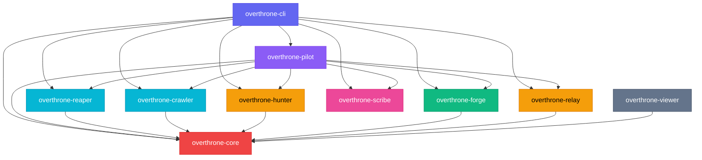

Core is the dependency everyone shares. Pilot optionally orchestrates the others when
running in auto-pwn mode. CLI is the user's entry point. Viewer is a standalone web
server that only imports core for graph data types.

---

## 2. overthrone-core — The Absolute Unit

Core is the protocol engine. It has no dependencies on other Overthrone crates. Every
other crate depends on it. It owns the network protocols, crypto, attack graph, post-
exploitation modules, C2 integrations, and ADCS exploit logic.

### 2a. Module Map

Core has ~130 source files organized into subdirectories by domain:

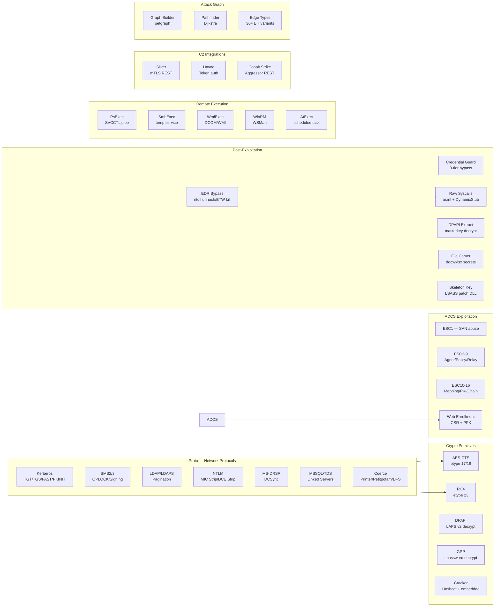

### 2b. How Protocols Flow

Every protocol follows the same pattern. Here's the general flow using Kerberos as an
example — SMB, LDAP, and MSSQL work the same way under the hood:

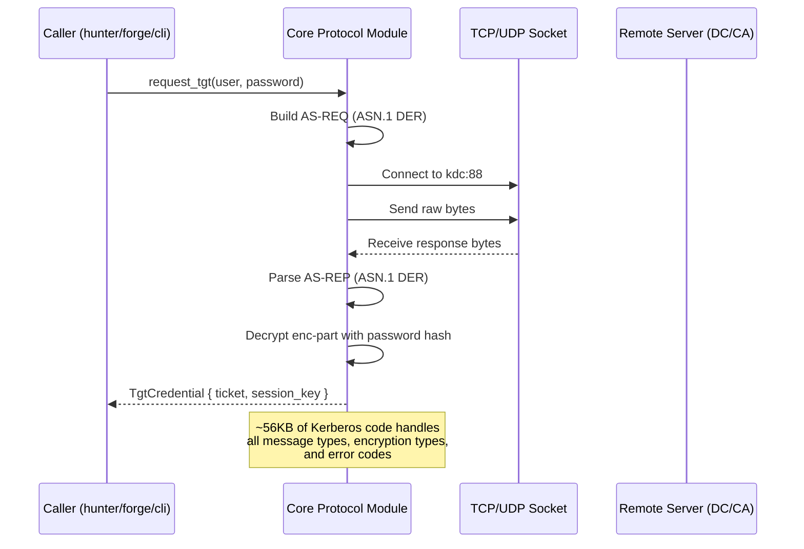

Core owns all the ASN.1 parsing, encryption, and wire format handling. Callers never
touch raw bytes. Every protocol library in core is pure Rust — no shelling out, no
P/Invoke, no C dependencies.

### 2c. Attack Graph Flow

The graph is built from LDAP enumeration data. It uses `petgraph` under the hood with
a custom edge-weight model:

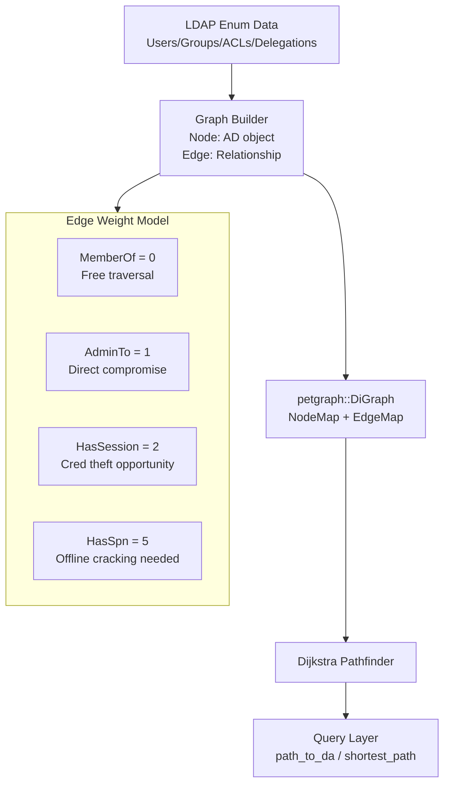

### 2d. Post-Exploitation: EDR & Credential Guard

The post-exploitation layer has three tiers of credential access, tried in order:

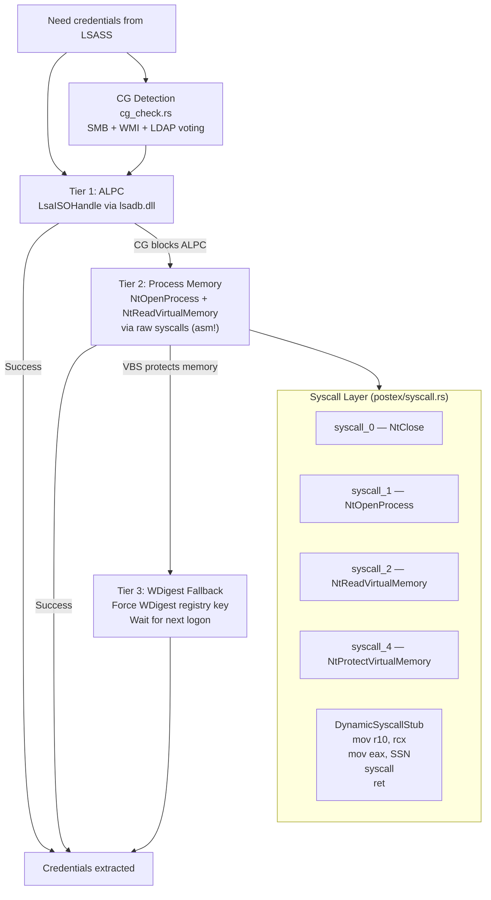

### 2e. ADCS Exploitation (ESC1-16)

The ADCS module covers the entire ESC spectrum. Exploits are broken into individual
files but share a common enrollment pipeline:

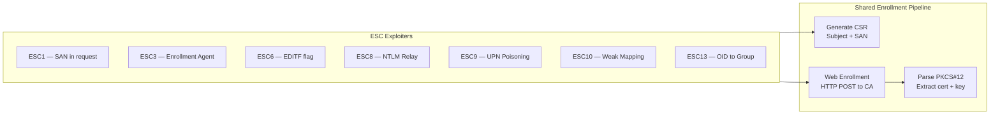

ESC4, ESC5, and ESC7 generate LDAP/registry modification commands for the operator
(they require additional privileges to modify template ACLs or CA permissions). ESC8
is special — it doesn't enroll directly, it coordinates with the relay crate to
capture NTLM auth and relay it to the CA web enrollment page.

---

## 3. overthrone-reaper — The Collector

Reaper is the enumeration crate. It talks LDAP to the domain controller, asks nicely
for everything, and returns structured data. No modification — read-only.

### 3a. Enumeration Flow

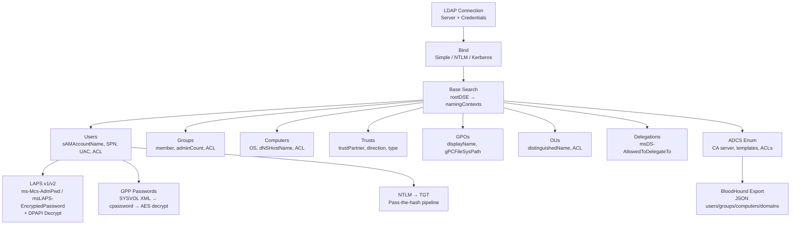

### 3b. Snaffler Flow

The Snaffler module crawls SMB shares looking for interesting files:

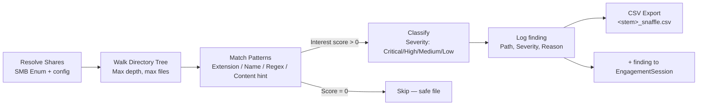

Under the hood it uses `smbclient` (Linux) or the built-in SMB2 client (cross-platform)
depending on availability. The pattern matching is unit-tested (`file_matches_pattern`
— 23 tests now) but the end-to-end SMB share crawling is not (requires a real file
server).

---

## 4. overthrone-hunter — The Overachiever

Hunter contains the attack primitives. It never modifies AD objects (that's forge's
job) but it requests tickets, cracks hashes, and identifies misconfigurations.

### 4a. Kerberoasting Pipeline

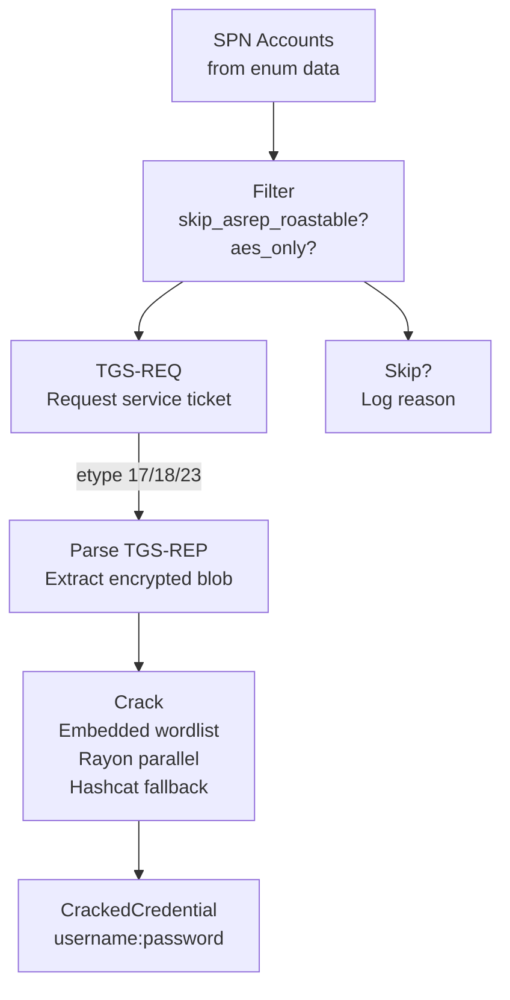

Kerberoasting requests come in three flavors: RC4 (etype 23, fast to crack),
AES128 (etype 17), and AES256 (etype 18, slow to crack). The `downgrade_to_rc4`
flag changes what encryption type hunter requests — the KDC will downgrade if the
account supports it.

### 4b. Delegation Chain Automation

Delegation attacks are multi-step. Hunter automates the whole chain:

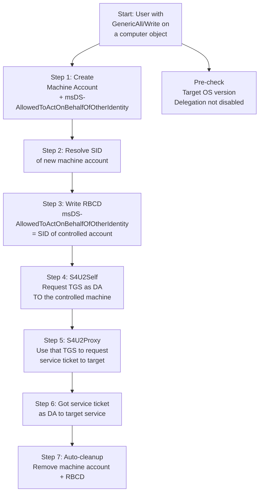

The whole pipeline is ~628 lines in `delegation_chain.rs`. Every step has error
handling and rolls back cleanly if something fails mid-chain.

---

## 5. overthrone-crawler — The Explorer

Crawler maps trust relationships, analyzes cross-domain attack paths, and now has
network-level OPSEC features for evading detection during reconnaissance.

### 5a. Cross-Domain Trust Mapping

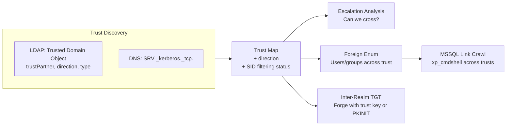

### 5b. Network OPSEC Features

These are the newer additions that help crawler blend in:

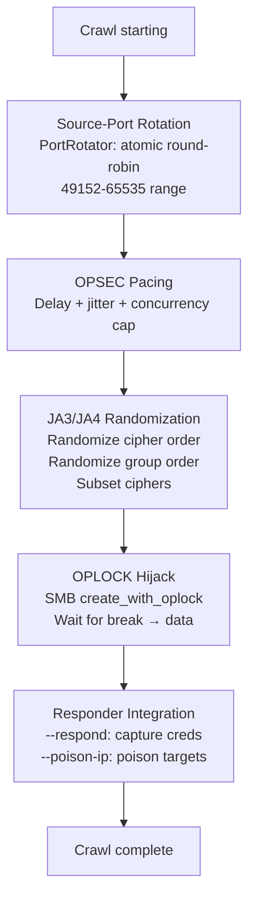

The port rotator (`PortRotator` in `pacing.rs`) doesn't need admin rights — it uses
ports >= 1024. The JA3/JA4 module is feature-gated behind `tls_fingerprint` because
it pulls in `rustls` as a dependency. The Responder integration is feature-gated
behind `responder` because it depends on the relay crate's poisoner.

---

## 6. overthrone-forge — The Blacksmith

Forge is the persistence crate. It fakes Kerberos tickets, abuses AD CS, and leaves
backdoors. Every function takes a config and returns a result — no side effects,
no println.

### 6a. Ticket Forging Pipeline

Different ticket types need different inputs but share a common PAC construction:

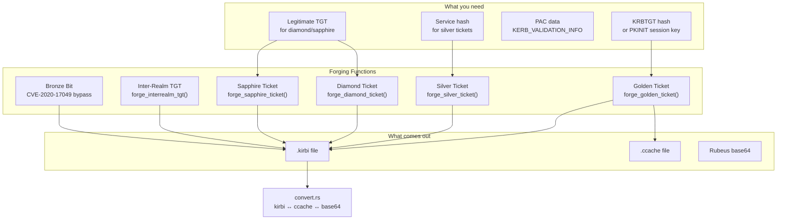

The `Enhanced Diamond` variant parses the legitimate TGT's PAC, locates the KDC
checksum (type 7), and preserves it — the forged ticket carries a checksum that
looks like it was issued by the real KDC. `Sapphire` goes further: it decrypts
the service ticket from S4U2Self, extracts the KDC-issued PAC, and wraps it in
a new TGT encrypted with krbtgt.

### 6b. ADCS Dispatcher Flow

The ADCS dispatcher tries exploits in a priority order (when set to Auto mode):

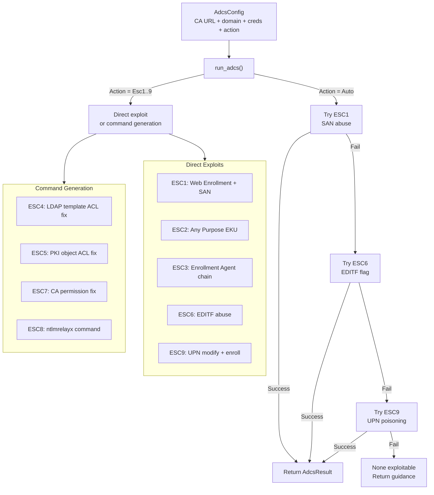

For ESC4/5/7/8, the dispatcher can't directly exploit (needs additional access or
a relay setup), so it prints the commands the operator should run.

---

## 7. overthrone-pilot — The Strategist

Pilot orchestrates the other crates. It runs the auto-pwn pipeline, manages the
Q-learning engine, and handles session save/resume.

### 7a. Auto-Pwn Stage Machine

Auto-pwn runs through 6 stages, saving state after each one:

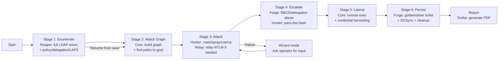

Each stage calls into the relevant crate. The executor (`executor.rs`) handles
error recovery: if kerberoasting fails, it tries AS-REP roasting instead. If
all attacks fail at a stage, it pauses and asks for operator input (wizard mode).

### 7b. Q-Learning Flow

The Q-learner improves attack selection over multiple runs:

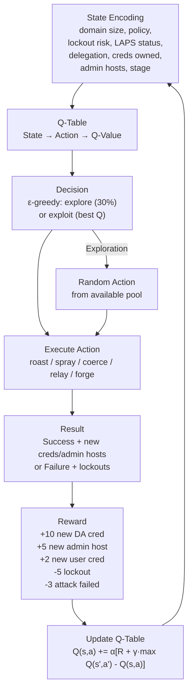

The Q-learner is compiled by default (no feature gate). It learns across sessions
if you save the Q-table to disk (`--q-table ./brain.json`).

### 7c. Session Save/Resume

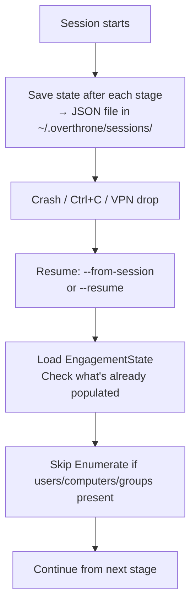

The `WizardSession::new_with_state()` constructor enables the skip-Enumerate flow.
It checks whether the loaded state has users, computers, and groups — if so, it
starts at the Attack stage instead of Enumerate.

---

## 8. overthrone-relay — The Interceptor

Relay captures NTLM authentication from one protocol and forwards it to another.
It also handles network poisoning (LLMNR/NBT-NS/mDNS) to trigger authentication.

### 8a. Relay Engine Flow

The core relay path is the same regardless of source/target protocol:

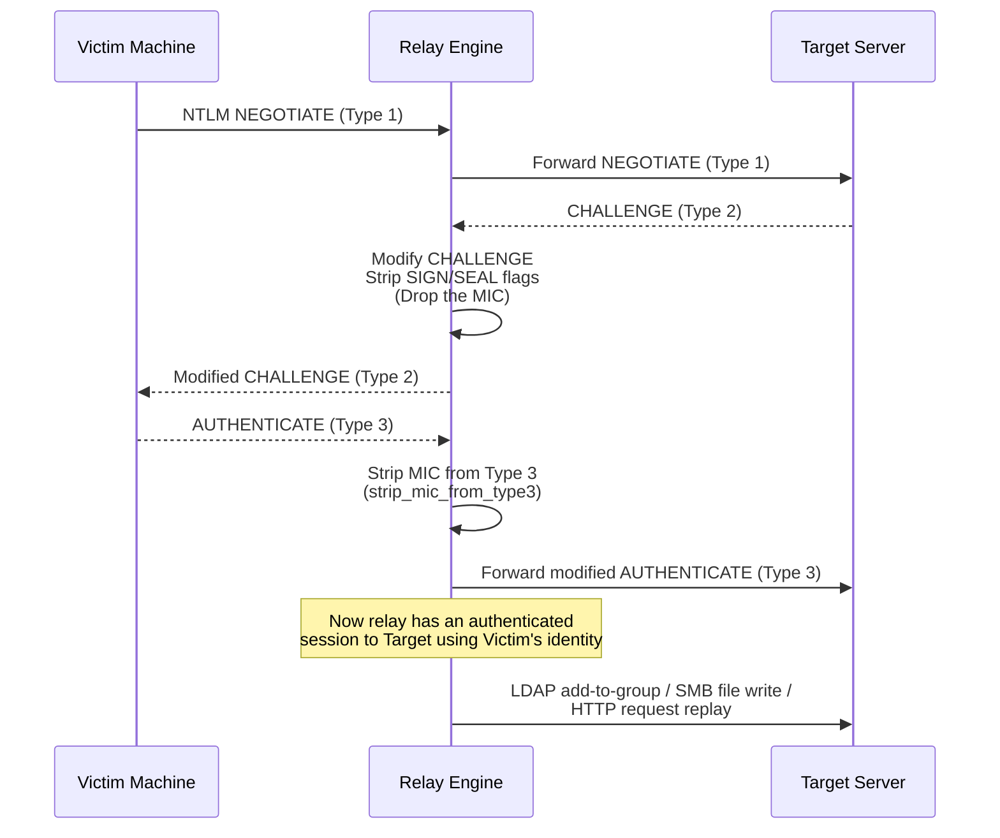

The engine handles multiple protocol combinations:

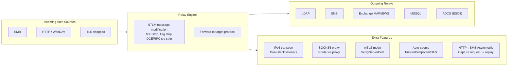

### 8b. HTTP→SMB Asymmetric Relay

This is the newer, more sophisticated relay type. It captures the full HTTP request,
extracts the NTLM token, and replays the request as an authenticated NTLM request
to the target:

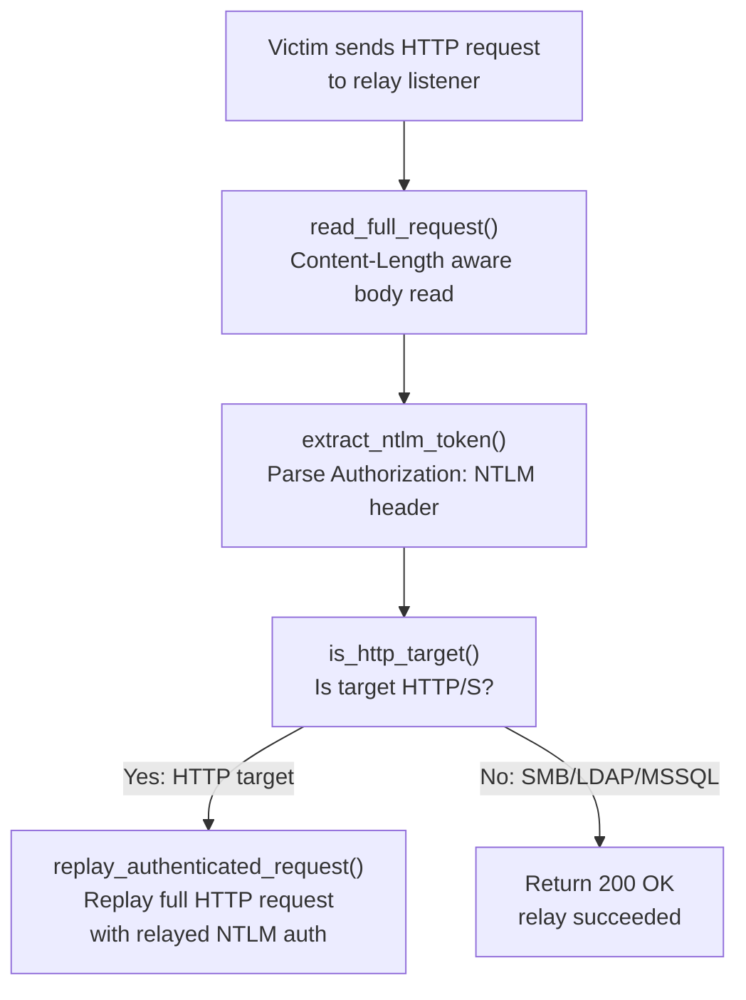

### 8c. Poisoning Flow

The poisoner listens for broadcast name resolution queries and answers them:

```mermaid
flowchart TD
    LISTEN["Listen on UDP:137 (NBT-NS)<br/>UDP:5355 (LLMNR)<br/>UDP:5353 (mDNS)"] --> QUERY["Incoming query<br/>'Who is FILESERVER?'"]
    QUERY --> SPOOF["Spoofed response<br/>'FILESERVER is at <attacker_ip>'"]
    SPOOF --> VICTIM["Victim connects to attacker<br/>SMB / HTTP / WPAD"]
    VICTIM --> CAPTURE_START["NTLM auth captured → Relay Engine"]

    QUERY --> FILTER["Filter logic<br/>Don't poison:<br/>- Domain controllers<br/>- Configured exclusions<br/>- Same subnet as querier"]
    FILTER --> SPOOF
```

---

## 9. overthrone-scribe — The Chronicler

Scribe takes an `EngagementSession` (a struct full of findings, credentials, and
timeline data) and turns it into a formatted report.

### 9a. Report Generation Pipeline

```mermaid
flowchart LR
    SESSION["EngagementSession<br/>+ Findings<br/>+ Credentials<br/>+ Timeline<br/>+ Evidence"] --> MAPPER["Mapper<br/>MITRE ATT&CK<br/>technique IDs"]
    SESSION --> NARRATIVE["Narrative<br/>Human-readable<br/>attack story"]

    MAPPER --> RENDERER["Report Renderer"]
    NARRATIVE --> RENDERER

    RENDERER -->|Format = Markdown| MD["markdown.rs<br/>Technical report<br/>+ remediation"]
    RENDERER -->|Format = JSON| JSON["JSON export<br/>Machine-readable"]
    RENDERER -->|Format = PDF| PDF["pdf.rs<br/>printpdf renderer<br/>Executive summary"]

    RENDERER --> EVIDENCE["Evidence hashing<br/>sha256 on each EvidenceItem"]
    RENDERER --> TIMELINE["Timeline view<br/>timeline_by_day()"]
```

All three output formats share the same input data. The markdown report is the most
detailed (full technical breakdown). The PDF is shorter (executive summary with
findings and risk scores). The JSON is for programmatic consumption (SIEMs,
ticketing systems).

---

## 10. overthrone-cli — The Interface

The CLI crate is a binary-only crate (no lib.rs). It parses command-line arguments
with clap and dispatches to the appropriate crate. It also hosts the TUI and the
interactive shell.

### 10a. Command Dispatch

```mermaid
flowchart TD
    MAIN["main.rs<br/>7,241 lines<br/>Clap definitions"] --> DISPATCH["Match subcommand"]

    DISPATCH -->|"ovt auto-pwn"| AUTOPWN["autopwn.rs → pilot::run()"]
    DISPATCH -->|"ovt wizard"| WIZARD["commands/wizard.rs → pilot::wizard()"]
    DISPATCH -->|"ovt enum *"| ENUM["commands/enum_commands/* → reaper"]
    DISPATCH -->|"ovt kerberos *"| KRB["→ hunter"]
    DISPATCH -->|"ovt adcs"| ADCS["→ core::adcs"]
    DISPATCH -->|"ovt forge"| FORGE["→ forge::run_forge()"]
    DISPATCH -->|"ovt graph *"| GRAPH["graph_view.rs / tree_viewer.rs → core::graph"]
    DISPATCH -->|"ovt relay"| RELAY["→ relay"]
    DISPATCH -->|"ovt ntlm *"| NTLM["→ relay::http_asymmetric / relay::relay"]
    DISPATCH -->|"ovt report"| REPORT["→ scribe"]
    DISPATCH -->|"ovt config *"| CONFIG["commands/config.rs → cli_config.rs"]
    DISPATCH -->|"ovt config profile *"| PROFILE["commands/config.rs → profile system"]
    DISPATCH -->|"ovt session *"| SESSION["commands/session.rs → pilot::session"]
    DISPATCH -->|"ovt shell"| SHELL["interactive_shell.rs"]
    DISPATCH -->|"ovt tui"| TUI["tui/runner.rs"]
    DISPATCH -->|"ovt doctor"| DOCTOR["commands/doctor.rs"]

    subgraph SHELLDETAIL["Interactive Shell (3,263 lines)"]
        REPL["rustyline REPL<br/>Tab completion<br/>History<br/>Syntax highlighting"]
        MODULES["Forge modules<br/>golden / silver / diamond / skeleton<br/>use → set → run"]
        REMOTE["Remote shell types<br/>WinRM / SMB / WMI"]
    end

    SHELL --> REPL
    SHELL --> MODULES
    SHELL --> REMOTE

    subgraph CONFIGDETAIL["Config System (1,111 lines)"]
        TOML["TOML loading<br/>XDG-aware paths"]
        PROFILE_SYS["Profile system<br/>Named profiles<br/>OT_CONFIG / OT_PROFILE env"]
        MERGE["Config merge order<br/>CLI flag > env > profile > config > default"]
    end

    CONFIG --> TOML
    CONFIG --> PROFILE_SYS
    CONFIG --> MERGE
```

### 10b. TUI Architecture

The TUI has 6 modules that work together via ratatui:

```mermaid
flowchart TD
    START["ovt tui"] --> RUNNER["runner.rs<br/>Terminal setup (crossterm)<br/>30 FPS render loop"]
    RUNNER --> APP["app.rs<br/>Application state<br/>Tab management"]
    APP --> UI["ui.rs<br/>Layout + widget rendering"]
    APP --> EVENT["event.rs<br/>Keyboard / mouse handling"]

    APP --> GRAPH["graph_view.rs<br/>1,741 lines<br/>Node/edge rendering<br/>Attack graph visualization"]

    GRAPH --> QUIT["q → quit<br/>? → help"]
```

The TUI can run in two modes: live crawler mode (connects to a DC and shows
enumeration progress in real-time) and view-only mode (loads a graph from a JSON
file and lets you explore it).

---

## 11. overthrone-viewer — The Window

The viewer is a standalone web server. It's the only crate that runs as a long-lived
process (the CLI commands exit after they finish). It serves a browser-based graph
GUI.

### 11a. Web Stack

```mermaid
flowchart TD
    USER["Browser<br/>Three.js WebGL"] --> TLS["TLS Terminator<br/>rustls TlsListener"]
    TLS --> AUTH["Auth Middleware<br/>Bearer token or Basic auth<br/>Always-on"]
    AUTH --> CSRF["CSRF Middleware<br/>X-CSRF-Token check on<br/>POST/PUT/DELETE"]
    CSRF --> CORS["CORS<br/>Loopback only<br/>localhost / 127.0.0.1 / ::1"]
    CORS --> RATE["Rate Limiter<br/>Per-user + per-IP<br/>Token bucket"]
    RATE --> ROUTER["Axum Router<br/>Static files + API"]
    ROUTER --> SESSION["Session Store<br/>48-char tokens<br/>8-hour TTL<br/>Multi-user HashMap"]

    subgraph GraphAPI["Graph Endpoints"]
        NODES["/api/nodes<br/>Search + filter"]
        PATHS["/api/paths<br/>Shortest path finder"]
        DETAILS["/api/details<br/>Node + edge detail"]
        STATS["/api/stats<br/>Graph statistics"]
    end

    ROUTER --> GraphAPI

    subgraph Security["Security Features"]
        RANDOM_CREDS["Random credentials on launch<br/>12-char user, 24-char pass<br/>32-char CSRF token"]
        LOOPBACK_BIND["Refuse non-loopback bind<br/>without TLS"]
        TLS_CLIENT["mTLS client cert verification<br/>WebPkiClientVerifier"]
    end

    Security --> TLS
    Security --> AUTH
```

The viewer loads graph data from JSON files (Overthrone exports or BloodHound JSON
collections). It indexes the data and serves it via REST endpoints. The browser
renders the graph using Three.js (migrated from D3.js for GPU-accelerated WebGL
performance). The canvas starts blank — the operator searches for nodes and renders
chunks with configurable budgets (50 to ALL nodes).

---

## 12. Putting It All Together: Full Auto-Pwn

This is what happens when you run `ovt auto-pwn`. The diagram shows every crate
involved and the order of operations:

```mermaid
sequenceDiagram
    participant User
    participant CLI as overthrone-cli
    participant PILOT as overthrone-pilot
    participant REAPER as overthrone-reaper
    participant CORE as overthrone-core
    participant HUNTER as overthrone-hunter
    participant FORGE as overthrone-forge
    participant RELAY as overthrone-relay
    participant SCRIBE as overthrone-scribe

    User->>CLI: ovt auto-pwn -H DC -d CORP -u user -p pass

    CLI->>PILOT: AutoPwnConfig::run()
    Note over PILOT: Stage 1: Enumerate
    PILOT->>REAPER: enum_all(DC, domain, creds)
    REAPER->>CORE: LDAP bind + search
    CORE-->>REAPER: Raw LDAP entries
    REAPER-->>PILOT: ADData { users, groups, trusts, acls, laps, gpp }
    PILOT->>PILOT: Save session state

    Note over PILOT: Stage 2: Attack Graph
    PILOT->>CORE: build_graph(ADData)
    CORE->>CORE: petgraph DiGraph + Dijkstra
    CORE-->>PILOT: AttackGraph + PathsToDA

    Note over PILOT: Stage 3: Attack
    PILOT->>HUNTER: kerberoast(SPN accounts)
    HUNTER->>CORE: TGS-REQ/REP
    CORE-->>HUNTER: Service tickets with hashes
    HUNTER->>HUNTER: Crack hashes (embedded wordlist)
    HUNTER-->>PILOT: CrackedCredentials

    PILOT->>HUNTER: spray(users, common passwords)
    HUNTER->>CORE: Kerberos pre-auth attempts
    CORE-->>HUNTER: Success/failure responses
    HUNTER-->>PILOT: SprayResults

    PILOT->>RELAY: auto_coerce(targets)
    RELAY->>CORE: trigger_printer_bug/petitpotam
    RELAY-->>PILOT: CapturedCredentials

    Note over PILOT: Stage 4: Escalate
    PILOT->>FORGE: RBCD / delegation abuse
    FORGE->>CORE: LDAP modify + S4U2Self/Proxy
    CORE-->>FORGE: Service tickets
    FORGE-->>PILOT: EscalationResult

    Note over PILOT: Stage 5: Lateral
    PILOT->>CORE: exec methods (PsExec/SmbExec/WinRM)
    CORE-->>PILOT: Command output
    PILOT->>CORE: DCSync
    CORE-->>PILOT: All domain hashes

    Note over PILOT: Stage 6: Persist
    PILOT->>FORGE: forge_golden_ticket(krbtgt hash)
    FORGE->>CORE: Ticket crypto
    CORE-->>FORGE: Forged ticket bytes
    FORGE-->>PILOT: GoldenTicket

    Note over PILOT: Generate Report
    PILOT->>SCRIBE: generate_report(EngagementSession)
    SCRIBE-->>PILOT: Report files (md/json/pdf)

    PILOT-->>CLI: EngagementResult
    CLI-->>User: "Domain owned. Report at ./engagement-report.md"
```

---

## 13. Data Flow Summary

Every piece of data in Overthrone flows through a few core types. Here's how they
connect:

```mermaid
flowchart LR
    AD_DATA["ADData<br/>Users / Groups / Computers<br/>ACLs / Trusts / GPOs / LAPS"] --> GRAPH["AttackGraph<br/>petgraph::DiGraph<br/>Node<->Edge map"]
    AD_DATA --> HUNT_RES["HuntResult<br/>Cracked creds<br/>Roastable accounts"]

    HUNT_RES --> CRED_STORE["CredStore<br/>Privilege-ranked<br/>DA > EA > Admin > User"]
    CRED_STORE --> ENG["EngagementSession<br/>All findings + creds + timeline"]
    GRAPH --> ENG

    ENG --> REPORT["ReportOutput<br/>Markdown / JSON / PDF"]
    ENG --> SAVE["Saved to JSON<br/>~/.overthrone/sessions/<domain>-<dc>.json"]

    SAVE --> RESUME_LOAD["Loaded by --from-session<br/>→ EngagementState"]
    RESUME_LOAD --> AD_DATA
```

The `EngagementSession` is the single source of truth for reporting. It's what the
scribe renders, what the pilot saves to disk, and what `--from-session` loads back
into memory. Every crate that discovers something pushes it into the engagement
session.
