# ANZ Pentester 5.1 Interview — Overthrone & Rust Deep Dive

> **Confidence level:** You've shipped Rust to prod. You understand AD internals at the packet level.
> **Purpose:** Survive the technical grilling. Impress the architecture round. Own the culture-fit chat.
>
> Every answer below has three layers: the **short answer** (1 sentence that proves you know your shit),
> the **technical deep-dive** (what actually happens under the hood), and a **fun example** (because
> ANZ pentesters appreciate someone who can explain SMB signing without putting the room to sleep).

---

# PART 1: OVERTHRONE PROJECT

---

## Q1: "Explain the Overthrone architecture in 30 seconds. What problem does it solve?"

**Short answer:** Overthrone is a 100% Rust, 10-crate, ~160,000-line Active Directory exploitation framework that covers the entire kill chain — recon → graph → exploit → persist → report — in a single statically-linked binary with zero Python, .NET, or Neo4j dependencies.

**Technical deep-dive:** Think of Overthrone as a siege engine factory, not just a battering ram. It's a Rust workspace with ten crates, each responsible for one phase of castle-toppling:

| Crate | Role | Real talk |
|-------|------|-----------|
| **overthrone-core** | The engine room | 64,500 lines. Every protocol: LDAP, Kerberos, SMB2, NTLM, MS-DRSR, MSSQL TDS 7.4, DNS, Registry. Also: crypto (AES-CTS, RC4, HMAC, MD4, DPAPI, ticket math), attack graph (petgraph + Dijkstra), ADCS (ESC1-16), EDR evasion (1,575 lines), C2 integration (CS/Sliver/Havoc), plugin system (native DLL + WASM), remote exec (PsExec/SmbExec/WmiExec/WinRM/AtExec), port scanner, SOCKS5 proxy, Azure AD hybrid ops (8 attack types), credential vault, post-exploitation enumeration. |
| **overthrone-reaper** | The enumerator | AD object collection: users, groups, computers, ACLs, GPOs, OUs, SPNs, trusts, LAPS (v1 plain + v2 DPAPI decrypted), GPP passwords, BloodHound JSON/CSV export. |
| **overthrone-hunter** | The attacker | Kerberoasting (with AES-only filter), AS-REP roasting, zero-knowledge Kerberos user enumeration, auth coercion (PetitPotam, PrinterBug, DFSCoerce, ShadowCoerce), RBCD, constrained/unconstrained delegation abuse, ticket format conversion, inline hash cracking. |
| **overthrone-crawler** | The explorer | Cross-domain: trust mapping, inter-realm TGT forging, SID filter analysis, PAM trust detection, foreign LDAP (25KB of real cross-trust queries), MSSQL linked server crawling. |
| **overthrone-forge** | The blacksmith | Golden/Silver/Diamond/Sapphire tickets, DCSync, Shadow Credentials (msDS-KeyCredentialLink + PKINIT), ACL backdoors, Skeleton Key DLL injection, DSRM backdoor, forensic cleanup, CVE exploits (nopac, bronze-bit). |
| **overthrone-pilot** | The strategist | Autonomous kill chain orchestration with Q-Learning AI. Plans multi-step attacks from graph data, adapts based on runtime results, interactive wizard mode, YAML playbooks, session resume. |
| **overthrone-relay** | The interceptor | NTLM relay engine (SMB→LDAP, HTTP→SMB, Exchange), LLMNR/NBT-NS/mDNS poisoner, ADCS relay (ESC8), Exchange relay (CVE-2024-21410 with EPA bypass), Drop the MIC (CVE-2019-1040 LDAP signing bypass). |
| **overthrone-scribe** | The chronicler | Report generation in Markdown/PDF/JSON/HTML. MITRE ATT&CK mapping, CVSS scoring, mitigation recommendations, attack narrative prose. |
| **overthrone-cli** | The interface | 29+ subcommands, interactive REPL shell (rustyline), TUI (ratatui), TOML config system, named profiles, shell completions. |
| **overthrone-viewer** | The window | Browser-based graph GUI (Axum + Three.js/D3). No Neo4j. Just a local web server and pure JS. |

**Why Rust?** Two reasons. First, memory safety — when you're injecting into LSASS, parsing Kerberos tickets, and forging NTLM signatures, use-after-free bugs aren't just annoying, they're *operationally catastrophic*. Second, no runtime dependencies — the binary statically links everything. You drop `ovt.exe` on a Windows 10 helpdesk machine and it just works. No Python. No .NET. No "oh sorry, you need pip install impacket version 0.9.19 specifically."

> **Fun example:** Imagine you're pentesting a bank. The traditional approach is like bringing 15 different tools in a suitcase — Mimikatz here, BloodHound there, Impacket scripts everywhere. Overthrone is the Swiss Army chainsaw. You type `ovt auto-pwn -H dc01.bank.anz -d BANK -u j.smith -p 'P@ssw0rd'` and walk away. 47 minutes later you get a PDF showing every compromised credential, every attack path, and a MITRE ATT&CK heatmap. One binary. No missing dependencies. No "Python 3.8 not supported." Just results.

---

## Q2: "How does Overthrone handle Kerberos — walk me through a kerberoast attack from packet level up."

**Short answer:** It opens a raw TCP socket to port 88 on the DC, manually constructs ASN.1 DER-encoded AS-REQ and TGS-REQ messages using the `kerberos_asn1` crate, parses responses, extracts encrypted ticket data, and spits out `$krb5tgs$23$*user$domain$spn*hash` — directly consumable by hashcat.

**Technical deep-dive:** Overthrone implements the Kerberos protocol from scratch. No GSSAPI, no SSPI, no system krb5 library. Here's the full packet flow:

1. **AS-REQ**: Builds a `KdcReq` body with `KDC_OPT_CANONICALIZE | KDC_OPT_RENEWABLE_OK` flags, wraps it in `[APPLICATION 10]` ASN.1 tag, and sends it over TCP:88 using the standard 4-byte length prefix. The PA-DATA includes `PA_ENC_TIMESTAMP` encrypted with the user's NTLM hash.

2. **AS-REP**: Parses the response — extracts the TGT (ticket + session key), decrypts the `enc-part` using the user's key, caches the session key for subsequent requests.

3. **TGS-REQ**: Using the cached TGT, builds a new `KdcReq` for the target SPN (e.g., `MSSQLSvc/db.bank.anz:1433`). Wraps the AP-REQ authenticator in `PA_TGS_REQ`. Optionally supports FAST armoring (`PA_FX_FAST`) and PAC options.

4. **TGS-REP**: Extracts the service ticket. If `aes_only` mode is set, filters etypes to `AES256_CTS_HMAC_SHA1_96` (18) and `AES128_CTS_HMAC_SHA1_96` (17), skipping RC4.

5. **Output**: The hash string is built from the ticket's `enc-part` — `KRB_CRED` -> `EncKrbCredPart` -> ciphertext. Format: `$krb5tgs$23$*{username}*${domain}${spn}*${ciphertext}${et}}\`.

The `kerberoast_ex()` function at `core/src/proto/kerberos.rs:1874` takes an `aes_only` boolean parameter. When `true`, it calls `request_service_ticket_ex()` which builds the TGS-REQ body with etype list `[18, 17]` only, skipping `23` (RC4). This is critical for modern AD environments where RC4 is being deprecated.

> **Fun example:** Kerberos is basically a medieval royal court. The AS-REQ is you knocking on the castle gate saying "I'm Sir John, let me in." The KDC (gatekeeper) checks your ID (password hash), gives you a wax-sealed letter (TGT) that says "this guy is legit." The TGS-REQ is you taking that letter to a different castle door saying "I need access to the treasury (MSSQLSvc/db.bank.anz)." The treasurer stamps your letter (TGS), and you can now walk into the treasury. Overthrone does all the stamp-forging and letter-intercepting. Hashcat does the lock-picking.

---

## Q3: "ESCs 1 through 16. Give me the TL;DR on each and tell me which ones actually work in the real world."

**Short answer:** ESC1-16 cover the entire ADCS attack chain — every misconfiguration that lets you turn a certificate request into domain admin. Overthrone implements ALL 16. In real engagements, ESC1, ESC3, ESC8, and ESC9/10 are the ones that actually pop shells. ESC12 (CA key theft) is rare but devastating.

**Technical deep-dive:**

| ESC | Name | What goes wrong | Overthrone implementation | Real-world hit rate |
|-----|------|-----------------|--------------------------|---------------------|
| **1** | SAN UPN abuse | Template has `CT_FLAG_ENROLLEE_SUPPLIES_SUBJECT` + `Client Authentication` EKU + manager approval off | `Esc1Exploiter::exploit(template, target_upn)` — builds CSR with arbitrary UPN in SAN, submits via Web Enrollment, gets PKCS#12 | Very common. Free DA if template allows domain admin UPN. |
| **2** | Any-purpose EKU | Template allows "Any Purpose" (`2.5.29.37.0`) | Similar to ESC1 but broader | Uncommon. Templates with anyPurpose are rare. |
| **3** | Enrollment Agent abuse | User has "Enrollment Agent" rights, can request on behalf of others | `Esc3Exploiter` — agent cert + target cert chain | Common in CA delegation setups. |
| **4** | Vulnerable ACLs | Low-priv user can modify template security descriptor | `Esc4Target` — write to template, flip `CT_FLAG_ENROLLEE_SUPPLIES_SUBJECT` | Common. Free DA if you can edit the "Domain Controller" template. |
| **5** | CA ACL abuse | Low-priv user has `ManageCA` rights on the CA itself | `Esc5Target` — modify CA settings to enable ESC1 | Uncommon but deadly when it exists. |
| **6** | EDITF_ATTRIBUTESUBJECTALTNAME2 | CA has the `EDITF_ATTRIBUTESUBJECTALTNAME2` flag set | `Esc6Exploiter` — submits CSR with SAN in certificate request attributes | Semi-common. Enabled by default on enterprise CAs in some build scripts. |
| **7** | CA permission abuse | Low-priv user has `ManageCertificates` or `IssueAndManage` rights | `Esc7Target` — approve failed requests | Nice-to-have but situational. |
| **8** | NTLM relay to Web Enrollment | ADCS Web Enrollment doesn't enforce EPA or channel binding | `AdcsRelay::relay_and_enroll()` — coerces victim auth, relays NTLM to `/certsrv/` | VERY common. One of the most reliable ADCS attacks. |
| **9** | No Security Extension + UPN poisoning | Template doesn't have `msPKI-Application-Policies` + attacker controls victim UPN | `Esc9Exploiter` — modify UPN, enroll, restore | Common in real forests. |
| **10** | Weak certificate mapping | Certificate maps to user via UPN/SAN but strong mapping not enforced | `Esc10Exploiter` with `Esc10Variant` enum (UPN/SID/Subject) | WS 2025 tightened this. Pre-2025 still vulnerable. |
| **11** | NTLM relay to ICPR | ICertPassage RPC endpoint doesn't require signing | `CertPassage` RPC enrollment in `icert_passage.rs` | Rare but doesn't need web enrollment to be exposed. |
| **12** | CA private key extraction | Attacker has `Read` access to CA private key file | `Esc12Assessment` — checks file permissions on CA server | Very rare. Full domain admin or local admin on CA required. |
| **13** | Issuance Policy → Privileged Group | Template links to issuance policy that maps to group membership | `Esc13Exploiter` — enrolls with policy OID that auto-adds to admin group | Semi-common in gov/military forests. |
| **14** | altSecurityIdentities mapping | Certificate maps to user via `altSecurityIdentities` attribute | `Esc14Exploiter` with `MappingStyle` enum | Rare. Requires write access to target's `altSecurityIdentities`. |
| **15** | CVE-2024-49019 | Schema v1 + enrollee-supplies-subject | `Esc15Exploiter` — Windows 2000-compatible template abuse | Legacy setups only. |
| **16** | CA security extension disabled | CA has certificate extensions disabled for specific templates | `Esc16Exploiter` — template enrolls without EKU enforced | Rare edge case. |

> **Fun example:** ADCS has 16 ways to accidentally give away the kingdom. It's like a castle where every guard has a "pull in case of emergency" lever, and someone put all the levers in the visitor center. ESC1 is the lever labeled "Free DA Certificate." ESC8 is the lever labeled "Just relay my hash and we'll call it even." ESC9 is the lever behind the potted plant. Overthrone pulls every lever and enjoys the chaos.

---

## Q4: "Explain the attack graph engine. How does it find the path to Domain Admin?"

**Short answer:** Overthrone builds a directed graph (petgraph `DiGraph`) where nodes are AD objects (users, groups, computers, domains, GPOs, OUs, cert templates) and edges are privileges/relationships. It runs reverse Dijkstra from Domain Admin nodes back to a starting node, finding the weighted shortest path.

**Technical deep-dive:**

The attack graph is the heart of Overthrone's autonomous planning. Here's the full pipeline:

**1. Node Types** (`AdNode`): Each node has a name, a `NodeType` enum variant (`User`, `Computer`, `Group`, `Domain`, `Gpo`, `Ou`, `CertTemplate`), a domain, an optional distinguished name, and a properties hashmap for arbitrary metadata.

**2. Edge Types** (`EdgeType`) — 40+ BloodHound-compatible variants, each with a **cost** for Dijkstra:

- **Cost 0** (free transitions): `MemberOf`, `HasSidHistory`, `Contains`
- **Cost 1** (direct compromise): `AdminTo`, `DcSync`, `GenericAll`, `ForceChangePassword`, `Owns`, `WriteDacl`, `AllExtendedRights`, `WriteKeyCredentialLink`, ALL `AdcsEsc1-16`
- **Cost 2** (indirect compromise): `HasSession`, `GenericWrite`, `AddMembers`, `ReadLapsPassword`, `ReadGmsaPassword`, `GetChanges`, `GetChangesAll`, `WriteSPN`
- **Cost 3** (requires more access): `CanRDP`, `CanPSRemote`, `ExecuteDCOM`, `SQLAdmin`, `GpoLink`, `Enroll`, `ManageCA`
- **Cost 4-5** (rare paths): `TrustedBy`, `HasSpn`, `DontReqPreauth`
- **Cost 10** (uncharted): `Custom(String)` — for BloodHound import edge types not natively supported

**3. Construction**: The graph is built from LDAP enumeration data (`ingest_enumeration()`). For each enumerated user, group, computer, ACL entry, SPN, trust, etc., it adds corresponding nodes and edges. It also supports `add_session()`, `add_local_admin()`, `add_acl_edge()` for incremental building.

**4. Pathfinding** (`paths_to_da()`): Uses Dijkstra's algorithm (petgraph's `dijkstra()`). From a starting node, it finds the shortest weighted path to any node that has `DcSync` privileges or `MemberOf` -> `Domain Admins`. Returns an `AttackPath` with `PathHop` entries showing each step.

**5. High-Value Target Analysis**: `reachable_kerberoastable()` and `reachable_unconstrained_delegation()` find secondary attack vectors from your current position.

**6. BloodHound Integration**: Can import BloodHound JSON dumps (`from_json_file()`) and export to BloodHound format (`export_bloodhound()`). The viewer crate serves a D3.js visualization in your browser.

> **Fun example:** The attack graph is Google Maps for hacking. "Current location: j.smith@BANK (regular user, desk 3B, has a framed photo of their cat). Destination: Domain Admin. Suggested route: MemberOf 'Domain Users' -> WriteDacl on 'Payroll' group -> AdminTo 'HR-FILESERVER' -> HasSession 't.lee@BANK' -> MemberOf 'Backup Operators' -> ReadGmsaPassword 'SQL-SVC' -> MemberOf 'Domain Admins'. Estimated hops: 6. Estimated time: 14 minutes with cracking. Proceed?"

---

## Q5: "What's the EDR evasion module actually do? Give me the details."

**Short answer:** It's a 1,575-line module that detects 22 EDR vendors, unhooks ntdll.dll from disk (restoring clean `.text` section), abolishes ETW providers by walking kernel callback lists, re-resolves syscall numbers from fresh ntdll, and obfuscates heap regions during sleep — all from pure Rust.

**Technical deep-dive:**

The module at `core/src/postex/edr_bypass.rs` is a full next-gen stealth suite. Here's every technique:

**1. EDR Reconnaissance** (`detect_edr_vendors()`):
- Scans running processes for known EDR process names (SentinelOne, CrowdStrike, Microsoft Defender, Carbon Black, Symantec, Trend Micro, McAfee, Palo Alto/Cortex XDR, Sophos, Cylance, Kaspersky, FireEye, Fortinet, Check Point, Bitdefender, ESET, Comodo, F-Secure, Avast, AVG, Malwarebytes, Panda, Norton)
- Queries installed drivers via service control manager
- Checks WMI for security product presence
- Returns a ranked list of detected vendors with confidence scores

**2. NtDll Unhooking** (`unhook_ntdll()`):
- EDRs hook ntdll by replacing function prologues with JMP instructions to their detection logic
- Overthrone maps a clean copy of ntdll.dll from disk (via `CreateFileMapping`/`MapViewOfFile`), reads the `.text` section headers, copies the clean bytes over the hooked ones
- This restores `NtCreateFile`, `NtOpenProcess`, `NtAllocateVirtualMemory`, `NtProtectVirtualMemory`, and all other syscall stubs to their original state

**3. Syscall Resurrection** (`resolve_syscall_numbers()`):
- Even with clean ntdll, EDRs can hook via kernel callbacks or `PspCreateProcessNotifyRoutine`
- Overthrone re-resolves syscall numbers (SSNs) from the fresh ntdll
- Builds indirect syscall stubs that bypass user-mode hooks entirely

**4. ETW Abolition** (`abolish_etw()`):
- EDRs rely heavily on ETW (Event Tracing for Windows) for telemetry
- Overthrone walks the ETW provider callback list via `NtControlTrace`
- Disables all trace sessions and provider enable callbacks
- Specifically targets `Microsoft-Windows-Kernel-Process`, `Microsoft-Windows-Threat-Intelligence`, and security audit providers

**5. Heap Obfuscation** (`obfuscate_heap()`):
- During "sleep" or dead-drop periods, encrypts heap regions using XOR + rotate
- Prevents memory scanning by EDR's kernel-mode components
- Restores on wake

**6. Thread Vestige Removal**:
- Removes thread creation notifications from `PspCreateThreadNotifyRoutine`
- Spoofs call stacks to hide the origin of injection operations

**7. Unified Entry Point** (`apply_stealth_profile()`):
- The function takes a `StealthProfile` enum with levels: `Basic` (unhook only), `Standard` (unhook + ETW), `Paranoid` (everything + heap obfuscation)
- Returns a result indicating which techniques succeeded/failed

> **Fun example:** EDR is the castle's security guard who knows every trick. Ntdll unhooking is swapping out the guard's wanted posters with empty frames. ETW abolition is cutting the alarm system wires. Heap obfuscation is hiding the loot under a magic cloak while the guard walks past. syscall resurrection is building a secret tunnel that bypasses the front gate entirely. The guard is still there. The guard just has nothing to detect.

---

## Q6: "How does Credential Guard detection work as a multi-signal system?"

**Short answer:** It queries three independent data sources — SMB remote registry, WMI, and LDAP domain assessment — then uses weighted voting to determine if Credential Guard is enabled. Each signal has a confidence score. If two of three say "enabled," you don't waste time on LSASS dumping.

**Technical deep-dive:**

The `CgPreflightResult` struct at `core/src/postex/cg_check.rs` models the output:

```rust
pub struct CgPreflightResult {
    pub status: CredentialGuardStatus,        // Enabled, Disabled, or Unknown
    pub lsa_cfg_flags_readable: bool,
    pub lsa_cfg_flags: Option<u32>,           // 0=disabled, 1=enabled+UEFI, 2=enabled
    pub isolated_credential_secret_present: Option<bool>,
    pub device_guard_queried: bool,
    pub security_services_running: Option<u32>,
    pub recommendation: String,              // "Use Shadow Credentials" or "LSASS dumping is viable"
    pub findings: Vec<String>,
}
```

**Signal 1 — SMB Remote Registry** (highest confidence):
- Opens `\PIPE\winreg` via SMB named pipe
- Queries `HKLM\SYSTEM\CurrentControlSet\Control\Lsa\LsaCfgFlags`
- Values: `0` = Disabled, `1` = Enabled with UEFI lock, `2` = Enabled without lock
- Also checks `IsolatedCredentialsRootSecret` — if present, CG is active and has an isolated secret

**Signal 2 — WMI** (medium confidence):
- Queries `Win32_DeviceGuard` via `ROOT\Microsoft\Windows\DeviceGuard`
- Checks `SecurityServicesRunning` array (bitmask)
- Falls back when SMB registry is blocked by firewall

**Signal 3 — LDAP Domain Assessment** (lower confidence):
- Reads domain-joined DC build versions from LDAP
- Checks domain-level GPO for `LsaCfgFlags` policy setting
- Infers CG presence from Windows 10+ / Server 2016+ build numbers + GPO audit

**Weighted Voting:**
- Each signal assigns a weight (registry=5, WMI=3, LDAP=2)
- If the weighted sum exceeds a threshold, `status` is set to `Enabled`
- The `recommendation` string tells the operator: "CG is ON. Use Shadow Credentials or RBCD. LSASS dumping will get you 0 hashes and 1 detection alert."

**Dynamic routing** (`choose_cred_extraction()`): Based on the result, Overthrone's pilot crate automatically routes to Shadow Credentials or RBCD attacks instead of LSASS dumping.

> **Fun example:** Credential Guard is a vault inside the castle that locks away credential material. Three scouts check if the vault door is open. Scout 1 (SMB registry) actually touches the door handle. Scout 2 (WMI) looks through the window. Scout 3 (LDAP) talks to the castle architect about whether the vault was even installed. Two out of three say "vault is locked" -> you don't bother picking the lock. You find another way in.

---

## Q7: "Explain the NTLM relay engine. What protocols can it relay between?"

**Short answer:** It captures NTLM authentication via LLMNR/NBT-NS/mDNS poisoning or responder mode, then relays the challenge-response to SMB, HTTP, HTTPS, LDAP, LDAPS, MSSQL, WEBDAV, MSMQ, or Exchange (MAPI/EWS) targets. It supports cross-protocol relay (e.g., capture via SMB, relay to LDAP).

**Technical deep-dive:**

The relay architecture at `crates/overthrone-relay/src/relay.rs` is built around the concept of a `RelayController` that manages:

1. **AttackMode** enum: `Capture` (just log creds), `Relay` (specify target), `SmbRelay` (auto SMB target), `HttpRelay` (auto HTTP target)

2. **Poisoning layer** (`responder.rs`, `poisoner.rs`, `mitm6.rs`):
   - **LLMNR/NBT-NS/mDNS poisoner**: Responds to name resolution queries with the attacker's IP
   - **DHCPv6 poisoning** (`mitm6.rs`): Sets the attacker as DNS server via ICMPv6 Router Advertisement, intercepts WPAD queries
   - Configurable per-protocol: enable/disable LLMNR, NBT-NS, mDNS independently

3. **Relay flow**:
   - Phase 1: Victim connects (e.g., via SMB), attacker sends `NTLMSSP_NEGOTIATE`
   - Phase 2: Attacker relays victim's negotiate to target (e.g., LDAP), gets target's challenge
   - Phase 3: Attacker sends target's challenge back to victim, victim computes response
   - Phase 4: Attacker relays victim's response to target -> authenticated!

4. **Cross-protocol relay**: The magic is that NTLM is protocol-agnostic. The negotiate/challenge/authenticate exchange works the same over SMB, HTTP, LDAP, etc. The RelayController handles the protocol-specific framing:
   - SMB: Wraps NTLM in SMB2 `SESSION_SETUP` packets
   - HTTP: Wraps in `WWW-Authenticate: NTLM` headers
   - LDAP: Wraps in `LDAP_BIND` requests with SASL NTLM
   - MSSQL: Wraps in TDS `LOGIN7` with NTLM auth
   - Exchange: Wraps in MAPI/EWS NTLM HTTP headers

5. **Specialized relay targets**:
   - **ADCS relay** (`adcs_relay.rs` — ESC8): Relays to `/certsrv/` Web Enrollment endpoints
   - **Exchange relay** (`exchange.rs` — CVE-2024-21410): Relays to MAPI/EWS with EPA bypass
   - **LDAP signing bypass**: Implements CVE-2019-1040 "Drop the MIC" — strips SIGN/SEAL/ALWAYS_SIGN flags, zeroes MIC in `AUTHENTICATE` message

6. **Pre-flight checks**: Before relaying, checks if SMB signing is required on target (refuses relay if signing is mandatory). Also checks LDAP signing policy via `ovt doctor` mode.

7. **`RelayStreamType`**: Unified enum for plain TCP and TLS-wrapped streams — LDAPS uses TLS via `tokio-rustls` with `AcceptAllVerifier`.

> **Fun example:** NTLM relay is the "can I borrow your ID to get into the building?" attack. Someone badged in (victim authenticated), and you stand at the door saying "hold on, the reader is broken, let me try your badge for you" (relay). You take their badge swipe, run to a different door (the LDAP server), and swipe it there. The LDAP door opens because it thinks the victim badged in. The victim goes about their day. You're now inside the server room.

---

## Q8: "What's the Q-Learning engine in the pilot crate? How does it make decisions?"

**Short answer:** It's a reinforcement learning system that maps network state to attack actions. Each state is a combination of factors like "do we have domain admin?", "which protocols are available?", "what privileges do we have?" The Q-table stores expected rewards for each (state, action) pair. Over time, it learns which attacks work best in which environments.

**Technical deep-dive:**

The Q-Learner at `crates/overthrone-pilot/src/qlearner.rs` is feature-gated behind `#[cfg(feature = "qlearn")]` and is ~1,051 lines.

**State representation**: A Q-state encodes the current operational picture as a set of booleans/flags:
- Do we have a foothold?
- Is SMB signing required?
- Is LDAP signing required?
- Is Credential Guard detected?
- What privilege level do we have? (User, LocalAdmin, DomainAdmin, EnterpriseAdmin)
- Which protocols are reachable? (SMB, RPC, WinRM, WMI, MSSQL)
- Is ADCS present? Vulnerable templates enumerated?
- Current noise budget consumed?

**Action space**: ~30 attack actions, each with a pre-defined noise level (Low/Medium/High/Critical):
- `EnumLdap`, `Kerberoast`, `AsrepRoast`, `PasswordSpray`
- `DCSync`, `GoldenTicket`, `SilverTicket`, `DiamondTicket`
- `AdcsEsc1` through `AdcsEsc8` (one action per ESC)
- `Coercion`, `SkeletonKey`, `ShadowCredentials`
- `SmbExec`, `PsExec`, `WmiExec`, `WinRmExec`
- `RelayAttack`, `Responder`, `ExchangeRelay`

**Q-Learning algorithm**:
- Q-table: `HashMap<QState, HashMap<ActionId, f64>>` — stored as `q_table.json` on disk
- Update rule: `Q(s,a) += alpha * (reward + gamma * max(Q(s',a')) - Q(s,a))`
- Parameters: learning rate `alpha = 0.1`, discount factor `gamma = 0.9`, exploration rate `epsilon = 0.2`
- **Exploration vs Exploitation**: ε-greedy — 80% of the time, pick the best-known action; 20% of the time, try something random
- **Reward function**: +100 for achieving goal (DA compromise), +10 for intermediate progress (new credentials), -5 for failed attack, -10 for detection/lockout, -50 for getting caught (goal unreachable)

**Adaptation** (`adaptive.rs`): After each action, the adaptive engine re-scores remaining actions based on results. If Kerberoasting worked, it boosts the priority of credential-based attacks. If relay failed due to signing, it marks relay actions as lower probability.

> **Fun example:** The Q-Learner is your attack buddy who's done 1000 AD pentests. At first, it tries everything — sometimes it guesses wrong (exploration). But after a few forests, it knows: "When I see a DC with `EDITF_ATTRIBUTESUBJECTALTNAME2`, ESC6 works 94% of the time." So it picks ESC6 first, saving you 20 minutes of dicking around. It's not Skynet. It's just a really experienced intern who learns fast.

---

## Q9: "Walk me through the auto-pwn kill chain. What happens at each phase?"

**Short answer:** Five phases — Recon (enumerate everything), Graph (build attack path), Exploit (execute the path), Persist (DCSync + tickets + backdoors), Report (generate output). One command: `ovt auto-pwn -H DC -d DOMAIN -u USER -p PASS`.

**Technical deep-dive:**

The `AutoPwnConfig` drives `pilot::runner::run()` which orchestrates:

**Phase 1: RECON**
- LDAP enumeration: binds to the DC's LDAP port, performs a base DN search for users, groups, computers, contacts, GPOs, OUs, trusts, service connection points
- SPN enumeration: queries `servicePrincipalName` for all Kerberoastable accounts
- Password policy: reads `lockoutThreshold`, `lockoutDuration`, `minPwdLength` from domain policy
- ADCS enumeration: runs `AdcsAutoScanner` to find CA servers, enrollment endpoints, certificate templates
- LAPS detection: checks for `ms-Mcs-AdmPwd` or `msLAPS-EncryptedPassword` attributes
- Delegation discovery: finds constrained/unconstrained delegation relationships
- Trust discovery: enumerates domain/forest trusts via LDAP
- SMB null-session check: tests for unauthenticated SMB access

**Phase 2: GRAPH**
- Builds `AttackGraph` from Phase 1 data
- Finds all paths to DA: runs Dijkstra from every compromised node to Domain Admin
- Prunes dead ends: removes paths with stuck edges (e.g., delegation that requires creds you don't have)
- Ranks paths: shortest weighted path first
- Output: an ordered list of `PlanStep`s with dependencies

**Phase 3: EXPLOIT**
- Executes the attack plan step by step. Each `PlanStep` is a `PlannedAction`:
  - `Kerberoast` -> captures TGS hashes -> cracks offline (or inline)
  - `AsrepRoast` -> captures AS-REP hashes for users without preauth
  - `ShadowCredentials` -> writes `msDS-KeyCredentialLink` -> enrolls cert -> authenticates via PKINIT
  - `RBCD` -> configure resource-based constrained delegation -> S4U2Proxy
  - `Coercion` -> PetitPotam/PrinterBug -> relay NTLM -> LDAP add-to-group
  - `Exec` -> PsExec/SmbExec/WmiExec/WinRM -> shell on target
  - `AdcsExploit` -> ESC1-8 based on Phase 1 findings
- After each step, the adaptive engine re-evaluates the plan

**Phase 4: PERSIST**
- `DCSync`: extracts `krbtgt` hash + all user hashes via `DRSGetNCChanges`
- Golden Ticket: forges TGT with the extracted `krbtgt` hash
- Silver Ticket: forges TGS for specific services (HOST, CIFS, HTTP, MSSQLSvc)
- ACL Backdoor: adds `DCSync` rights to a controlled account via DACL modification
- Skeleton Key: injects `MsvpPasswordValidate` hook into LSASS (if no Credential Guard)
- Shadow Credentials: persists `msDS-KeyCredentialLink` on high-value targets

**Phase 5: REPORT**
- `CredStore` is serialized: all credentials found/used, ranked by privilege
- Attack narrative generated: human-readable "what happened" with timeline
- MITRE ATT&CK mapping: each technique mapped to tactic (TA0001-TA0040)
- Evidence collection: screenshots, command outputs, ticket files
- Output: Markdown/PDF/JSON/HTML — your choice via `--output-format`

> **Fun example:** Auto-pwn is like ordering the "I want to own everything" combo meal. Phase 1 is reading the menu (what's available?). Phase 2 is figuring out what to order and in what sequence (appetizer = user enum, main = kerberoast, dessert = DCSync). Phase 3 is the cooking — messy but effective. Phase 4 is taking leftovers home. Phase 5 is posting the Yelp review. One order. Full meal. No dishes to wash.

---

## Q10: "How does DCSync work under the hood? What RPC calls does it make?"

**Short answer:** It opens an MS-DRSR (Directory Replication Service) RPC pipe via SMB named pipe `\PIPE\lsarpc`, calls `DRSBind` to authenticate, then `DRSGetNCChanges` to request domain object replication — the same call domain controllers use to sync with each other.

**Technical deep-dive:**

The implementation lives at `core/src/proto/drsr.rs`. Here's the exact wire sequence:

1. **SMB connection**: Connects to the target DC via SMB2, authenticates with the provided credentials (must have `Replicating Directory Changes` privilege — granted to Domain Admins, Enterprise Admins, Administrators by default)

2. **RPC bind**: Opens `\PIPE\lsarpc` via SMB named pipe, performs DCE/RPC bind for `DRSUAPI` UUID (`e3514235-4b06-11d1-ab04-00c04fc2dcd2`)

3. **DRSBind**: Calls `DRSBind` method (Opnum 0) with:
   - `DREXT` (extended binding) to request the replication interface
   - Client-provided GUID as the replication client ID
   - Returns a context handle used for subsequent calls

4. **DRSGetNCChanges** (Opnum 1): This is the money call. Parameters:
   - `DrsGetNCChangesReq` structure containing:
     - `uuidDsaObjDest`: our DC GUID (we pretend to be a DC)
     - `uuidDsaObjSrc`: the source DC GUID
     - `pNC`: the naming context (e.g., `DC=bank,DC=anz` to get all objects, or `CN=Schema,CN=Configuration,...` for schema)
     - `ulFlags`: includes `DRS_INIT_SYNC` | `DRS_WRIT_REP` | `DRS_GET_ALL_GROUP_MEMBERSHIP`
     - `pPartialAttrSet`: the attribute list — for DCSync this is targeted: `unicodePwd`, `ntPwdHistory`, `lmPwdHistory`, `supplementalCredentials`
     - `pExtendedRet`: 0 (get all changes)

5. **Response parsing**: The `DrsGetNCChangesResp` contains:
   - `pObjects`: array of replicated objects with their attributes
   - Each object contains the encrypted hash material: `peK` (encrypted key) wrapped in `KERB_STORED_CREDENTIAL` structure
   - `Prefix` mapping for compressed attribute names

6. **Hash extraction**: The raw `KERB_STORED_CREDENTIAL` for each user contains:
   - `NtHash` (MD4 of password)
   - `LmHash` (LM hash, usually empty)
   - `NtHistory` (NTLM history entries)
   - `SupplementalCredentials` (Kerberos keys, clear text password in some configurations)
   - `CredentialKey` (for `kerb` key set)

7. **Loop**: The response includes `pncdwMore` which, if non-zero, indicates more data is available. Overthrone calls `DRSGetNCChanges` in a loop until it's all retrieved.

> **Fun example:** DCSync is the "I'm a police officer asking other police officers for criminal records" attack. You're impersonating a DC (police officer) and asking another DC (records department) for all the files. The records department checks your badge, sees you're an officer, hands over the files. You're not actually a DC. You just have the right badge (Replicating Directory Changes permission). Now you have everyone's password hash. Thanks, records department.

---

# PART 2: RUST DEEP DIVE

---

## Q11: "You chose Rust for an AD exploitation framework. Why Rust over C++, Go, or Python?"

**Short answer:** Memory safety without GC, zero-cost abstractions, true cross-compilation to Windows/ Linux/macOS from a single codebase, and the type system prevents entire classes of security bugs at compile time — critical when your tool handles credential material and performs memory injection.

**Technical deep-dive:**

| Concern | Rust | Python | C++ | Go |
|---------|------|--------|-----|-----|
| **Memory safety** | ✅ Guaranteed by borrow checker | ✅ (but GC pauses) | ❌ Use-after-free, buffer overflows | ✅ (GC) |
| **Zero deps binary** | ✅ Static link everything | ❌ Needs Python + pip | ✅ | ✅ |
| **Win API FFI** | ⭐ Excellent (`windows-rs`, `winapi`) | ❌ ctypes/cffi misery | ✅ Native | ⚠️ CGo overhead |
| **Crypto correctness** | ⭐ Type-safe byte handling | ❌ Easy to mix up key sizes | ⚠️ Easy to mis-use | ⚠️ |
| **Concurrency** | ⭐ `Send` + `Sync` traits | ⚠️ GIL | ✅ | ✅ Goroutines |
| **Cross-compile** | ⭐ `cargo build --target x86_64-pc-windows-gnu` | ⚠️ | ✅ | ✅ |
| **Ecosystem** | ⭐ crates.io (tokio, serde, clap, etc.) | ✅ Massive | ✅ Massive | ✅ Growing |

**Specific Rust features Overthrone exploits daily:**

- **`Result` and `?` operator**: Every operation that could fail — ASN.1 parsing, crypto key derivation, LDAP binding — returns `Result<T, OverthroneError>`. The `?` operator propagates errors up with zero boilerplate. In C++ you'd be writing try-catch blocks everywhere or (god forbid) ignoring return codes.

- **`Cow<[u8]>`**: Used extensively in protocol parsing. Zero-copy when you can borrow, owned when you need to modify. Critical for Kerberos ticket manipulation where copying a 4KB TGT is expensive in a hot loop.

- **`#[repr(C)]` + `#[cfg(windows)]`**: Native plugin FFI. The `NativePluginInfo` struct is `#[repr(C)]` for ABI compatibility with MSVC-compiled DLLs. `libloading` loads the DLL, maps exported functions by name, calls them through Rust function pointers.

- **`#[async_trait]`**: The plugin trait, `C2Channel` trait, and executor traits all use `async_trait` for async dispatch. Each plugin runs in its own `tokio::task` with a dedicated event channel.

- **`petgraph::DiGraph<AdNode, EdgeType>`**: Type-safe graph where edges carry the `EdgeType` enum directly. No runtime type checks. The Dijkstra pathfinding is generic over edge costs via the `std::ops::Add` trait.

- **`serde::Serialize` + `serde::Deserialize`**: Applied to every config struct (`OverthroneConfig`, `ForgeConfig`, `ReaperConfig`, etc.), every result struct, and the attack graph itself. JSON persistence is one derive macro away. The Q-table is serialized to `q_table.json` at runtime.

- **`Arc<RwLock<AttackGraph>>`**: Thread-safe shared graph state. The plugin system passes an `Arc<RwLock<AttackGraph>>` to each plugin's `PluginContext`. Multiple plugins can read the graph concurrently; writes are exclusive.

- **`borrow checker`**: It prevented real bugs. Early in development, an LDAP search result iterator was returning references to a buffer that was dropped after the LDAP message was parsed. Rust said NO at compile time. In C this would have been a use-after-free that manifests differently in every environment.

> **Fun example:** Rust is the nerd in the group who reminds everyone to lock their car doors. It's annoying until you're in the bad part of town and your car is still there. In C++, the car door is unlocked and the keys are in the ignition. In Python, the car is made of cardboard. In Go, the car has a chauffeur (GC) who occasionally falls asleep. Rust's borrow checker is the friend who triple-checks the door, checks the windows, checks the sunroof, and then asks "but what if someone comes through the AC vent?"

---

## Q12: "Explain the `Result` type and `?` operator with Overthrone-specific examples."

**Short answer:** `Result<T, E>` is Rust's way of saying "this function either returns what you want or tells you what went wrong — no exceptions, no null pointers, no ignored errors." The `?` operator unwraps success or returns the error to the caller immediately.

**Technical deep-dive:**

Overthrone defines a unified error type at `core/src/error.rs`:

```rust
#[derive(Error, Debug)]
pub enum OverthroneError {
    #[error("LDAP error: {0}")]       Ldap(String),
    #[error("Kerberos error: {0}")]   Kerberos(String),
    #[error("SMB error: {0}")]        Smb(String),
    #[error("ADCS error: {0}")]       Adcs(String),
    #[error("Crypto error: {0}")]     Crypto(String),
    #[error("Graph error: {0}")]      Graph(String),
    #[error("Plugin error: {0}")]     Plugin(String),
    #[error("C2 error: {0}")]         C2(String),
    #[error("IO error: {0}")]         Io(#[from] std::io::Error),
    #[error("Parse error: {0}")]      Parse(String),
    #[error("Auth error: {0}")]       Auth(String),
    #[error("Not implemented: {0}")]  NotImplemented(String),
    #[error("{0}")]                   General(String),
}
```

Real usage in the kerberoasting path:

```rust
pub fn kerberoast_ex(
    dc_ip: &str, tgt: &TicketGrantingData, target_spn: &str, aes_only: bool
) -> Result<CrackableHash> {
    let tgs_req = if aes_only {
        build_tgs_req_body(tgt.realm, target_spn, &[18, 17], ...)?
    } else {
        build_tgs_req_body(tgt.realm, target_spn, &[18, 17, 23], ...)?
    };
    let pa_tgs_req = build_pa_tgs_req(&tgt.ticket, &authenticator)?;
    let mut kdc_req = build_kdc_req(tgs_req, pa_tgs_req)?;
    let response = kdc_exchange(dc_ip, &kdc_req.der_encode()?)?;
    extract_hash_from_tgs_rep(&response)?
}
```

Every `?` does one of these:
- `build_tgs_req_body` returns `Result<KdcReqBody>` — if building fails (invalid SPN format), `?` returns `Err(Kerberos("invalid SPN syntax"))`
- `build_pa_tgs_req` returns `Result<PaData>` — if session key decryption fails, `?` returns `Err(Kerberos("session key mismatch"))`
- `der_encode()` returns `Result<Vec<u8>>` — if ASN.1 serialization fails, `?` returns `Err(Parse("ASN.1 encoding error"))`
- `kdc_exchange` returns `Result<Vec<u8>>` — if the DC returns `KRB_ERR_S_PRINCIPAL_UNKNOWN`, `?` returns `Err(Kerberos("KRB_ERR_S_PRINCIPAL_UNKNOWN"))`

The `Result<T>` alias (`std::result::Result<T, OverthroneError>`) means every function in the codebase uses the same error type, making interop seamless. A function in `reaper/` returning `Result<Vec<User>>` can be called from `pilot/` using `?` — the error bubbles up cleanly without conversion fuss.

**Contrast with other languages:**
- **Python**: `try: ... except LDAPError as e:` — runtime cost for every try/except even when no error occurs. No way to know which functions can fail without reading the implementation.
- **C++**: `if (!ldap_bind(...)) { return -1; }` — ignores the error, caller gets a magic number, 15 minutes debugging "why is the bind failing?" turns into 2 hours.
- **Rust with `?`**: `ldap.bind()?` — compiler guarantees you handle the error. Zero runtime cost. The function signature declares it can fail. Documentation is generated automatically.

> **Fun example:** In Python, error handling is like putting a "Caution: Wet Floor" sign somewhere in the building and hoping people see it. In C, it's like not having a sign and being surprised when someone sues. In Rust with `?`, every wet floor has a sign, a railing, a non-slip mat, and a safety inspector who visits at compile time.

---

## Q13: "What's the `Send` and `Sync` trait? How does Overthrone use them for thread safety?"

**Short answer:** `Send` means a type can be transferred across thread boundaries. `Sync` means a type can be shared across thread boundaries (accessed via reference). Overthrone uses `Arc<RwLock<T>>` extensively — `Arc` provides `Send` + `Sync` for the reference count, `RwLock` provides interior mutability with read/write locking.

**Technical deep-dive:**

The `CredStore` at `core/src/cred_store.rs` is the canonical example:

```rust
pub struct CredStore {
    entries: Mutex<Vec<CredEntry>>,
}
```

`Mutex<Vec<CredEntry>>` implements `Send` (you can send the `Mutex` to another thread) and `Sync` (you can share a `&CredStore` across threads because `Mutex::lock()` provides exclusive access).

The factory method creates a thread-shared instance:

```rust
impl CredStore {
    pub fn shared() -> Arc<Self> {
        Arc::new(CredStore { entries: Mutex::new(Vec::new()) })
    }
}
```

`Arc<CredStore>` is `Send + Sync` because:
- `CredStore` is `Send` (all fields are `Send`)
- `CredStore` is `Sync` (access via `&self` is safe because `Mutex` handles locking)
- `Arc<T>` is `Send + Sync` when `T: Send + Sync`

The attack graph is another example:

```rust
pub type SharedGraph = Arc<RwLock<AttackGraph>>;
```

This flows into the plugin system:

```rust
pub struct PluginContext {
    pub graph: SharedGraph,
    pub state: Arc<RwLock<HashMap<String, String>>>,
    // ...
}
```

Multiple plugins can read the graph simultaneously (`RwLock` allows unlimited readers), and the pilot crate can write to it exclusively when new paths are discovered. The `Arc` ensures the graph lives as long as any plugin holds a reference.

**What happens without `Send + Sync`?** Rc<T> (reference counted, not atomic) is `!Send` — you can't send an `Rc` to another thread because the reference count isn't atomic. If you try, the compiler rejects it. `RefCell<T>` (runtime borrow checking, single-threaded) is `!Sync` — you can't share a `RefCell` across threads because the borrow counter isn't thread-safe.

> **Fun example:** `Send` is a pizza box you can hand to someone in another room. `Sync` is a pizza you can put on the table for everyone to share — as long as only one person grabs a slice at a time (or multiple people read the toppings without touching). `Rc` is a pizza box with no lid. You can't give it to someone without toppings falling everywhere. The compiler catches this before you even order.

---

## Q14: "Explain `Cow<[u8]>` and its role in protocol parsing in Overthrone."

**Short answer:** `Cow<[u8]>` ("clone on write byte slice") lets you represent both borrowed (`&[u8]`) and owned (`Vec<u8>`) byte buffers with a single type. In protocol parsing, it means you can parse directly from the received buffer without copying until you actually need to modify the data.

**Technical deep-dive:**

In Overthrone's Kerberos and LDAP parsers, `Cow<[u8]>` is used wherever a parsed field might be either a reference into the original packet buffer or a modified copy:

```rust
// Simplified from NTLM parsing
pub struct NtlmChallenge {
    pub server_challenge: [u8; 8],      // Fixed size, stack-allocated
    pub target_name: Cow<'_, [u8]>,     // Borrowed from packet or owned for modified
    pub av_pairs: Vec<AvPair>,           // Parsed from target_name
}

pub struct AvPair {
    pub id: u16,
    pub value: Cow<'_, [u8]>,           // Flags borrow from packet
}
```

The `strip_mic_from_type3` function at `core/src/proto/ntlm.rs` uses `Cow` cleverly:

```rust
pub fn strip_mic_from_type3(data: &[u8]) -> Vec<u8> {
    // Parse the Type3 message, identify AV_PAIRs and MIC location
    // Returns an owned Vec<u8> because we're actively modifying the packet
}
```

Here, the input is `&[u8]` (borrowed), but the output is `Vec<u8>` (owned) because we're modifying flags and zeroing bytes. The function signature makes this explicit — you can't accidentally mutate the original packet.

In the ticket parsing code:

```rust
// decrypted_ticket_part could be owned (from decryption) or borrowed (from a parsed structure)
fn parse_pac(data: Cow<'_, [u8]>) -> Result<PacData> {
    // Most parsing is read-only borrow
    let version = data[0];
    // But if we need to fix endianness:
    let fixed = fix_endianness(data.as_ref());
    // Cow::Owned(fixed) for the return
}
```

**The zero-copy advantage**: When parsing a 4KB Kerberos ticket from a DC response, `Cow<[u8]>` means most fields (signatures, key data, principal names) are just references into the original response buffer. No `Vec` allocations, no `memcpy`, no GC pressure. Only the fields that need transformation (like endianness-fixed integers) become owned allocations.

> **Fun example:** `Cow<[u8]>` is the "look but don't touch" policy at a museum. You can look at the exhibit (borrow) as much as you want. But if you want to add a mustache to the painting (modify), you need to buy a print first (clone). The museum stays intact. The artist (memory allocator) doesn't cry.

---

## Q15: "What's the `#[async_trait]` pattern and how does Overthrone use it?"

**Short answer:** `#[async_trait]` from the `async-trait` crate lets you define trait methods that return `Future` — needed because Rust doesn't natively support async functions in traits. Overthrone uses it for the `Plugin`, `C2Channel`, and `RemoteExecutor` traits.

**Technical deep-dive:**

The `Plugin` trait definition:

```rust
#[async_trait]
pub trait Plugin: Send + Sync {
    fn manifest(&self) -> &PluginManifest;
    async fn init(&mut self, ctx: &PluginContext) -> Result<()>;
    async fn execute_command(
        &mut self, command: &str, args: &HashMap<String, String>, ctx: &PluginContext
    ) -> Result<PluginResult>;
    async fn on_event(&self, event: &PluginEvent, ctx: &PluginContext) -> Result<()> { Ok(()) }
    async fn shutdown(&self) -> Result<()> { Ok(()) }
    fn is_healthy(&self) -> bool { true }
}
```

Without `#[async_trait]`, you'd need to write: `fn execute_command<'a>(&'a mut self, ...) -> Pin<Box<dyn Future<Output = Result<PluginResult>> + 'a + Send>>` — and every implementer would need the same monstrous return type.

`#[async_trait]` transforms the `async fn` desugaring under the hood:
- Wraps the return type in `Pin<Box<dyn Future<Send + 'life>>`
- Handles the lifetime elision for `&self`, `&mut self`, and other parameters
- The boxed future is heap-allocated, not inline — this is the tradeoff

The `C2Channel` trait uses the same pattern:

```rust
#[async_trait]
pub trait C2Channel: Send + Sync {
    async fn connect(&mut self) -> Result<()>;
    async fn exec_command(&mut self, session_id: &str, command: &str) -> Result<String>;
    async fn upload_file(&mut self, session_id: &str, src: &str, dst: &str) -> Result<()>;
    async fn shellcode_inject(&mut self, session_id: &str, sc: &[u8]) -> Result<()>;
    // ...
}
```

Each C2 implementation (Cobalt Strike, Sliver, Havoc) implements this trait. The `C2Manager` holds a `Vec<Box<dyn C2Channel>>` and dispatches commands to all connected channels. The `async_trait` ensures each channel's network I/O is properly async without blocking the manager's event loop.

**Why not use `async` in traits natively?** Rust RFC 3668 (async fn in traits) was stabilized in Rust 1.75, but `#[async_trait]` is still used for broader compatibility and because it allows returning `dyn Future` which enables trait objects (`Box<dyn Plugin>`, `Box<dyn C2Channel>`).

> **Fun example:** Without `#[async_trait]`, defining an async trait method would be like writing a recipe where every ingredient list is 47 pages long and includes the chemical formula for water. `#[async_trait]` is the friend who says "just write '1 cup water' — I know what water is."

---

## Q16: "How does Overthrone handle configuration with serde? Config layering, profiles, env vars?"

**Short answer:** Configuration layers in this order: CLI flags > environment variables > active profile > main config file > defaults. Everything is serialized with `serde` + `serde_json`/`toml`. The config system includes a TOML config file at `~/.config/overthrone/config.toml` and named profiles at `~/.config/overthrone/profiles/<name>.toml`.

**Technical deep-dive:**

The `CliConfig` struct at `cli/src/cli_config.rs`:

```rust
#[derive(Debug, Serialize, Deserialize, Clone)]
pub struct CliConfig {
    pub dc_host: Option<String>,
    pub domain: Option<String>,
    pub username: Option<String>,
    pub password: Option<String>,          // Serialized but masked in display
    pub nt_hash: Option<String>,           // Serialized but masked in display
    pub auth_method: Option<AuthMethod>,
    pub stdout_format: Option<OutputFormat>,
    pub verbose: Option<u8>,
    pub dry_run: Option<bool>,
    pub json_log: Option<bool>,
    pub outfile: Option<String>,
    pub user_list: Option<String>,
    pub pass_list: Option<String>,
    pub user_pass_list: Option<String>,
    pub pkinit_cert: Option<String>,
    pub pkinit_key: Option<String>,
    pub output_dir: Option<String>,
}
```

**Layering logic** in `main.rs`:

```rust
fn main() -> Result<(), anyhow::Error> {
    // 1. Parse CLI args
    let cli = Cli::parse();

    // 2. Load main config file (from --config, OT_CONFIG env, or default path)
    let main_config = load_config(&cli.config)?;

    // 3. Load profile (from --profile, OT_PROFILE env, or active)
    let profile_config = load_profile(&cli.profile)?;

    // 4. Read env vars (already handled by clap's env attribute for most)
    //    Extra: OT_DC_HOST, OT_DOMAIN, OT_USERNAME, OT_PASSWORD, OT_NT_HASH, KRb5CCNAME

    // 5. Merge: CLI overrides env, env overrides profile, profile overrides config
    let merged = apply_config_layer(
        apply_config_layer(
            apply_config_layer(base_defaults, main_config),
            profile_config
        ),
        cli.to_config_fragment()
    );
}
```

**Secret masking** in `display()`:

```rust
pub fn display(&self) -> String {
    // Shows password as "hu********et" — first 2 + last 2 chars visible
    // Same for nt_hash and pkinit_key
    // All other fields shown in full
}
```

**Profile system**: Named profiles at `<config_dir>/profiles/<NAME>.toml`:
- `validate_profile_name()`: rejects path traversal, control chars, names > 64 chars
- `clone_profile()`: copies an existing profile to a new name
- `active_profile()`: reads `OT_PROFILE` env var to determine active profile
- `list_profiles()`: enumerates all `.toml` files in profiles directory

**`FromStr` for `AuthMethod`**:

```rust
impl FromStr for AuthMethod {
    type Err = String;
    fn from_str(s: &str) -> Result<Self, Self::Err> {
        match s.to_lowercase().as_str() {
            "password" | "pass" => Ok(AuthMethod::Password),
            "ntlm" | "nt" | "hash" => Ok(AuthMethod::NtHash),
            "ticket" | "kirbi" | "ccache" => Ok(AuthMethod::Ticket),
            "pkinit" | "cert" => Ok(AuthMethod::Pkinit),
            _ => Err(format!("Unknown auth method: {s}")),
        }
    }
}
```

> **Fun example:** Config layering is like getting dressed. The defaults are your underwear (you always have it). The config file is your shirt (base layer). The profile is your hoodie (situation-specific). The env vars are your jacket (weather-dependent). CLI flags are the hat and sunglasses (personal style, overrides everything). You go outside looking coherent, and nobody knows you're wearing three layers of socks (they're all optional).

---

## Q17: "What's the `#[repr(C)]` attribute and how is it used in the native plugin system?"

**Short answer:** `#[repr(C)]` forces Rust to lay out a struct's fields in memory the same way C would — no reordering, no padding optimization. This is essential for FFI (Foreign Function Interface) when loading native `.dll` or `.so` plugins compiled with C or C++ compilers.

**Technical deep-dive:**

In the plugin system at `core/src/plugin/loader.rs`:

```rust
#[repr(C)]
pub struct NativePluginInfo {
    pub id: [u8; 64],           // Fixed-size C string buffer
    pub name: [u8; 128],
    pub version: [u8; 16],
    pub plugin_type: u32,       // 0=Native, 1=Wasm, 2=Script, 3=Builtin
    pub api_version: u32,       // Must match OVERTHRONE_PLUGIN_API_VERSION
    pub capabilities: u64,      // Bitmask: 1<<0=Execution, 1<<1=Enumeration, etc.
}
```

Without `#[repr(C)]`, Rust might reorder fields for better alignment (putting `u32` before `[u8; 64]` for example). The C DLL compiled with MSVC expects exactly this layout. If Rust rearranges it, `plugin_type` might read from the wrong offset, and suddenly your "enumeration plugin" tries to execute shellcode.

The DLL entry points are discovered via `libloading`:

```rust
unsafe {
    let lib = Library::new(path)?;
    let info_fn: Symbol<unsafe extern "C" fn() -> *const NativePluginInfo> =
        lib.get(b"overthrone_plugin_info")?;
    let create_fn: Symbol<unsafe extern "C" fn() -> *mut c_void> =
        lib.get(b"overthrone_plugin_create")?;
    let destroy_fn: Symbol<unsafe extern "C" fn(*mut c_void)> =
        lib.get(b"overthrone_plugin_destroy")?;
}
```

The `extern "C"` ABI ensures calling convention matches (`cdecl` vs `stdcall`). On Windows, `libloading` handles DLL loading via `LoadLibraryW` internally.

**`#[cfg(windows)]`**: Parts of the plugin loader are gated:

```rust
#[cfg(windows)]
fn load_native_plugin(path: &Path) -> Result<Box<dyn Plugin>> {
    // Uses libloading + windows-rs for DLL loading
    // Validates PE signature, checks DLL is not malicious
}

#[cfg(unix)]
fn load_native_plugin(path: &Path) -> Result<Box<dyn Plugin>> {
    // Uses libloading for .so loading on Linux
}
```

The `#[no_mangle]` attribute is used on the DLL exports:

```rust
#[no_mangle]
pub extern "C" fn overthrone_plugin_info() -> *const NativePluginInfo {
    // Rust compiler preserves the symbol name exactly (no mangling)
    &PLUGIN_INFO as *const NativePluginInfo
}
```

> **Fun example:** `#[repr(C)]` is the UN translator at a diplomatic meeting. Rust speaks Rust (field type A at offset 4), C speaks C (field type A at offset 0). Without the translator, Rust walks into the meeting room, sits in chair 4 thinking it's chair 0, and everyone has a bad time. `#[repr(C)]` says "no, sit in chair 0, that's what the C delegation expects."

---

## Q18: "Explain the trait object pattern with `Box<dyn Trait>` in Overthrone. Where and why?"

**Short answer:** `Box<dyn Trait>` enables runtime polymorphism — you can hold different concrete types that all implement the same trait in a single collection. Overthrone uses it for the `Plugin` trait, `C2Channel` trait, and `RemoteExecutor` trait, where the concrete type isn't known until runtime.

**Technical deep-dive:**

The `C2Manager` holds a collection of heterogeneous C2 channels:

```rust
pub struct C2Manager {
    channels: Vec<Box<dyn C2Channel>>,
    config: C2Config,
}

impl C2Manager {
    pub fn add_channel(&mut self, channel: Box<dyn C2Channel>) {
        self.channels.push(channel);
    }

    pub async fn broadcast_command(&self, session_id: &str, cmd: &str) -> Vec<Result<String>> {
        let mut results = Vec::new();
        for channel in &self.channels {
            results.push(channel.exec_command(session_id, cmd).await);
        }
        results
    }
}
```

Without `Box<dyn C2Channel>`, you'd need a separate `Vec<CobaltStrikeChannel>`, `Vec<SliverChannel>`, `Vec<HavocChannel>` — and all the dispatch logic would be duplicated.

The `PluginRegistry` uses the same pattern:

```rust
pub struct PluginRegistry {
    plugins: Vec<Box<dyn Plugin>>,
    ctx: Arc<PluginContext>,
}

impl PluginRegistry {
    pub async fn execute_command(
        &mut self, name: &str, command: &str, args: &HashMap<String, String>
    ) -> Result<PluginResult> {
        // Find the named plugin, execute the command
        for plugin in &mut self.plugins {
            if plugin.manifest().name == name {
                return plugin.execute_command(command, args, &self.ctx).await;
            }
        }
        Err(OverthroneError::Plugin(format!("Plugin '{name}' not found")))
    }
}
```

The `RemoteExecutor` trait is returned from auto-detect:

```rust
pub fn resolve_executor(method: ExecMethod) -> Box<dyn RemoteExecutor> {
    match method {
        ExecMethod::Auto => Box::new(AutoExecutor::new()),  // tries all
        ExecMethod::PsExec => Box::new(PsExec::new(config)),
        ExecMethod::SmbExec => Box::new(SmbExec::new(config)),
        ExecMethod::WmiExec => Box::new(WmiExec::new(config)),
        ExecMethod::WinRm => Box::new(WinRmExec::new(config)),
        ExecMethod::AtExec => Box::new(AtExec::new(config)),
    }
}
```

**Memory layout**: `Box<dyn Trait>` stores:
- Pointer to the data on the heap
- Pointer to the vtable (a static table of function pointers for each trait method)

This is a **fat pointer** (two machine words = 16 bytes on 64-bit). The vtable enables dynamic dispatch — calling `channel.exec_command(...)` on a `Box<dyn C2Channel>` is a vtable lookup, equivalent to C++ virtual methods.

> **Fun example:** `Box<dyn Trait>` is a universal remote. A `CobaltStrikeChannel` is a Samsung TV remote (specific buttons, specific IR codes). A `SliverChannel` is an LG TV remote. `Box<dyn C2Channel>` is the universal remote that works with both — you press "volume up" and it figures out which IR signal to send. The remote doesn't care which TV it's pointing at. It just sends the signal.

---

## Q19: "How does `tokio::task` work for concurrency in Overthrone's relay and viewer crates?"

**Short answer:** Overthrone uses `tokio::task::spawn` to run concurrent tasks — the relay controller spawns one task per poisoned protocol, the viewer spawns one task per WebSocket connection, and the pilot crate spawns tasks for parallel attack execution. All tasks share state via `Arc<RwLock<T>>` and communicate via `tokio::mpsc` channels.

**Technical deep-dive:**

**Relay controller concurrency** (`relay/src/relay.rs`):

```rust
pub async fn start_relay_attack(config: RelayControllerConfig) -> Result<()> {
    let (control_tx, mut control_rx) = tokio::sync::mpsc::unbounded_channel();
    let stats = Arc::new(RwLock::new(RelayStats::default()));

    // Spawn one task per protocol listener
    let mut handles = vec![];
    if config.enable_smb { handles.push(spawn_smb_listener(config.clone()?)); }
    if config.enable_http { handles.push(spawn_http_listener(config.clone()?)); }
    if config.enable_ldap { handles.push(spawn_ldap_listener(config.clone()?)); }

    // Control loop — listens for shutdown, stats queries, config changes
    while let Some(msg) = control_rx.recv().await {
        match msg {
            ControlMsg::Shutdown => break,
            ControlMsg::Stats(tx) => { tx.send(*stats.read().await).ok(); }
            ControlMsg::UpdateConfig(c) => { /* apply runtime config changes */ }
        }
    }
    // Graceful shutdown: cancel all task handles
    for handle in handles { handle.abort(); }
    Ok(())
}
```

Each listener runs in its own `tokio::task` with a `TcpListener` and accepts connections in a loop:

```rust
async fn spawn_smb_listener(config: SmbRelayConfig) -> tokio::task::JoinHandle<()> {
    tokio::task::spawn(async move {
        let listener = TcpListener::bind(config.bind_address).await.unwrap();
        loop {
            let (stream, addr) = listener.accept().await.unwrap();
            tokio::task::spawn(handle_smb_relay(stream, addr, config.clone()));
        }
    })
}
```

**Viewer crate** (`viewer/src/server.rs`): Uses Axum with shared state:

```rust
#[derive(Clone)]
pub struct AppState {
    pub graph: Arc<RwLock<ViewerGraph>>,
    pub stats: Arc<ViewerStats>,
}

pub async fn launch_with_config(config: ViewerConfig) -> Result<()> {
    let state = AppState {
        graph: Arc::new(RwLock::new(ViewerGraph::default())),
        stats: Arc::new(ViewerStats::new()),
    };

    let app = Router::new()
        .route("/api/graph", get(get_graph))
        .route("/api/search", get(search_nodes))
        .route("/api/path/{from}/{to}", get(find_path))
        .with_state(state)
        .layer(CorsLayer::permissive());   // Dev convenience, tighten for prod

    let listener = tokio::net::TcpListener::bind(config.bind_address).await?;
    axum::serve(listener, app).await?;
    Ok(())
}
```

**Pilot's parallel attacks** (`pilot/src/planner.rs`): The planner identifies independent `PlanStep`s and executes them concurrently:

```rust
async fn execute_parallel_attacks(steps: Vec<PlanStep>) -> Vec<AttackResult> {
    let mut handles = vec![];
    for step in steps {
        handles.push(tokio::task::spawn(async move {
            execute_single_attack(step).await
        }));
    }
    futures::future::join_all(handles).await
        .into_iter()
        .filter_map(|r| r.ok())
        .collect()
}
```

> **Fun example:** Tokio tasks are like chefs in a kitchen. The relay controller is the head chef assigning stations: "You're on SMB grill. You're on HTTP saute. You're on LDAP pastry." Each chef works independently but shares the ingredient fridge (`Arc<RwLock<>>`). When the order "SHUTDOWN" comes in, all chefs stop and clean their stations. The kitchen (task scheduler) ensures nobody burns their hands.

---

## Q20: "What testing strategies does Overthrone use? Unit tests, integration tests, property-based tests?"

**Short answer:** Split roughly 60-30-10: unit tests for individual functions (e.g., `strip_mic_from_type3` has 11 tests), integration tests for crate boundaries (e.g., `reaper_test.rs` is 587 lines), and live DC tests gated behind `OT_DC_HOST` env var. No property-based tests yet.

**Technical deep-dive:**

**Unit tests** — embedded in each module with `#[cfg(test)]`:

```rust
#[cfg(test)]
mod tests {
    use super::*;

    #[test]
    fn test_strip_mic_clears_sign_flags() {
        let mut input = vec![0u8; 200];
        // Set up NTLM Type 3 header at proper offsets
        input[60..62].copy_from_slice(&[0x00, 0x10]); // SIGN flag set
        let result = strip_mic_from_type3(&input);
        // SIGN flag should be cleared
        assert_eq!(result[60..62], [0x00, 0x00]);
    }

    #[test]
    fn test_strip_mic_zeros_mic_bytes() {
        // ... 10 more tests
    }
}
```

**Integration tests** — at the crate level, testing real protocol flows:

```rust
// In reaper_test.rs (587 lines)
#[tokio::test]
async fn test_user_enumeration_roundtrip() {
    let mut mock_ldap = MockLdapSession::new();
    mock_ldap.expect_search()
        .returning(|_| Ok(vec![ldap_user_entry("test_user")]));
    let users = enumerate_users(&mut mock_ldap).await.unwrap();
    assert_eq!(users.len(), 1);
    assert_eq!(users[0].username, "test_user");
}

// This test exercises:
// 1. LDAP search construction
// 2. Result parsing
// 3. User struct population
// 4. Error handling for malformed responses
}
```

**Live DC tests** — gated, runs against real infrastructure:

```rust
#[tokio::test]
async fn test_kerberoast_live_dc() {
    let dc_host = std::env::var("OT_DC_HOST").expect("Set OT_DC_HOST");
    let domain = std::env::var("OT_DOMAIN").expect("Set OT_DOMAIN");
    let username = std::env::var("OT_USERNAME").expect("Set OT_USERNAME");
    let password = std::env::var("OT_PASSWORD").expect("Set OT_PASSWORD");

    let tgt = request_tgt(&dc_host, &domain, &username, &password, false).unwrap();
    let hash = kerberoast(&dc_host, &tgt, "MSSQLSvc/db.test.local").unwrap();
    assert!(hash.hash_string.starts_with("$krb5tgs$"));
}
```

**Test runner commands** (from AGENTS.md):
- `cargo test --workspace --lib` — runs all 1,474 unit tests
- `cargo clippy --workspace --lib --bins -- -D warnings` — clippy clean

**What's not tested**: Real ADCS enrollment against a live CA, real NTLM relay against a live DC, real Skeleton Key injection (DLL load requires LSASS). These are manually validated in lab environments.

> **Fun example:** Unit tests are checking each individual gear in a watch. Integration tests are checking that the gears turn together. Live DC tests are dropping the watch from a second-story window to see if it still tells time. Property-based tests (not yet used) would be throwing the watch in a dryer and checking it still ticks — Overthrone hasn't gotten that creative yet.

---

## Q21: "What's `anyhow::Result` vs `core::Result<OverthroneError>` vs `Box<dyn Error>`?"

**Short answer:** Three layers of error handling. `OverthroneError` is the crate-internal enum for all AD/network/crypto errors (the "schema"). `anyhow::Result` is used by the CLI for top-level command handlers (the "catch-all"). `Box<dyn Error>` is used in the plugin system for FFI boundary errors (the "anything goes").

**Technical deep-dive:**

**Layer 1 — `core::Result<T>` (crate-internal)**

```rust
// In overthrone-core/src/lib.rs
pub type Result<T> = std::result::Result<T, OverthroneError>;
```

Used in every core function. Callers know exactly what can go wrong:

```rust
fn decrypt_ticket_part(etype: i32, key: &[u8], ct: &[u8], key_usage: i32) -> Result<Vec<u8>> {
    if key.len() != expected_key_length(etype)? {
        return Err(OverthroneError::Crypto(
            format!("Key length {} invalid for etype {}", key.len(), etype)
        ));
    }
    // ... actual decryption
}
```

**Layer 2 — `anyhow::Result<T>` (CLI / top-level)**

```rust
// In overthrone-cli/src/commands_impl.rs
pub fn run_forge_action(cli: &Cli, action: ForgeAction) -> anyhow::Result<()> {
    let config = ForgeConfig::build(cli)?;  // anyhow wraps OverthroneError automatically
    let result = run_forge(&config, &action)?;  // anyhow wraps OverthroneError automatically
    if cli.stdout_format == OutputFormat::Json {
        println!("{}", serde_json::to_string_pretty(&result)?);  // anyhow wraps serde error
    }
    Ok(())
}
```

`anyhow::Error` has `impl<E: std::error::Error> From<E>`, so any error type that implements `std::error::Error` can be converted with `?`. The `OverthroneError` enum derives `Error` via `thiserror`, so it flows into `anyhow` seamlessly.

**Layer 3 — `Box<dyn std::error::Error>` (FFI / plugin boundary)**

```rust
// In plugin loader — the FFI boundary between Rust host and C DLL
unsafe fn call_plugin_function(
    plugin: *mut c_void, func_name: &[u8], args: &[u8]
) -> std::result::Result<Vec<u8>, Box<dyn std::error::Error>> {
    let func = lib.get::<unsafe extern "C" fn(*mut c_void, *const u8, usize, *mut usize) -> i32>(
        func_name
    )?;  // `?` works because `libloading::Error` implements `std::error::Error`

    let mut out_len: usize = 0;
    let result = func(plugin, args.as_ptr(), args.len(), &mut out_len);
    if result != 0 {
        return Err(Box::new(std::io::Error::new(
            std::io::ErrorKind::Other,
            format!("Plugin function returned error code {}", result)
        )));
    }
    // ... return output buffer
}
```

`Box<dyn Error>` is the "I don't know what can go wrong here, wrap it up" type. It's the type-erased error container, used at boundaries where the concrete error type isn't known.

> **Fun example:** Error types are like luggage. `OverthroneError` is a hard-shell suitcase with separate compartments for shirts (LDAP errors), shoes (Kerberos errors), and toiletries (crypto errors). `anyhow::Error` is a duffel bag — everything gets thrown in together, and you can still find what you need (via `downcast_ref`). `Box<dyn Error>` is a trash bag — you know there's stuff in there, but you're not sure what, and you're okay with that because you're never opening it again.

---

## Q22: "How does Derive macros work for the config structs? Walk me through `#[derive(Debug, Serialize, Deserialize, Clone)]`."

**Short answer:** `#[derive(Trait)]` tells the Rust compiler to automatically implement a trait for a struct or enum using a compiler-generated or proc-macro-generated implementation. `Debug` generates the `{:?}` formatter. `Serialize`/`Deserialize` from serde generates JSON/TOML serialization code. `Clone` generates `self.clone()`. One line replaces 50+ lines of boilerplate.

**Technical deep-dive:**

Without derive macros, the `ForgeConfig` struct would need manual implementations:

```rust
// What you write:
#[derive(Debug, Clone, Serialize, Deserialize)]
pub struct ForgeConfig {
    pub domain: String,
    pub username: String,
    pub krbtgt_hash: Option<String>,
    pub dry_run: bool,
    pub output_format: OutputFormat,
}

// What the compiler generates (simplified):
impl std::fmt::Debug for ForgeConfig {
    fn fmt(&self, f: &mut std::fmt::Formatter<'_>) -> std::fmt::Result {
        f.debug_struct("ForgeConfig")
            .field("domain", &self.domain)
            .field("username", &self.username)
            .field("krbtgt_hash", &self.krbtgt_hash)
            .field("dry_run", &self.dry_run)
            .field("output_format", &self.output_format)
            .finish()
    }
}

impl Clone for ForgeConfig {
    fn clone(&self) -> Self {
        ForgeConfig {
            domain: self.domain.clone(),
            username: self.username.clone(),
            krbtgt_hash: self.krbtgt_hash.clone(),
            dry_run: self.dry_run,
            output_format: self.output_format.clone(),
        }
    }
}

impl serde::Serialize for ForgeConfig {
    fn serialize<S: serde::Serializer>(&self, s: S) -> Result<S::Ok, S::Error> {
        let mut map = s.serialize_struct("ForgeConfig", 5)?;
        map.serialize_field("domain", &self.domain)?;
        map.serialize_field("username", &self.username)?;
        map.serialize_field("krbtgt_hash", &self.krbtgt_hash)?;
        map.serialize_field("dry_run", &self.dry_run)?;
        map.serialize_field("output_format", &self.output_format)?;
        map.end()
    }
}
```

**The `#[serde(rename = "...")]` attribute** customizes serialization:

```rust
#[derive(Debug, Clone, Serialize, Deserialize)]
pub struct OutputFormat {
    #[serde(rename = "type")]
    pub format_type: FormatType,
}
```

**The `#[serde(skip_serializing_if = "Option::is_none")]`** pattern:

```rust
#[derive(Debug, Clone, Serialize, Deserialize)]
pub struct CliConfig {
    #[serde(skip_serializing_if = "Option::is_none")]
    pub password: Option<String>,     // Only serialized if Some
}
```

**`thiserror` derive macro** for error types:

```rust
#[derive(Error, Debug)]
pub enum OverthroneError {
    #[error("LDAP bind failed: {0}")]
    LdapBind(String),

    #[error("Kerberos KDC returned error: {code} - {message}")]
    KdcError { code: i32, message: String },

    #[error(transparent)]
    Io(#[from] std::io::Error),
}
```

This generates `Display`, `Error` (with `source()` returning the inner error for `Io` variants), and `From<std::io::Error>` for automatic conversion.

> **Fun example:** Derive macros are the IKEA furniture assembly service. You could buy a flatpack, spend 4 hours with an Allen key, and end up with a crooked bookshelf. Or you pay for assembly (`#[derive(Serialize)]`) and get a perfect bookshelf delivered in 5 minutes. Both create the same furniture (same generated code). One does not require you to find the Allen key you lost under the couch.

---

## Q23: "How does the `#[cfg]` attribute conditionally compile platform-specific code?"

**Short answer:** `#[cfg(windows)]` includes code only on Windows builds. `#[cfg(unix)]` includes code only on Unix builds. Overthrone uses this to gate WMI/DCOM execution (Windows-only), the skeleton key DLL injection (Windows-only), and the native plugin loader.

**Technical deep-dive:**

**Platform-gated execution** (`core/src/exec/wmiexec.rs`):

```rust
impl RemoteExecutor for WmiExec {
    fn exec(&self, target: &str, command: &str) -> Result<ExecOutput> {
        self.exec_inner(target, command)
    }
}

#[cfg(windows)]
fn exec_inner(&self, target: &str, command: &str) -> Result<ExecOutput> {
    // Real WMI implementation using COM via windows-rs
    // IWbemServices::ExecMethodAsync
    // Requires DCOM infrastructure only available on Windows
}

#[cfg(not(windows))]
fn exec_inner(&self, target: &str, command: &str) -> Result<ExecOutput> {
    Err(OverthroneError::Exec(
        "WMI is only available on Windows targets. Use --method psexec or --method smbexec.".into()
    ))
}
```

**Feature-gated code** (`Cargo.toml features`):

```toml
# In overthrone-core/Cargo.toml
[features]
default = []
sliver-grpc = ["tonic", "prost"]
full-c2 = ["sliver-grpc"]
opsec = []
```

```rust
// In core/src/c2/havoc.rs
#[cfg(feature = "sliver-grpc")]
pub mod sliver_grpc {
    use tonic::Request;
    use prost::Message;
    // gRPC client for Sliver's gRPC API
    // Only compiled when --features sliver-grpc is specified
}
```

**The skeleton key DLL**:

```rust
#[cfg(windows)]
pub mod skeleton_key_dll {
    // Contains embedded DLL bytes:
    pub const SKELETON_KEY_DLL: &[u8] = include_bytes!("../../../../tools/skeleton_key/target/release/skeleton_key.dll");
    // Only compiles on Windows (the DLL exists in the tree)
}
```

**EDR bypass module** — some techniques are Windows-only:

```rust
#[cfg(windows)]
fn unhook_ntdll() -> Result<()> {
    // Uses VirtualProtect, CreateFileMapping, etc.
    // These are Windows API calls via windows-rs
}
```

**Testing conditional compilation**:

```rust
#[cfg(test)]
mod tests {
    #[test]
    #[cfg_attr(not(windows), ignore)]
    fn test_windows_only_feature() {
        // This test only runs on Windows
        // On Linux/macOS it's marked as ignored
    }
}
```

> **Fun example:** `#[cfg(windows)]` is like packing your suitcase differently depending on where you're going. Going to Windows-land? Bring the DCOM adapter, the DLL injector, and the COM plugin. Going to Linux-land? Leave those at home — they won't work on the beach anyway. `#[cfg(not(windows))]` is the "pack a clear error message instead" option.

---

# PART 3: SCENARIO-BASED QUESTIONS

---

## Q24: "You find yourself on a domain-joined Windows machine with standard user privileges. The DC is running Windows Server 2025 with all default security settings. Walk me through your engagement using Overthrone."

**Short answer:** Phase 1: `ovt doctor` to assess terrain. Phase 2: `ovt auto-pwn --stealth` with SMB signing expected, LDAP signing required, Credential Guard likely. Phase 3: Expect Shadow Credentials or RBCD instead of LSASS dumping. Phase 4: Diamond tickets over Golden tickets. Phase 5: PDF report.

**Technical deep-dive:**

**WS 2025 default security posture:**
- SMB signing: Required for outbound connections
- LDAP signing: Required (new deployments, `LdapServerIntegrity = 2`)
- LDAP channel binding: Audited/Encouraged
- NTLM blocking: Reduced availability
- Credential Guard: Enabled by default on privileged systems
- Windows Defender: On with AMSI + cloud protection

**Game plan with Overthrone:**

**Step 1: Terrain assessment**
```bash
ovt doctor -H dc2025.bank.anz
```
Doctor checks:
- LDAP signing policy (`LdapServerIntegrity` — 0=never, 1=negotiate, 2=require)
- SMB signing configuration
- Clock skew (>5 min = Kerberos won't work)
- DC build version (WS 2025 = 20348+)
- Anonymous LDAP accessibility
- Port scan (88, 389/636, 445, 5985/5986)

**Step 2: Low-noise recon**
```bash
ovt enum users -H dc2025.bank.anz -d BANK -u j.smith -p 'P@ssw0rd'
ovt enum groups -H dc2025.bank.anz -d BANK -u j.smith -p 'P@ssw0rd'
ovt enum trusts -H dc2025.bank.anz -d BANK -u j.smith -p 'P@ssw0rd'
ovt adcs enum -H dc2025.bank.anz -d BANK -u j.smith -p 'P@ssw0rd'
```

**Step 3: Low-noise exploitation**
- Kerberoasting works (TGS-REQ still works over TCP:88)
  ```bash
  ovt kerberos roast -H dc2025.bank.anz -d BANK -u j.smith -p 'P@ssw0rd' --aes-only
  ```
- AS-REP roasting works (no interaction with security settings)
- LDAP relay is out (signing required) — skip ESC8
- ADCS ESC1-3/6 still work if templates allow

**Step 4: Lateral movement**
- DCSync needs `--stealth` mode (WS 2025 audits replication)
- PsExec/SmbExec work (SMB signing is required on outbound, but Overthrone's SMB2 client signs by default)
- WmiExec won't work from Linux (use PsExec)

**Step 5: Persistence**
- Golden Tickets: Still work (krbtgt hash determines validity)
- Diamond Tickets: Preferred in 2025 (less suspicious TGT structure)
- Shadow Credentials: Best option if CG is enabled
- **Skeleton Key**: Will fail with CG (DLL injection into Virtual Secure Mode LSASS doesn't work)

**Step 6: Report**
```bash
ovt report generate --format pdf --output engagement-2025.pdf
```

> **Fun example:** WS 2025 is the castle that finally got a security consultant. LDAP signing required? The guards check IDs at the door. SMB signing required? Every document has a wax seal. Credential Guard? The treasury is in a separate locked room. Overthrone adapts — instead of picking the lock (LSASS), it climbs through the window (Shadow Credentials). Instead of forging a royal decree (Golden Ticket), it carefully modifies an existing one (Diamond Ticket). The castle is secure. The castle is also still owned.

---

# PART 4: QUICK-FIRE QUESTIONS

---

## Q25: "What's the difference between kernel/user-mode in the EDR bypass context?"

EDRs (Endpoint Detection and Response) operate in **kernel mode** via a driver (e.g., `CrowdStrike.sys`, `SentinelMonitor.sys`) and **user mode** via a service/dll (e.g., `CSFalconService.exe`, `SentinelAgent.exe`). The kernel driver registers callbacks (`PspCreateProcessNotifyRoutine`, `PspCreateThreadNotifyRoutine`, `PsSetLoadImageNotifyRoutine`) to monitor process creation, thread creation, and module loading. The user-mode component hooks ntdll.dll functions (`NtOpenProcess`, `NtCreateFile`, etc.) by overwriting function prologues with JMP instructions to its detection logic. Overthrone's EDR bypass module targets **user-mode hooks** via ntdll unhooking, **ETW** (Event Tracing for Windows, user-mode telemetry) via `NtControlTrace`, and acknowledges that **kernel-mode callbacks** require a driver to unload (separate escalation).

---

## Q26: "What's `unsafe` in Rust? Where does Overthrone use it?"

`unsafe` is the keyword that enables four superpowers: dereference raw pointers, call `extern` functions (FFI), access/modify mutable static variables, and implement `unsafe` traits. Overthrone uses `unsafe` in exactly three places: (1) loading native DLL plugins via `libloading` (FFI calls to `LoadLibraryW`/`GetProcAddress`), (2) the skeleton key DLL injection (writing to LSASS process memory via `NtWriteVirtualMemory`), and (3) the EDR bypass ntdll unhooking (`VirtualProtect` to make `.text` section writable). Every `unsafe` block has a safety comment explaining why it's safe (e.g., "FFI call to libloading — plugin DLL is validated before load").

---

## Q27: "What's the difference between `std::mem::transmute` and pointer casting in Rust?"

`transmute` reinterprets the bits of a value as a different type — it's a compiler built-in that's equivalent to `memcpy` with type erasure. It's unchecked (no size validation at compile time for some cases). Pointer casting (`as *const T as *const U`) changes the type pointer without changing the address. Overthrone does NOT use `transmute` anywhere in production code. It uses pointer casting only in the FFI plugin loader: `let plugin: *mut c_void = /* from libloading */; let plugin_ref: &mut dyn Plugin = &mut *(plugin as *mut ConcretePlugin);`. Safety: only done after verifying the plugin manifest and API version match.

---

## Q28: "Explain `Pin` in async Rust. Does Overthrone use it?"

`Pin<P<T>>` is a type that guarantees the pointee `T` will never be moved (in memory). This is essential for async Rust because `Future`s can contain self-referential structs (e.g., a future that has a pointer to a field within itself). If the `Future` is moved, the pointer becomes dangling. `Pin` prevents this. Overthrone uses `Pin` implicitly via `tokio::spawn` (which requires `Future: Send + 'static`, and tokio handles the pinning internally). The `#[async_trait]` macro also generates `Pin<Box<dyn Future>>` under the hood. Direct `Pin` usage is in the WASM plugin loader where wasmtime requires pinned host function state.

---

## Q29: "What is PhantomData and where is it used in Overthrone?"

`PhantomData<T>` is a zero-sized type that tells the compiler "this struct logically owns or references T, even though T doesn't appear in the struct's fields." It's used for variance markers (covariant/contravariant/invariant) and drop check information. Overthrone uses it in the `RawHandle` type in the native plugin loader: `struct NativePluginHandle(NonNull<c_void>, PhantomData<c_void>)` — the `NonNull` provides the raw pointer, `PhantomData<c_void>` tells the compiler this handle owns the pointed-to resource for drop check purposes.

---

## Q30: "What's the difference between `#[tokio::test]` and `#[test]`?"

`#[test]` runs a synchronous test in a single thread. `#[tokio::test]` wraps the test function in a `tokio::runtime::Runtime` and executes it as an async task — necessary for testing async functions (LDAP binds, SMB sessions, HTTP relays). Overthrone uses `#[tokio::test]` for all integration tests that involve network I/O. Example: `#[tokio::test] async fn test_ldap_enumeration() { ... }`. The runtime uses the current-thread scheduler by default (`#[tokio::test(flavor = "current_thread")]`) unless multi-threaded is needed.

---

# APPENDIX: KEY FILE REFERENCE

| What | Where | Lines | Why you care |
|------|-------|-------|-------------|
| Kerberos protocol | `crates/overthrone-core/src/proto/kerberos.rs` | ~56KB | Full client implementation: AS-REQ/TGS-REQ, FAST armoring, PAC options, cross-domain referrals |
| LDAP protocol | `crates/overthrone-core/src/proto/ldap.rs` | ~43KB | Pagination, ACL parsing, LAPS, ADCS enumeration |
| SMB2 client | `crates/overthrone-core/src/proto/smb2.rs` | ~56KB | Pure Rust SMB2: negotiate, session setup, IPC, named pipes |
| Secrets dump | `crates/overthrone-core/src/proto/secretsdump.rs` | ~50KB | SAM/LSA/NTDS hive parsing, DCC2 extraction |
| NTLM | `crates/overthrone-core/src/proto/ntlm.rs` | ~12KB | v1/v2 auth, MIC stripping (CVE-2019-1040) |
| Attack graph | `crates/overthrone-core/src/graph/mod.rs` | ~2.5KB | 40+ edge types, Dijkstra pathfinding, BH export, 19 recent variants |
| ADCS modules | `crates/overthrone-core/src/adcs/` | ~23 modules | ESC1-16 exploiters, CSR, PFX, web enrollment |
| EDR bypass | `crates/overthrone-core/src/postex/edr_bypass.rs` | 1,575 lines | ntdll unhook, ETW abolition, syscall resurrection, heap obfuscation |
| CG check | `crates/overthrone-core/src/postex/cg_check.rs` | ~500 lines | Multi-signal CG detection with weighted voting |
| Plugin system | `crates/overthrone-core/src/plugin/` | ~3 files | Native DLL + WASM via wasmtime, async trait, event system |
| C2 integration | `crates/overthrone-core/src/c2/` | ~5 files | CS/Sliver/Havoc, `C2Channel` trait, implant deployment |
| MSSQL/TDS | `crates/overthrone-core/src/mssql/tds.rs` | ~full TDS 7.4 | Login, query, linked server crawl |
| SOCKS5 proxy | `crates/overthrone-core/src/proxy/socks5.rs` | ~RFC 1928 | IPv4/IPv6/domain proxying |
| Relay engine | `crates/overthrone-relay/src/relay.rs` | ~6,600 lines | Cross-protocol NTLM relay, poisoning, Exchange relay |
| CLI + TUI | `crates/overthrone-cli/src/` | ~22,500 lines | 29+ commands, REPL shell, ratatui, config system |
| Auto-pwn | `crates/overthrone-pilot/src/` | ~5,000 lines | Q-Learning AI, adaptive engine, session management |
| Forgery | `crates/overthrone-forge/src/` | ~4,000 lines | Golden/Silver/Diamond/Sapphire, Shadow Creds, Skeleton Key |
| Reporting | `crates/overthrone-scribe/src/` | ~2,500 lines | Markdown/PDF/JSON/HTML, MITRE ATT&CK, CVSS |
| Viewer | `crates/overthrone-viewer/src/` | ~4,000 lines | Axum web server, D3/Three.js graph, no Neo4j |

---

# APPENDIX B: FLOWCHARTS & VISUAL GUIDES

Clean Mermaid flowcharts showing how AD pentesting actually works — from Kerberos packet flow to full kill chain.

---

## B1: How AD Pentesting Works — The Full Kill Chain

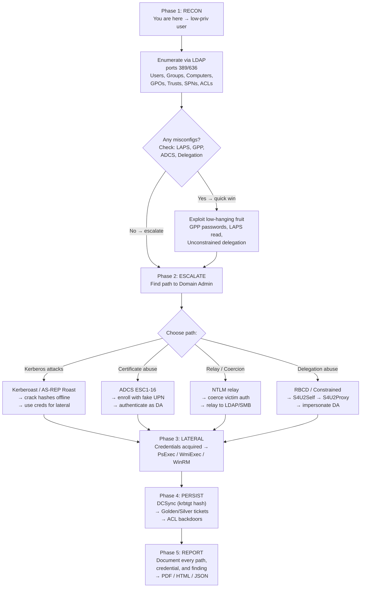

---

## B2: How Kerberos Works — Full Message Flow

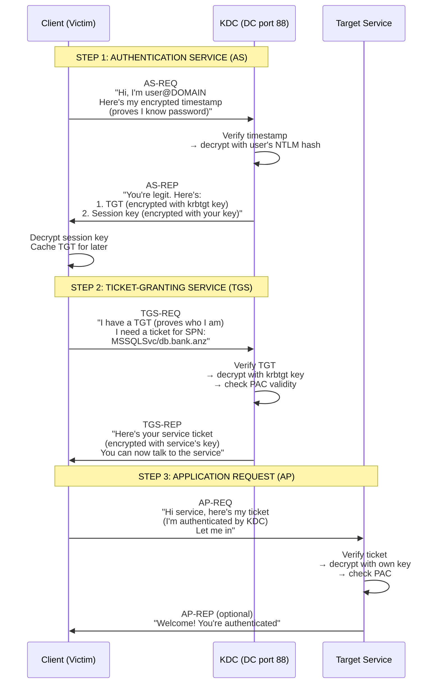

### Kerberos Ticket Anatomy

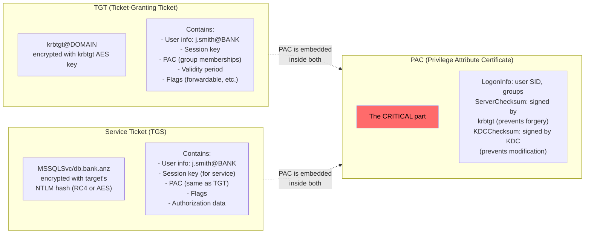

---

## B3: Kerberoasting — Step by Step

### What's happening: You request a service ticket for an SPN-registered account, and the ticket is encrypted with that account's password hash. You crack it offline.

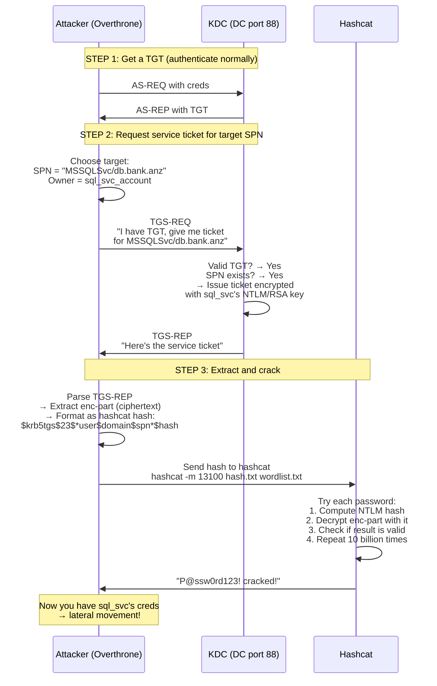

### Kerberoast: Hash Format on the Wire

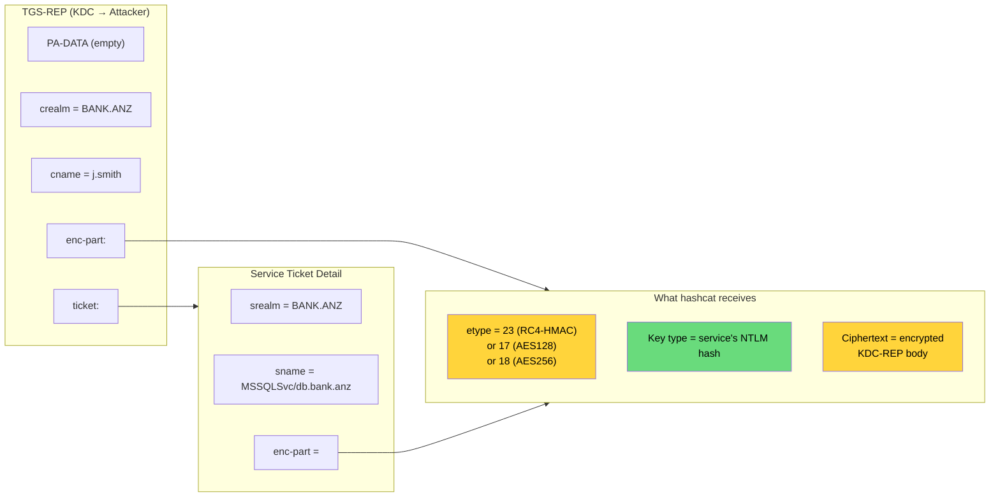

---

## B4: AS-REP Roasting — Step by Step

### What's happening: Some user accounts have "Do not require Kerberos pre-authentication" enabled. You can request a TGT for them without knowing their password. The AS-REP is encrypted with their key — crack it offline.

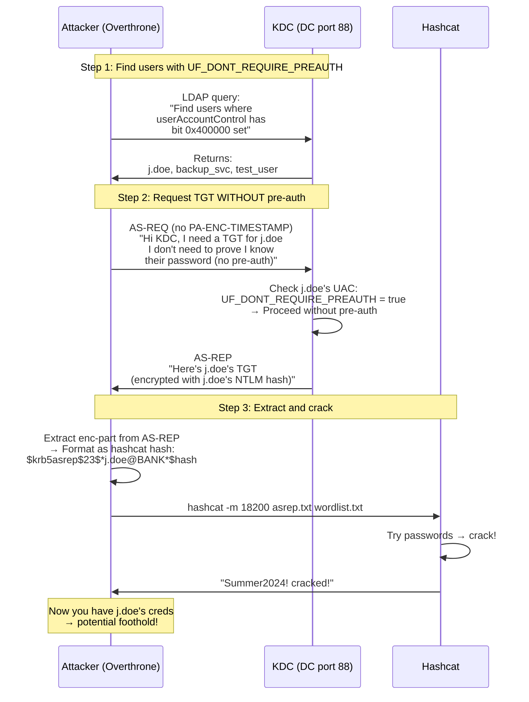

---

## B5: NTLM Relay — Capture and Relay Flow

### What's happening: Victim tries to authenticate to what they think is the real service. You intercept and relay their NTLM tokens to the real target.

```mermaid
sequenceDiagram
    participant V as Victim
    participant A as Attacker (Relay)
    participant T as Target (SMB/LDAP/ADCS)

    Note over V,A: Step 1: Coerce or intercept
    A->>V: Poisoned DNS/LLMNR response:<br/>"The file server you asked for?<br/>That's me! Connect here."
    
    V->>A: TCP connect to attacker's<br/>fake SMB/HTTP server
    
    Note over V,A,T: Step 2: NTLM 3-message handshake
    A->>V: "I challenge you to<br/>authenticate (401 / SMB negotiate)"
    
    V->>A: "Here's my NTLM NEGOTIATE<br/>(who I claim to be)"
    
    Note over A,T: Step 3: Forward to REAL target
    A->>T: "Hello, I'd like to<br/>authenticate (relayed NEGOTIATE)"
    T->>A: "OK, here's my CHALLENGE"
    
    A->>V: "Here's the challenge<br/>(from the REAL target)"
    
    V->>V: Compute AUTHENTICATE<br/>(using challenge from real target)
    V->>A: "Here's my AUTHENTICATE"
    
    A->>T: "Here's the AUTHENTICATE<br/>(relayed from victim)"
    T->>T: Verify AUTH vs challenge<br/>→ Match! Authenticated!
    T->>A: "You're in! (200 OK / SMB session)"
    
    Note over A,T: Step 4: Profit
    A->>T: Now authenticated as victim<br/>→ DCSync / read LAPS / add to group
    
    Note over A,V: Victim thinks they connected to legit service<br/>Victim sees "Access Denied" or timeout<br/>You own the target as victim
```

### NTLM Message Structure (What's on the Wire)

```mermaid
flowchart LR
    subgraph NEGOTIATE["Type 1 (NEGOTIATE)"]
        N1["NTLMSSP header<br/>(8 bytes)"]
        N2["Flags:<br/>0x00000010 = SIGN<br/>0x00000020 = SEAL<br/>0x00080000 = ALWAYS_SIGN"]
        N3["Domain + Workstation<br/>(optional)"]
    end
    
    subgraph CHALLENGE["Type 2 (CHALLENGE)"]
        C1["NTLMSSP header"]
        C2["Server challenge<br/>(8 random bytes)"]
        C3["Target info (AV_PAIRs):<br/>- NbDomainName<br/>- NbComputerName<br/>- DnsDomainName<br/>- ChannelBindings"]
        C4["Flags (which features<br/>the server supports)"]
    end
    
    subgraph AUTH["Type 3 (AUTHENTICATE)"]
        A1["NTLMSSP header"]
        A2["LM response (24 bytes)<br/>or empty"]
        A3["NT response (variable)<br/>= NTLMv2 proof (16 bytes)<br/>+ Client blob (timestamp,<br/>nonce, target info)"]
        A4["Username + Domain"]
        A5["Session key (optional)"]
        A6["MIC (Message Integrity Code)<br/>- proves no tampering<br/>- REMOVED in Drop-the-MIC"]
    end
    
    style A6 fill:#ff6b6b,color:#000
    linkStyle 0,1,2 stroke-width:2px
```

---

## B6: ADCS ESC8 (NTLM Relay to CA) — Full Attack Chain

### What's happening: You coerce a DC to authenticate to your HTTP server, then relay the relayed NTLM tokens to the ADCS Web Enrollment page, and request a certificate on behalf of the DC.

```mermaid
sequenceDiagram
    participant A as Attacker
    participant V as Victim (DC)
    participant C as ADCS CA (target)
    
    A->>A: Start HTTP NTLM relay on port 80
    A->>A: Target = ADCS Web Enrollment<br/>(http://ca01/certsrv/)
    
    Note over A,V: Step 1: Coerce authentication
    A->>V: PetitPotam / PrinterBug<br/>"Hey DC, connect to<br/>my fake HTTP server<br/>at \\attacker\coerce"
    V->>A: TCP connect (HTTP over port 80)
    
    Note over A,V,C: Step 2: NTLM 3-message handshake (relayed)
    A->>V: "401 Unauthorized<br/>WWW-Authenticate: NTLM"
    V->>A: "NTLM NEGOTIATE"
    
    A->>C: "NTLM NEGOTIATE (GET /certsrv/)"<br/>(on attacker→CA connection)
    C->>A: "401 → NTLM CHALLENGE"
    
    A->>V: "NTLM CHALLENGE<br/>(from CA)"
    V->>A: "NTLM AUTHENTICATE<br/>(computed against CA's challenge)"
    
    A->>C: "NTLM AUTHENTICATE (GET /certsrv/)"
    Note over A,C: AUTHENTICATE matches CHALLENGE → Authenticated!
    
    C->>A: "200 OK<br/>(you're in as DC$)"
    
    Note over A,C: Step 3: Enroll for certificate
    A->>C: "POST /certsrv/certfnsh.asp<br/>Mode=newreq<br/>CertRequest=<CSR><br/>CertAttrib=CertificateTemplate:DomainController"
    
    C->>C: DC$ authenticated? Yes<br/>Template permits? Yes<br/>→ Issue certificate
    
    C->>A: "Certificate issued!<br/>ReqID=42<br/>→ Download .cer + .pfx"
    
    Note over A: Step 4: Use certificate<br/>→ Authenticate as DC$<br/>→ DCSync with PKINIT<br/>→ Full domain compromise!
```

### ESC8: Critical Requirements

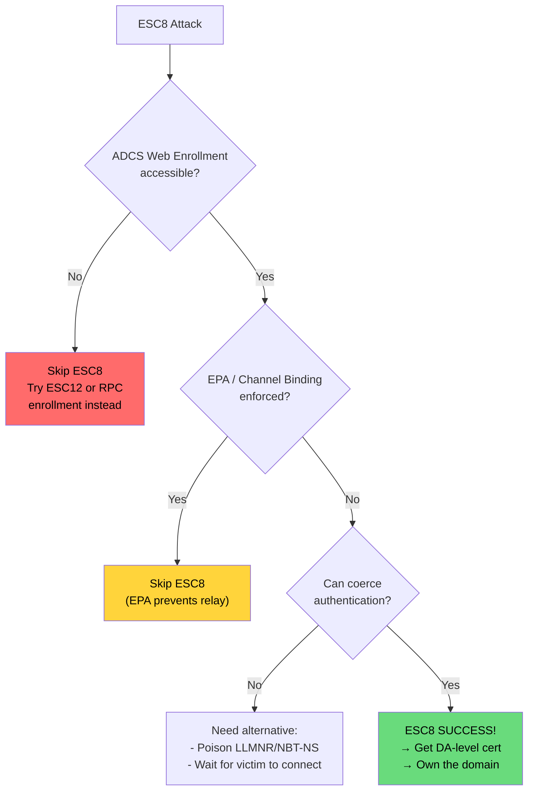

---

## B7: Kerberos Ticket Forging (Golden vs Silver vs Diamond vs Sapphire)

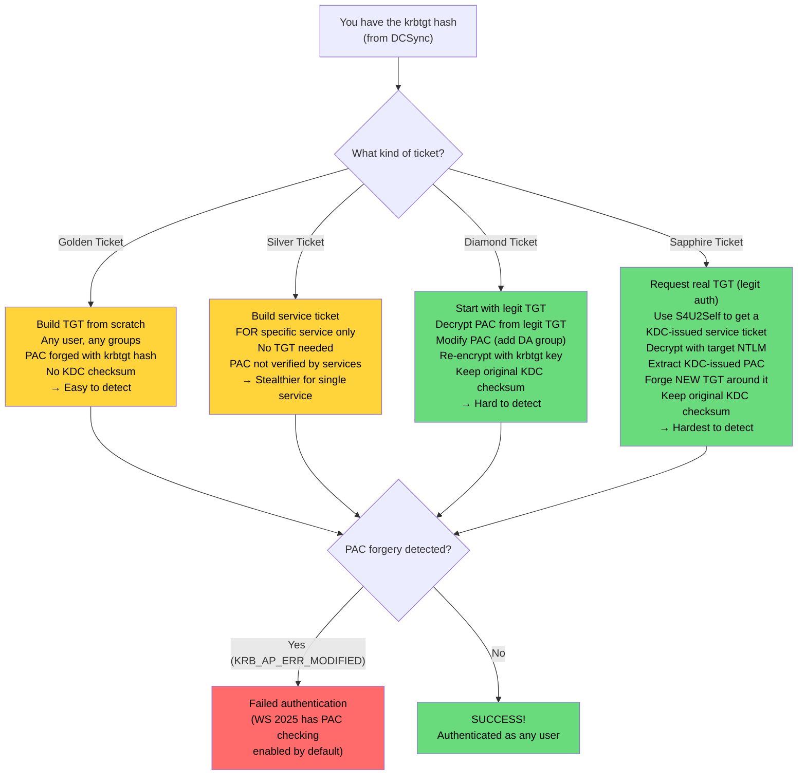

---

## B8: LDAP Signing Bypass (Drop the MIC — CVE-2019-1040)

### What's happening: The NTLM AUTHENTICATE message contains a MIC that proves the negotiation wasn't tampered with. Remove it, clear the signing flags, and the target LDAP server accepts the relayed auth anyway.

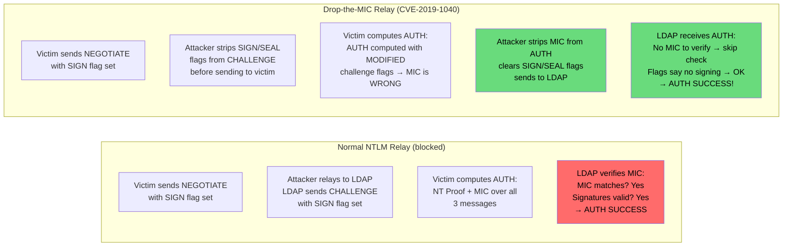

---

## B9: BloodHound Attack Graph — Finding the DA Path

### How Overthrone builds the graph and finds the shortest path to Domain Admin.

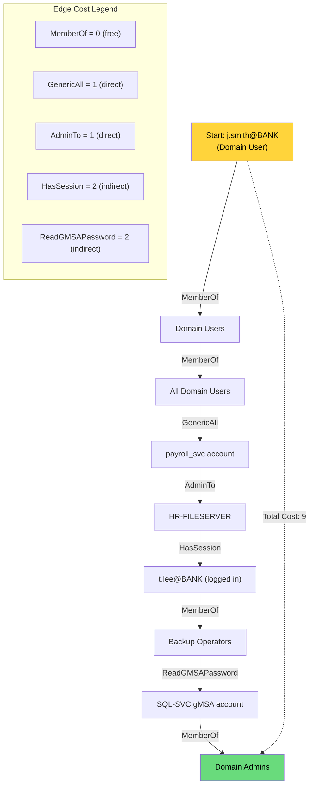

---

## B10: DCSync — The Wire-Level View

### How Overthrone extracts password hashes by pretending to be another Domain Controller.

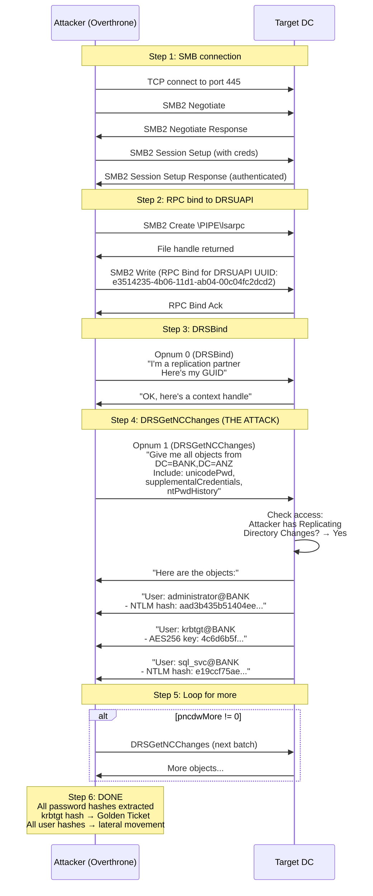

---

## Quick Reference: Key Ports & Protocols

| Port | Protocol | What it's used for in AD pentesting |
|------|----------|-------------------------------------|
| 88 | TCP | Kerberos — ALL attacks go through here (AS-REQ, TGS-REQ, DCSync RPC) |
| 389 | TCP | LDAP — User/group enumeration, ACL reading, ADCS template discovery |
| 636 | TCP | LDAPS — Secure LDAP (same as 389 with TLS) |
| 445 | TCP | SMB — Named pipes, file shares, PsExec/SmbExec, remote registry |
| 135 | TCP | RPC Endpoint Mapper — Find which services are listening on which ports |
| 5985/5986 | TCP | WinRM — Remote PowerShell execution |
| 3389 | TCP | RDP — Remote Desktop (often means someone's logged in → session stealing) |
| 80/443 | TCP | HTTP/HTTPS — ADCS Web Enrollment (ESC8 relay target), Exchange |
| 3899 | TCP | VNC (rare but exploitable) |
| 53 | TCP/UDP | DNS — Zone transfers, AD domain discovery, DNS poisoning |
| 137-139 | UDP | NetBIOS — NBT-NS poisoning (responder) |
| 5355 | UDP | LLMNR — LLMNR poisoning (responder) |
| 5353 | UDP | mDNS — mDNS poisoning (responder) |
| 1801 | TCP | MSMQ — NTLM relay target (rare but possible) |
| 1433 | TCP | MSSQL — Database server, xp_cmdshell for command execution |

---

# APPENDIX C: COMPREHENSIVE GLOSSARY

Every abbreviation used in this document, expanded and explained in plain English.

---

## Protocols & Network

| Abbr | Full Form | Plain English |
|------|-----------|---------------|
| **AD** | Active Directory | Microsoft's directory service — the master database of users, computers, groups, and permissions in a Windows domain. The castle. |
| **LDAP** | Lightweight Directory Access Protocol | The protocol for querying and modifying AD. Think "SQL for directories" — you ask LDAP questions like "who are all the users?" and AD answers. |
| **LDAPS** | LDAP over TLS | LDAP wrapped in TLS encryption (port 636). The secure tunnel version. |
| **SMB** | Server Message Block | Windows file-sharing protocol. Also used for named pipes, remote admin, and printer sharing. The backbone of lateral movement. |
| **SMB2** | Server Message Block v2 | Modern version of SMB (Vista/2008+). Faster, fewer dialects, mandatory signing in modern Windows. What Overthrone implements in pure Rust. |
| **NTLM** | Windows NT LAN Manager | Microsoft's legacy authentication protocol. Still everywhere. Still exploited daily. Challenge-response based. |
| **NTLMv2** | NTLM version 2 | The modern version of NTLM with stronger crypto and timestamp-based protection. Still relayable with the right tricks. |
| **MS-DRSR** | Microsoft Directory Replication Service | The RPC protocol domain controllers use to replicate AD data between each other. DCSync abuses this — you pretend to be a DC and ask for a copy of everything. |
| **MSSQL** | Microsoft SQL Server | Microsoft's database server. Often runs with high privileges. `xp_cmdshell` can give you command execution. |
| **TDS** | Tabular Data Stream | The wire protocol MSSQL speaks to clients. Overthrone implements TDS 7.4 natively to talk to MSSQL without any Microsoft drivers. |
| **DNS** | Domain Name System | The phonebook of the internet — converts domain names (bank.anz) to IP addresses. Also used by AD for service discovery. |
| **DHCPv6** | Dynamic Host Configuration Protocol v6 | IPv6's version of DHCP. DHCPv6 poisoning tricks clients into using the attacker as their DNS server. |
| **ICMPv6** | Internet Control Message Protocol v6 | The IPv6 version of ping. Used by DHCPv6 poisoning for router advertisement spoofing. |
| **HTTP** | Hypertext Transfer Protocol | The web protocol. Used by Overthrone for ADCS web enrollment relay and responder. |
| **HTTPS** | HTTP Secure | HTTP over TLS. Same as HTTP but encrypted. |
| **TCP** | Transmission Control Protocol | The reliable connection-oriented transport protocol. Kerberos runs over TCP:88. |
| **IPC** | Inter-Process Communication | How processes on Windows talk to each other. SMB named pipes are the most common IPC mechanism for remote admin. |
| **RPC** | Remote Procedure Call | A protocol that lets a program call a function on a remote computer as if it were local. DCSync, PsExec, and most Windows admin tools use RPC. |
| **DCE/RPC** | Distributed Computing Environment / RPC | The standard RPC protocol Windows uses. The "DCE" part came from the Open Software Foundation in the 1990s. Still in use today. |
| **EPM** | Endpoint Mapper | The RPC service that tells clients "if you want to talk to service X, connect to port Y." Runs on port 135. |
| **MSMQ** | Microsoft Message Queuing | A queued messaging protocol. Occasionally used as an NTLM relay target. |
| **TLS** | Transport Layer Security | The encryption layer that secures HTTPS, LDAPS, and most modern protocols. Replaced SSL. |
| **SASL** | Simple Authentication and Security Layer | A framework that wraps authentication mechanisms (like NTLM) inside other protocols (like LDAP). How LDAP does NTLM auth. |
| **MOF** | Managed Object Format | WMI's schema definition language. Used in some WMI-based attacks. |
| **ICMP** | Internet Control Message Protocol | The protocol for ping, traceroute, and network diagnostics. Sometimes used for data exfiltration. |

---

## Kerberos

| Abbr | Full Form | Plain English |
|------|-----------|---------------|
| **KDC** | Key Distribution Center | The Kerberos service on the Domain Controller that issues tickets. The ticket booth. |
| **TGT** | Ticket-Granting Ticket | The "golden ticket" (literally). A Kerberos ticket that proves you authenticated successfully. You present this to get service tickets. |
| **TGS** | Ticket-Granting Service | The service within the KDC that issues service tickets when you present your TGT. |
| **AS-REQ** | Authentication Service Request | The first message in Kerberos — "Hello KDC, I'm John, here's my encrypted timestamp, please give me a TGT." |
| **AS-REP** | Authentication Service Response | The KDC's reply to AS-REQ — "Here's your TGT, encrypted with your password hash." |
| **TGS-REQ** | Ticket-Granting Service Request | "Hey KDC, I have a TGT. Give me a ticket for MSSQLSvc/db.bank.anz." |
| **TGS-REP** | Ticket-Granting Service Response | "Here's your service ticket, encrypted with the service account's key." |
| **AP-REQ** | Application Request | The message the client sends to the actual service — "Here's my ticket, let me in." |
| **PAC** | Privilege Attribute Certificate | The part of a Kerberos ticket that contains the user's group memberships, SIDs, and authorization data. Forging this = domain admin. |
| **SPN** | Service Principal Name | A unique identifier for a service in Kerberos format: `MSSQLSvc/db.bank.anz:1433`. Kerberoasting targets accounts with registered SPNs. |
| **SPNEGO** | Simple and Protected GSS-API Negotiation | A protocol for negotiating which security mechanism to use between client and server. Kerberos or NTLM. |
| **UPN** | User Principal Name | A user's login name in email format: `john.smith@bank.anz`. Used extensively in certificate SAN abuse (ESC1). |
| **FAST** | Flexible Authentication via Secure Tunneling | Also called Kerberos armoring. Wraps Kerberos messages in an encrypted tunnel to prevent tampering. RFC 6806. |
| **PKINIT** | Public Key Cryptography for Initial Authentication | Using a certificate (smart card or PKCS#12) instead of a password for Kerberos initial authentication. How Shadow Credentials work. |
| **S4U2Self** | Service for User to Self | A Kerberos extension that lets a service request a ticket on behalf of a user TO itself. First step of constrained delegation abuse. |
| **S4U2Proxy** | Service for User to Proxy | A Kerberos extension that lets a service request a ticket on behalf of a user TO another service. Second step of delegation abuse. |
| **ETYPE** | Encryption Type | The encryption algorithm used to protect Kerberos messages. Common types: 23 (RC4), 17 (AES128), 18 (AES256). |
| **KRB_CRED** | Kerberos Credential | The ASN.1 structure that wraps one or more Kerberos tickets for transmission or storage. Used in .kirbi files. |
| **ASN.1** | Abstract Syntax Notation One | A standard for describing data structures in telecommunications and networking. Kerberos messages are ASN.1 encoded. |
| **DER** | Distinguished Encoding Rules | A binary encoding format for ASN.1. How Kerberos messages look on the wire. |
| **KIRBI** | Kerberos KIRBI file | A file format for storing Kerberos tickets (usually base64-encoded KRB_CRED). Named after the .kirbi extension Mimikatz popularized. |
| **CCACHE** | Credential Cache file | MIT Kerberos's file format for storing tickets. The other main ticket format alongside .kirbi. |

---

## ADCS (Certificate Services)

| Abbr | Full Form | Plain English |
|------|-----------|---------------|
| **ADCS** | Active Directory Certificate Services | Microsoft's Public Key Infrastructure (PKI) server. Issues certificates for smart cards, VPN, HTTPS, etc. Also has 16 known vulnerability classes (ESC1-16). |
| **ESC** | Escalation (in ADCS context) | Short for "Escalation of Privilege" — a numbered class of ADCS misconfiguration that lets attackers escalate privileges. ESC1 through ESC16. |
| **CA** | Certificate Authority | The server that issues and manages certificates. The "notary public" of the PKI world. |
| **CSR** | Certificate Signing Request | A request for a certificate containing the applicant's public key and identity information. Overthrone builds malicious CSRs with fake identities. |
| **SAN** | Subject Alternative Name | Additional identities a certificate is valid for. ESC1 exploits templates that let you put any UPN in the SAN. |
| **EKU** | Extended Key Usage | What a certificate is allowed to be used for (e.g., Client Authentication, Server Authentication, Smart Card Logon). Templates with dangerous EKUs are ESC targets. |
| **OID** | Object Identifier | A globally unique number that identifies things in PKI (e.g., `1.3.6.1.5.5.7.3.2` = Client Authentication). Used in ESC13 for issuance policies. |
| **PFX** | Personal Information Exchange | A file format (PKCS#12) containing a certificate and its private key. What you get after successful ADCS exploitation. |
| **PKCS** | Public-Key Cryptography Standards | A family of standards for public key infrastructure. PKCS#12 = PFX files. PKCS#10 = CSR format. |
| **EPA** | Extended Protection for Authentication | A security feature that binds NTLM authentication to the TLS channel to prevent relay. ESC8 works when EPA is NOT enforced. |
| **ICertPassage** | Interface Certificate Passage | An RPC interface for certificate enrollment. ESC11 attacks this when the web enrollment isn't exposed. |

---

## Crypto & Security

| Abbr | Full Form | Plain English |
|------|-----------|---------------|
| **AES** | Advanced Encryption Standard | The gold-standard symmetric encryption algorithm. Used in Kerberos (AES128/AES256), LAPS v2, and ADCS crypto. |
| **AES-CTS** | AES Ciphertext Stealing | A variant of AES-CBC used by Kerberos. Doesn't need padding because it "steals" bits from the penultimate block. |
| **RC4** | Rivest Cipher 4 | An old stream cipher. Used by Kerberos RC4-HMAC (etype 23). Being deprecated everywhere because it's weak and you can crack the key offline. |
| **HMAC** | Hash-Based Message Authentication Code | A keyed hash that proves a message wasn't tampered with. Used in SMB signing, Kerberos checksums, and NTLM. |
| **MD4** | Message Digest 4 | A hash function used by NTLM to derive the NT hash from a password. Broken as a cryptographic hash, but still used everywhere. |
| **MD5** | Message Digest 5 | A hash function. Used in Kerberos checksums (HMAC-MD5). Also broken, also everywhere. |
| **SHA1** | Secure Hash Algorithm 1 | A hash function used in Kerberos AES HMAC. Being deprecated but still in use. |
| **SHA256** | Secure Hash Algorithm 256-bit | A modern secure hash function. Used in SMB2 packet signing and modern crypto. |
| **RSA** | Rivest-Shamir-Adleman | The most widely used public-key cryptosystem. Used by ADCS for certificate signing and by PKINIT for authentication. |
| **DH** | Diffie-Hellman | A key exchange algorithm. Used by PKINIT to establish a shared session key without exposing the private key. |
| **DPAPI** | Data Protection API | Windows crypto API that encrypts data tied to a user or machine. LAPS v2 uses DPAPI. Breaking it requires the domain backup key. |
| **MIC** | Message Integrity Code | A cryptographic checksum in NTLM that proves the message wasn't tampered with. CVE-2019-1040 "Drop the MIC" removes it. |
| **CG / CredGuard** | Credential Guard | A Windows security feature that isolates LSASS in a virtualized container. Prevents Mimikatz-style credential dumping. |
| **LSA** | Local Security Authority | The Windows subsystem that manages authentication. Contains credential material attackers want. |
| **LSASS** | LSA Subsystem Service | The process (lsass.exe) that holds user credentials in memory. The primary target for credential dumping — unless Credential Guard is enabled. |
| **LSAISO** | LSA Isolated | The isolated LSA process (lsaiso.exe) used by Credential Guard. When CG is on, credentials live here, not in LSASS. |
| **AMSI** | Anti-Malware Scan Interface | A Windows API that allows applications to send content (scripts, macros, PowerShell) to antivirus for scanning before execution. |
| **ETW** | Event Tracing for Windows | Windows' built-in logging and telemetry system. EDRs rely on ETW heavily. Overthrone's EDR bypass disables ETW provider callbacks. |
| **SSN** | System Service Number | A number assigned to each Windows syscall (e.g., NtCreateFile = 0x55). EDRs hook syscalls; Overthrone re-resolves SSNs to bypass hooks. |

---

## Attack Techniques & Tools

| Abbr | Full Form | Plain English |
|------|-----------|---------------|
| **DCSync** | Domain Controller Synchronization | An attack that abuses AD replication to extract password hashes from a DC. Pretends to be another DC requesting a copy of all user secrets. |
| **DSRM** | Directory Services Restore Mode | A special admin account for recovering a DC. The DSRM password hash can be used for persistence if you have local admin on the DC. |
| **RBCD** | Resource-Based Constrained Delegation | A delegation model where the RESOURCE (not the DC) controls who can delegate to it. If you have write access to a computer's `msDS-AllowedToActOnBehalfOfOtherIdentity` attribute, you can impersonate any user to that computer. |
| **S4U2Proxy** | Service for User to Proxy | Kerberos extension that lets a service impersonate a user to ANOTHER service. RBCD and constrained delegation abuse hinge on this. |
| **S4U2Self** | Service for User to Self | Kerberos extension that lets a service request a ticket for a user TO itself. Used as a stepping stone for delegation attacks. |
| **GPO** | Group Policy Object | A collection of policy settings applied to users/computers in AD. Misconfigured GPOs = instant domain admin in many cases. |
| **GPP** | Group Policy Preference | Old-style GPO settings (pre-Windows 10) that stored passwords encrypted with a published AES key. Free hashes since 2012. |
| **LAPS** | Local Administrator Password Solution | Microsoft's tool for managing local admin passwords on domain-joined computers. LAPS v1 stored passwords in plaintext in LDAP. LAPS v2 encrypts them with DPAPI. |
| **ACL** | Access Control List | A list of permissions attached to an AD object specifying who can do what. Overthrone enumerates ACLs to find privilege escalation paths. |
| **DACL** | Discretionary Access Control List | The part of the ACL that specifies who has what access. Modified for ACL backdoor persistence. |
| **SID** | Security Identifier | A unique identifier for every user, group, and computer in AD. SID filtering analysis detects cross-forest trust vulnerabilities. |
| **SIDHistory** | Security Identifier History | An AD attribute that holds old SIDs for migrated users. Can be abused to gain cross-domain access if SID filtering is disabled. |
| **PE** | Portable Executable | The Windows executable file format (.exe, .dll). Overthrone works with PE files for DLL injection and skeleton key loading. |
| **DLL** | Dynamic-Link Library | Windows' shared library format (.dll). Overthrone uses native DLL plugins and injects the skeleton key DLL into LSASS. |
| **WASM** | WebAssembly | A binary instruction format for virtual machines. Overthrone's plugin system supports WASM plugins via wasmtime for cross-platform extensibility. |
| **NOPAC** | No PAC (CVE-2021-42278 / CVE-2021-42287) | A pair of CVEs allowing domain privilege escalation by exploiting how the KDC handles PAC-less tickets. Overthrone implements this exploit. |
| **Bronze Bit** | CVE-2020-17049 | A vulnerability in S4U2Proxy that allows forging service tickets across trust boundaries without the TGT. Overthrone implements this in `bronze_bit.rs`. |
| **CIFS** | Common Internet File System | SMB's older name. Still used as a service principal name in Kerberos: `CIFS/fileserver.bank.anz`. |
| **PTT** | Pass-the-Ticket | Injecting a Kerberos ticket into your session to impersonate another user. How golden/silver tickets are used. |
| **PTH** | Pass-the-Hash | Using an NTLM hash directly for authentication without knowing the password. The hash IS the password. |
| **OVT** | Overthrone | The CLI shorthand for the Overthrone binary. `ovt auto-pwn` is the same as `overthrone auto-pwn`. 3 keystrokes instead of 10. |

---

## Relay & Poisoning

| Abbr | Full Form | Plain English |
|------|-----------|---------------|
| **LLMNR** | Link-Local Multicast Name Resolution | A protocol for name resolution on local networks. When a host fails DNS, it broadcasts an LLMNR query. Overthrone poisons these queries. |
| **NBT-NS** | NetBIOS Name Service | Legacy name resolution protocol. Same concept as LLMNR, older. Also poisoned by Overthrone. |
| **mDNS** | Multicast DNS | Apple's name resolution protocol (Bonjour). Also used on Linux. Also poisoned. |
| **WPAD** | Web Proxy Auto-Discovery Protocol | A protocol for automatically configuring browser proxy settings. Poisoning WPAD = intercepting all web traffic. |
| **MAPI** | Messaging API | The protocol Exchange uses for client communication. Exchange NTLM relay targets MAPI endpoints. |
| **EWS** | Exchange Web Services | Exchange's SOAP-based web API. Alternative MAPI target for NTLM relay. |
| **WEBDAV** | Web Distributed Authoring and Versioning | An extension to HTTP for file management. Sometimes used as an NTLM relay target. |
| **SMBDaemon** | SMB Daemon | A standalone SMB server for credential capture. Separate from the LLMNR/NBT-NS poisoner. |
| **MITM6** | Man-in-the-Middle IPv6 | DHCPv6 poisoning tool that Overthrone integrates. Sets the attacker as DNS server to intercept traffic. |

---

## C2 & Post-Exploitation

| Abbr | Full Form | Plain English |
|------|-----------|---------------|
| **C2** | Command and Control | The infrastructure attackers use to communicate with compromised machines. Overthrone integrates with Cobalt Strike, Sliver, and Havoc. |
| **CS** | Cobalt Strike | A commercial adversary simulation framework. Overthrone's C2 integration can deploy CS beacons and interact with CS sessions. |
| **C2Channel** | C2 Channel Trait | Overthrone's Rust trait that abstracts C2 operations (connect, exec, upload, inject) across different C2 frameworks. |
| **EDR** | Endpoint Detection and Response | Security software that monitors endpoints for malicious activity (CrowdStrike, Defender, SentinelOne). Overthrone's 1,575-line module evades it. |
| **NTDLL** | NT Layer DLL | The core Windows system DLL (ntdll.dll) that contains syscall stubs. EDRs hook it. Overthrone unhooks it. |
| **EULA** | End User License Agreement | Not used in this document — but good to know it's EULA, not something else. |
| **BOF** | Beacon Object File | Cobalt Strike's format for executing C code in beacon memory without writing to disk. Used by C2-based post-ex tools. |

---

## CLI & Configuration

| Abbr | Full Form | Plain English |
|------|-----------|---------------|
| **CLI** | Command Line Interface | Text-based interface where you type commands. Overthrone's primary interface with 29+ subcommands. |
| **TUI** | Terminal User Interface | A visual text-based interface (like a GUI but in the terminal). Overthrone uses ratatui for its TUI. |
| **GUI** | Graphical User Interface | A visual interface with windows, buttons, and graphs. Overthrone's viewer crate serves a browser-based GUI. |
| **REPL** | Read-Eval-Print Loop | An interactive shell where you type commands and see results immediately. Overthrone has a rustyline-powered REPL. |
| **TOML** | Tom's Obvious Minimal Language | A configuration file format. Used by Overthrone for config files and profiles. Similar to INI but better. |
| **JSON** | JavaScript Object Notation | A ubiquitous data format for structured data. Used by Overthrone for serialization and API responses. |
| **YAML** | YAML Ain't Markup Language | A human-readable data serialization format. Used for Overthrone's playbook definitions. |
| **HTML** | HyperText Markup Language | The format of web pages. Used by Overthrone's viewer crate for the browser GUI. |
| **CSV** | Comma-Separated Values | A simple spreadsheet format. Used for BloodHound data export by the reaper crate. |
| **TUI** | (defined above) | |
| **OPSEC** | Operations Security | The practice of avoiding detection. Overthrone has `--stealth` mode and OpSec noise gating for this. |
| **JIT** | Just-In-Time Compilation | Not directly used in Overthrone, but relevant to WASM plugin execution. |
| **XDG** | X Desktop Group | A Linux standard for config file locations (`~/.config/`). Overthrone follows XDG conventions on Linux. |
| **ENV** | Environment Variable | Operating system variables that configure program behavior. Overthrone reads `OT_CONFIG`, `OT_PROFILE`, `OT_DC_HOST`, etc. |

---

## Rust & Programming

| Abbr | Full Form | Plain English |
|------|-----------|---------------|
| **FFI** | Foreign Function Interface | Rust's mechanism for calling C/C++ code and vice versa. Used by Overthrone's native plugin system. |
| **ABI** | Application Binary Interface | The low-level calling conventions (how functions pass parameters, return values, and use the stack) between compiled code. |
| **GC** | Garbage Collection / Garbage Collector | Automatic memory management. Rust doesn't have one — ownership and borrowing handle memory at compile time. |
| **GIL** | Global Interpreter Lock | Python's mechanism that prevents multiple threads from executing Python bytecode simultaneously. Rust doesn't have this limitation. |
| **API** | Application Programming Interface | A set of functions/protocols that one program uses to interact with another. |
| **Rc** | Reference Counted | Rust's single-threaded reference-counting smart pointer. Counts references; deallocates when count reaches zero. NOT thread-safe. |
| **Arc** | Atomically Reference Counted | Rust's thread-safe reference-counted smart pointer. Uses atomic operations for the counter. Used everywhere in Overthrone for shared state. |
| **RwLock** | Read-Write Lock | A synchronization primitive allowing multiple readers OR one writer. Overthrone wraps the attack graph in `Arc<RwLock<>>`. |
| **Mutex** | Mutual Exclusion Lock | A synchronization primitive for exclusive access. Overthrone's CredStore uses `Mutex<Vec<CredEntry>>`. |
| **Vec** | Vector | Rust's dynamic array type. Grows and shrinks at runtime. The standard go-to for owning a sequence. |
| **HashMap** | Hash Map | A hash table — key-value store with O(1) average lookup. |
| **Trait** | Trait | Rust's version of interfaces. Defines shared behavior. `Send`, `Sync`, `Clone`, `Debug`, `Serialize` are all traits. |
| **Enum** | Enumeration | A type that can be one of several variants. OverthroneError, EdgeType, AuthMethod are all enums. |
| **Struct** | Structure | A composite data type grouping related fields. ForgeConfig, AdNode, CliConfig are all structs. |
| **Derive** | Derive Macro | An attribute (`#[derive(Debug)]`) that automatically generates trait implementations. Saves massive boilerplate. |
| **Macro** | Macro | Code that writes code. Derive macros, `println!`, `vec!`, and custom proc-macros are examples. |
| **Proc-Macro** | Procedural Macro | The most powerful kind of Rust macro — runs arbitrary Rust code at compile time to transform the AST. `#[derive(Serialize)]` is implemented as a proc-macro. |
| **Async** | Asynchronous | A programming model for concurrent operations without threads. Tokio is Rust's async runtime. |
| **Await** | Await | The keyword that suspends an async function until a future resolves. `channel.send(msg).await` — wait for the send to complete. |
| **Future** | Future | A value that will be available at some point. The core abstraction of async Rust. Every `async fn` returns a `Future`. |
| **Tokio** | Tokio | The most popular async runtime for Rust. Overthrone uses tokio for all async operations (relay, viewer, pilot, etc.). |
| **Axum** | Axum | A web framework built on tokio/hyper/tower. Used by Overthrone's viewer crate. |
| **Serde** | Serialize/Deserialize | The most popular serialization framework for Rust. One derive macro = JSON, TOML, or any other format. |
| **ThisError** | This Error | A derive macro for implementing `std::error::Error` on enums. OverthroneError uses this. |
| **Anyhow** | Anyhow | A flexible error handling library. Used by the CLI layer to handle heterogeneous error types with `?`. |
| **Clap** | Command Line Argument Parser | A Rust library for parsing CLI arguments. Powers Overthrone's 29+ subcommands. |
| **Petgraph** | Pet Graph | A graph data structure library for Rust. Overthrone uses `petgraph::DiGraph` for the attack graph and Dijkstra pathfinding. |
| **Libloading** | Library Loading | A Rust library for dynamically loading native libraries (.dll/.so). Used by the native plugin loader. |
| **Wasmtm** | WebAssembly Time | A WebAssembly runtime. Overthrone uses wasmtime to run WASM plugins. |
| **Rustyline** | Rusty Line | A Rust readline implementation. Powers Overthrone's interactive REPL shell. |
| **Ratatui** | Ratatui | A Rust TUI framework. Powers Overthrone's graph visualizer and session explorer. |
| **Futures** | Futures | The futures-rs crate providing `Future` combinators like `join_all`, `select`, etc. |
| **Rayon** | Rayon | A data parallelism library for Rust. Used by Overthrone for parallel hash cracking with the embedded wordlist. |
| **Crate** | Crate | A Rust package. Overthrone is a workspace of 10 crates. |
| **Workspace** | Workspace | A set of crates that share a common Cargo.lock and output directory. Overthrone's root Cargo.toml defines a workspace of 10 crates. |
| **Target** | Target Directory | Where Rust places compiled binaries (`target/debug/`, `target/release/`). |
| **Cargo** | Cargo | Rust's build system and package manager. `cargo build`, `cargo test`, `cargo clippy`. |
| **Clippy** | Clippy | Rust's linter. Enforces idiomatic code. Run with `cargo clippy`. |
| **Rustc** | Rust Compiler | The Rust compiler. Turns `.rs` files into binaries. |
| **LLVM** | Low Level Virtual Machine | The compiler backend Rust uses. Generates optimized machine code. |
| **AST** | Abstract Syntax Tree | The tree representation of source code that the compiler works with. Proc-macros transform the AST. |
| **VTable** | Virtual Table | A table of function pointers used for dynamic dispatch (trait objects). `Box<dyn Trait>` uses vtables. |
| **Fat Pointer** | Fat Pointer | A pointer that carries extra metadata. `&[u8]` is a fat pointer (address + length). `Box<dyn Trait>` is a fat pointer (data + vtable). |
| **MIR** | Mid-Level Intermediate Representation | Rust's intermediate representation between AST and LLVM IR. Used for borrow checking and optimizations. |
| **IR** | Intermediate Representation | A compiler's internal representation of code between parsing and code generation. |
| **SIMD** | Single Instruction Multiple Data | A CPU feature for parallel data processing. Used by some Rust crypto libraries for performance. |
| **Const** | Constant | A compile-time constant value. Overthrone embeds the skeleton key DLL bytes as a `const &[u8]`. |
| **Static** | Static | A global variable with a fixed memory address. Used for things like `PLUGIN_INFO`. |
| **LTO** | Link Time Optimization | Optimization across compilation unit boundaries during linking. Smaller binaries, faster code. |
| **CFG** | Configuration | Conditional compilation. `#[cfg(windows)]` means "only compile this on Windows." |

---

## Windows Internals

| Abbr | Full Form | Plain English |
|------|-----------|---------------|
| **COM** | Component Object Model | Microsoft's original component technology. Used by WMI, DCOM, and many Windows APIs. Overthrone uses it for WmiExec on Windows. |
| **DCOM** | Distributed COM | COM over the network. Used by WMI for remote management. Windows-only. |
| **WMI** | Windows Management Instrumentation | Microsoft's management and instrumentation framework. Query system info, run processes, manage services remotely. |
| **WinRM** | Windows Remote Management | Microsoft's implementation of WS-Management protocol. Remote PowerShell and command execution over HTTP/HTTPS. |
| **SVCCTL** | Service Control Manager | The Windows component that manages services. PsExec and SmbExec abuse the SVCCTL RPC interface. |
| **RID** | Relative Identifier | The last part of a SID that uniquely identifies a user/group within a domain. RID 500 = Administrator. RID cycling enumerates valid users by trying RIDs. |
| **NTDS** | NT Directory Services | The AD database file (NTDS.dit). Stored on DCs. Contains all objects, passwords, and policies. The jackpot for secrets dumping. |
| **SAM** | Security Account Manager | The local account database on Windows machines. Contains local user hashes. Offline extraction via registry hives. |
| **DCC2** | Domain Cached Credentials v2 | Cached domain logon hashes stored on a machine. Allows offline extraction of domain credentials, limited to last 10 logons by default. |
| **REG** | Registry | Windows' hierarchical configuration database. Remote registry access via SMB named pipes. Used by CG detection. |
| **PE** | (defined above) | |
| **UEFI** | Unified Extensible Firmware Interface | The modern replacement for BIOS. Credential Guard uses UEFI lock to prevent disabling without physical access. |
| **VSM** | Virtual Secure Mode | Windows' virtualization-based security. Credential Guard runs LSASS in a VSM-isolated environment. |
| **API** | (defined above) | |
| **LPC** | Local Procedure Call | Inter-process communication within a Windows machine. LSALPC is the channel between LSASS and its clients. |
| **ALPC** | Advanced Local Procedure Call | The modern version of LPC. Used by some post-exploitation techniques. |

---

## General

| Abbr | Full Form | Plain English |
|------|-----------|---------------|
| **ANZ** | Australia and New Zealand Banking Group | One of Australia's "Big Four" banks. The interview is for their pentesting team. |
| **MITRE ATT&CK** | MITRE Adversarial Tactics, Techniques, and Common Knowledge | A globally-accessible knowledge base of adversary tactics and techniques based on real-world observations. |
| **CVSS** | Common Vulnerability Scoring System | A standardized scoring system for vulnerability severity (0-10). Base score > 7 is "High." > 9 is "Critical." |
| **CVE** | Common Vulnerabilities and Exposures | A dictionary of publicly disclosed cybersecurity vulnerabilities. Each gets a unique ID like CVE-2024-21410. |
| **TL;DR** | Too Long; Didn't Read | Internet shorthand for "give me the summary." You'll find these in every good README. |
| **RFC** | Request for Comments | Internet standards documents. SMB2 = RFC, NTLM = RFC, Kerberos = RFC 4120. The IETF's way of saying "this is how it works." |
| **UUID** | Universally Unique Identifier | A 128-bit unique identifier. Used for RPC interfaces, AD objects, and plugin IDs. |
| **GUID** | Globally Unique Identifier | Microsoft's term for UUID. 128-bit, used everywhere in COM, RPC, and AD. |
| **MIDL** | Microsoft Interface Definition Language | The language used to define COM/RPC interfaces. Not used directly by Overthrone (we use the Rust implementations). |
| **HTB** | Hack The Box | A popular penetration testing training platform. Overthrone is tested against HTB/THM AD environments. |
| **THM** | TryHackMe | A cybersecurity training platform. Overthrone is tested here too. |
| **CTF** | Capture The Flag | A cybersecurity competition format. Overthrone is tested in CTF environments. |
| **GOAD** | Game of Active Directory | A deliberately vulnerable AD lab for training. Target environment for Overthrone testing. |
| **HVM** | Hardware Virtual Machine | Not directly in the doc, but relevant to Virtual Secure Mode / Credential Guard. |
| **DA** | Domain Admin | The highest-privilege group in a Windows domain. The target of most AD attacks. |
| **EA** | Enterprise Admin | Forest-wide admin group. Above Domain Admin in multi-domain forests. Controls everything. |
| **MSA** | Managed Service Account | An AD account whose password is managed automatically by the DC. |
| **gMSA** | Group Managed Service Account | MSA for multiple servers. Password is retrieved from AD by authorized computers. Overthrone reads gMSA passwords. |
| **KDC** | (defined under Kerberos) | |
| **WS 2025** | Windows Server 2025 | The latest Windows Server release. Has tightened security defaults that break some classic AD attack techniques. |
| **BH / BloodHound** | BloodHound | An AD attack path mapping tool. Overthrone can read and write BloodHound JSON format, no Neo4j required. |
| **JSON** | (defined above) | |

---

# APPENDIX C: COMPLETE AD ATTACK TECHNIQUES CATALOGUE

Every major Active Directory attack technique, exploit, and CVE — what it targets, how it works, and the impact. Organized by category.

---

## 1. KERBEROS ATTACKS

| Technique | What It Targets | How It Works | Impact | Overthrone Support |
|-----------|----------------|--------------|--------|-------------------|
| **Kerberoasting** | Service accounts with SPNs | Request TGS for service account, crack encrypted TGS part offline to reveal the service account password | Compromise service account (often high-privilege) | ✅ `ovt kerberos roast` |
| **AS-REP Roasting** | User accounts without Kerberos pre-authentication | Request AS-REP without pre-auth, the DC sends encrypted timestamp you can crack offline | Compromise user account that didn't require pre-auth | ✅ `ovt kerberos asrep` |
| **Golden Ticket** | The `krbtgt` account (domain KDC account) | Forge a TGT using the stolen `krbtgt` hash. Valid for any user, any group membership, any time range | Complete domain compromise — access ANY resource as ANY user | ✅ `ovt forge golden` |
| **Silver Ticket** | Any service account | Forge a TGS for a specific service using the service account's hash | Access to that specific service (e.g., CIFS, HOST, MSSQLSvc) without any DC contact | ✅ `ovt forge silver` |
| **Diamond Ticket** | The `krbtgt` account + KDC | Decrypt a real TGT, modify PAC, re-encrypt with stolen krbtgt hash. Harder to detect than Golden Ticket | Same as Golden Ticket but evades some detection | ✅ `ovt forge diamond` |
| **Sapphire Ticket** | KDC issued PAC bypass | Exploits how KDC validates PAC signatures. Allows PAC forgery without the krbtgt key | Domain compromise without needing krbtgt hash | ✅ `ovt forge sapphire` |
| **Pass-the-Ticket (PTT)** | Any Kerberos ticket on a machine | Extract a TGT or TGS from one machine and inject it into your session on another | Impersonate any user whose ticket you can steal | ✅ Ticket injection in `tickets.rs` |
| **Pass-the-Key / Overpass-the-Hash** | User's Kerberos keys (derived from password hash) | Use NTLM hash to request a TGT (instead of password), then use the TGT to access services | Turns NTLM hash into full Kerberos access | ✅ `ovt kerberos get-tgt --nt-hash` |
| **Kerberos Delegation Abuse** | Computers/users with delegation configured | Abuse constrained/unconstrained/resource-based delegation to impersonate users to services | Compromise targets the delegated account can access | ✅ `ovt kerberos delegated` |
| **Unconstrained Delegation** | Computer with unconstrained delegation enabled | Force a Domain Controller to authenticate to the computer, capture the DC's TGT in memory | Compromise the Domain Controller completely | ✅ |
| **Constrained Delegation** | User/computer with "TrustedToAuthForDelegation" | Use S4U2Self + S4U2Proxy to impersonate any user to the configured services | Access to the configured services as any user | ✅ |
| **RBCD (Resource-Based Constrained Delegation)** | Computer's `msDS-AllowedToActOnBehalfOfOtherIdentity` | If you can write to this attribute, configure any computer to accept delegations, then S4U2Proxy as any user to it | Full admin access to the target computer as any user | ✅ `ovt kerberos rbcd` |
| **Kerberos FAST Armoring Abuse** | KDC with FAST enabled | Abuse armored Kerberos exchanges to perform anonymous Roasting/Security checks | Can hide kerberoasting in armored exchanges | ✅ FAST in `kerberos.rs` |
| **MS Kile (CVE-2024-26248)** | Kerberos PAC validation | Elevation of privilege in Kerberos PAC handling on Windows Server | Domain admin from standard user | ❌ Not yet |
| **MS Kile (CVE-2024-43639)** | Kerberos signature validation | Bypass Kerberos signature verification | Forge tickets without detection | ❌ Not yet |

---

## 2. ADCS (CERTIFICATE SERVICES) ATTACKS

| Technique (ESC#) | What It Targets | How It Works | Impact | Overthrone Support |
|-----------------|-----------------|--------------|--------|-------------------|
| **ESC1 — SAN UPN Abuse** | Certificate template with `CT_FLAG_ENROLLEE_SUPPLIES_SUBJECT` + Client Auth EKU | Enroll for a certificate with arbitrary UPN (e.g., `administrator@domain`) in the SAN | Domain admin authentication via the certificate | ✅ `ovt adcs esc1` |
| **ESC2 — Any Purpose EKU** | Template with "Any Purpose" EKU (`2.5.29.37.0`) | Same as ESC1 but any purpose means any usage | Same as ESC1 | ✅ |
| **ESC3 — Enrollment Agent Abuse** | Certificate template + Enrollment Agent rights | Request a certificate on behalf of another user using enrollment agent cert | Impersonate any user | ✅ |
| **ESC4 — Template ACL Misconfiguration** | Certificate template with writable ACL | Modify template security descriptor to enable ESC1-like conditions | Escalate to ESC1/2 by modifying template | ✅ |
| **ESC5 — CA ACL Misconfiguration** | CA with insecure ACLs | Modify CA settings to enable vulnerable configurations | Full CA compromise | ✅ |
| **ESC6 — EDITF_ATTRIBUTESUBJECTALTNAME2** | CA with SAN flag enabled in registry | The CA allows SAN in certificate request attributes — no template config needed | Domain admin via certificate | ✅ |
| **ESC7 — CA Permission Misconfiguration** | CA with `ManageCertificates` or `IssueAndManage` permission | Approve failed certificate requests, issue certs that bypass restrictions | Escalate privileges via approved certs | ✅ |
| **ESC8 — NTLM Relay to ADCS Web Enrollment** | ADCS Web Enrollment (no EPA enforcement) | Coerce victim auth, relay NTLM to `/certsrv/`, enroll for a certificate in victim's name | Authenticate as the victim with the issued cert | ✅ `ovt ntlm relay` + `--adcs` |
| **ESC9 — No Security Extension + UPN Poisoning** | Template without `msPKI-Application-Policies` | Modify victim's UPN, enroll a cert with template, restore UPN | Compromise victim's identity | ✅ |
| **ESC10 — Weak Certificate Mapping** | Domain with weak certificate mapping (no strong mapping) | Certificate maps to user via UPN/SID — certificate to Kerberos mapping bypass | Authenticate as any user with a certificate | ✅ |
| **ESC11 — NTLM Relay to ICPR RPC** | ICertPassage RPC endpoint (no signing required) | Relay NTLM to ICPR RPC instead of web enrollment, get certificate | Same as ESC8 but via RPC | ✅ |
| **ESC12 — CA Private Key Extraction** | CA with readable private key file | If you have local admin on CA, read the CA's private key | Forge any certificate in the domain | ✅ |
| **ESC13 — Issuance Policy to Group Membership** | Template linked to issuance policy OID that maps to privileged group | Enroll with policy OID that auto-adds you to an admin group | Automatic privileged group membership | ✅ |
| **ESC14 — altSecurityIdentities Mapping** | Target user with `altSecurityIdentities` writable | Write certificate identity mapping to user's `altSecurityIdentities` attribute | Authenticate as the targeted user | ✅ |
| **ESC15 — CVE-2024-49019** | Schema v1 template + enrollee-supplies-subject | Abuse Windows 2000-compatible template for SAN injection | Domain admin on legacy AD setups | ✅ |
| **ESC16 — CA Security Extension Disabled** | CA with certificate extension enforcement disabled | Enroll without EKU restrictions enforced | Same as ESC2 | ✅ |

---

## 3. NTLM / CREDENTIAL RELAY ATTACKS

| Technique | What It Targets | How It Works | Impact | Overthrone Support |
|-----------|----------------|--------------|--------|-------------------|
| **NTLM Relay (SMB→SMB)** | SMB servers not requiring signing | Relay captured NTLM auth from one SMB session to another SMB server | Authenticate to the target server as the victim | ✅ |
| **NTLM Relay (SMB→LDAP)** | LDAP servers not requiring signing | Relay NTLM auth from SMB capture to LDAP bind | Execute LDAP operations as the victim (add user to group, modify ACLs) | ✅ |
| **NTLM Relay (HTTP→SMB)** | SMB servers not requiring signing | Capture NTLM from web (HTTP/HTTPS) and relay to SMB | Authenticate to SMB as a web-authenticated user | ✅ |
| **NTLM Relay (ADCS — ESC8)** | ADCS Web Enrollment | Relay NTLM to `/certsrv/` to enroll for a certificate | Certificate in victim's name | ✅ |
| **NTLM Relay (Exchange — CVE-2024-21410)** | Exchange MAPI/EWS endpoints | Relay NTLM to Exchange with EPA bypass | Access Exchange as victim | ✅ `exchange.rs` |
| **NTLM Relay (MSSQL)** | MSSQL with NTLM enabled | Relay NTLM to TDS login endpoint | Authenticate to MSSQL as victim | ✅ |
| **Drop the MIC (CVE-2019-1040)** | LDAP servers requiring signing | Strip MIC and signing flags from NTLM AUTHENTICATE message, bypasses LDAP signing requirement | Relay to LDAP even when signing is configured | ✅ `ntlm.rs` |
| **LLMNR/NBT-NS Poisoning** | Network name resolution | Respond to LLMNR/NBT-NS broadcast queries with attacker's IP, capture NTLM hashes | Capture credentials of any user on the network | ✅ `responder.rs` |
| **mDNS Poisoning** | Multicast DNS | Same concept as LLMNR but for mDNS (Bonjour) queries | Capture credentials where mDNS is used | ✅ `poisoner.rs` |
| **DHCPv6 Poisoning (MITM6)** | IPv6 network traffic | Set attacker as DNS server via ICMPv6 Router Advertisement, intercept WPAD queries, capture HTTP NTLM auth | Credential capture via web traffic | ✅ `mitm6.rs` |
| **Exchange Relay (CVE-2024-21410)** | Exchange Server NTLM endpoint | Relay NTLM to Exchange MAPI/EWS with EPA channel binding stripping | Access Exchange mailboxes as victim | ✅ |
| **SMB Signing Bypass** | SMB servers not requiring signing | Pre-flight check refuses relay when SMB signing is required, preventing detection | More reliable relay operations | ✅ |
| **WPAD Poisoning** | Web Proxy Auto-Discovery | Intercept WPAD queries, set attacker as proxy, capture all HTTP traffic | Full traffic interception + credential capture | ✅ `mitm6.rs` |

---

## 4. DCSYNC / REPLICATION ATTACKS

| Technique | What It Targets | How It Works | Impact | Overthrone Support |
|-----------|----------------|--------------|--------|-------------------|
| **DCSync** | Domain Controller (MS-DRSR replication) | Call `DRSGetNCChanges` to request replication of all domain objects, extract password hashes | Extract ALL user/computer hashes from the domain | ✅ `ovt dump ntds` |
| **DCShadow** | Domain Controller (replication + object modification) | Register a rogue DC and push malicious object changes via replication | Silently modify AD objects (backdoors, ACLs) | ❌ Planned |
| **AdminSDHolder Abuse** | `AdminSDHolder` container in AD | Modify the `AdminSDHolder` object's ACL — every protected admin group member inherits its ACEs every 60 minutes | Persistence: your controlled account stays admin even if removed from group | ✅ ACL backdoor in `forge` |
| **DSRM Backdoor** | DC's DSRM (Directory Services Restore Mode) password | Change DSRM password, enable registry key to allow network logon, then authenticate as the DC's local admin | Persistence on the Domain Controller | ✅ `ovt forge dsrm` |

---

## 5. PRIVILEGE ESCALATION

| Technique | What It Targets | How It Works | Impact | Overthrone Support |
|-----------|----------------|--------------|--------|-------------------|
| **Exchange Windows-AD Schema Escalation** | Exchange Trusted Subsystem | Exchange installation adds a group with high privileges; add yourself to this group | Domain admin via Exchange group membership | ✅ |
| **Group Policy Abuse (GPO)** | GPO objects with writable ACLs | Modify a GPO to add a scheduled task or startup script that adds your user to Domain Admins | Domain admin via infected GPO | ✅ `ovt gpo` |
| **SYSVOL GPP Password Decryption** | `Groups.xml` in SYSVOL with `cpassword` | The AES key for decrypting GPP passwords is published by Microsoft. Decrypt and get the plaintext password. | Free admin credentials from SYSVOL | ✅ `ovt gpp` |
| **LAPS Password Reading** | `ms-Mcs-AdmPwd` or `msLAPS-EncryptedPassword` attribute | Read LAPS passwords from LDAP (v1 plaintext) or decrypt via DPAPI (v2 encrypted) | Local admin on any computer with readable LAPS | ✅ `ovt laps` |
| **gMSA Password Reading** | Group Managed Service Account | Read gMSA password from LDAP if your computer is authorized | Service account credentials | ✅ |
| **Skeleton Key Injection** | LSASS on a Domain Controller | Inject a malicious DLL into LSASS that accepts any password for any account | Backdoor every account in the domain | ✅ `tools/skeleton_key/` |
| **CVE-2021-42278 / CVE-2021-42287 (noPac)** | KDC SAM account name confusion | Exploit confusion between sAMAccountName and sAMAccountName + `$` in Kerberos AS-REQ | Domain admin from standard user | ✅ `ovt forge nopac` |
| **CVE-2020-17049 (Bronze Bit)** | S4U2Proxy cross-domain | Forge service tickets across trust boundaries without the TGT | Cross-forest privilege escalation | ✅ `ovt forge bronze-bit` |
| **CVE-2022-33679 (KeyRoast)** | Users with RC4 encryption type disabled | AS-REP roasting without pre-auth — but for AES-only enabled accounts | Crack user's password offline | ✅ |
| **CVE-2025-53779 (BadSuccessor)** | dMSA (Dynamic Managed Service Accounts) | Abuse dMSA successor configuration for privilege escalation | Escalate to service account privileges | ✅ |
| **Shadow Credentials** | User/computer `msDS-KeyCredentialLink` attribute | Add a KeyCredential (public key) to a target object, then authenticate via PKINIT with the corresponding private key | Authenticate as ANY user or computer | ✅ `ovt forge shadow-creds` |

---

## 6. LATERAL MOVEMENT

| Technique | What It Targets | How It Works | Impact | Overthrone Support |
|-----------|----------------|--------------|--------|-------------------|
| **PsExec** | ADMIN$ share + SVCCTL RPC | Deploy service binary via ADMIN$, create service via SVCCTL named pipe, start service | Remote command execution as SYSTEM | ✅ `ovt exec --method psexec` |
| **SmbExec** | ADMIN$ share + SVCCTL RPC | Create temp service running `cmd.exe /c <command> > \\<output>` | Remote command execution (quieter than PsExec) | ✅ `ovt exec --method smbexec` |
| **WMI Exec** | WMI (DCOM) | Execute commands via `Win32_Process::Create` or `Win32_ScheduledJob` | Remote execution (Windows only) | ✅ `ovt exec --method wmiexec` |
| **WinRM** | WSMan HTTP/HTTPS | Execute commands via WinRM (PowerShell remoting) | Remote execution (modern, often logged) | ✅ `ovt exec --method winrm` |
| **AtExec** | Task Scheduler | Create scheduled task to run command | Remote execution (legacy method) | ✅ `ovt exec --method atexec` |
| **SMB Shell** | IPC$ named pipes | Interactive command execution over SMB named pipe (like socks but for commands) | Remote interactive shell | ✅ `ovt shell` |
| **Pass-the-Hash (PtH)** | SMB/NTLM authentication | Use NTLM hash directly instead of password for NTLM authentication | Authenticate without knowing the password | ✅ (any command with `--nt-hash`) |
| **Overpass-the-Hash** | Kerberos authentication | Use NTLM hash to request a TGT, then use TGT for service tickets | Turn NT hash into Kerberos access | ✅ |
| **Pass-the-Ticket** | Kerberos ticket cache | Extract TGT/TGS from one machine, inject into another | Impersonate the ticket's user without credentials | ✅ |
| **DCOM Lateral Movement** | DCOM interfaces (MMC, ShellWindows, etc.) | Instantiate DCOM objects on remote machine and execute commands | Remote execution via COM (Windows-only) | ✅ |
| **RDP Session Hijacking** | RDP sessions on a machine | Connect to an existing RDP session on a machine (requires SYSTEM) | Use another user's RDP session | ❌ |

---

## 7. AUTH COERCION

| Technique | What It Targets | How It Works | Impact | Overthrone Support |
|-----------|----------------|--------------|--------|-------------------|
| **PetitPotam (MS-EFSRPC)** | Domain Controller (MS-EFSRPC) | Trigger Domain Controller to authenticate to your relay server via EFS RPC call | Capture the DC's NTLM hash or relay it | ✅ `ovt kerberos coercion` |
| **PrinterBug (MS-RPRN)** | Windows Print Spooler | Trigger target to authenticate to your relay server via Print Spooler RPC | Capture target's NTLM auth | ✅ |
| **DFSCoerce (MS-DFSNM)** | Windows DFS Namespace | Trigger target to authenticate via DFS RPC | Capture target's NTLM auth | ✅ |
| **ShadowCoerce** | MS-FSRVP (File Share Shadow Copy) | Trigger target to authenticate via Shadow Copy RPC | Capture target's NTLM auth | ✅ |
| **MS-EFSRPC Abuse** | Encrypting File System Remote Protocol | Multiple coercion paths via different EFS RPC functions | Auth coercion | ✅ |

---

## 8. TRUST / CROSS-DOMAIN ATTACKS

| Technique | What It Targets | How It Works | Impact | Overthrone Support |
|-----------|----------------|--------------|--------|-------------------|
| **SID History Abuse** | Cross-domain trust with SID filtering disabled | Inject SID of Enterprise Admin group into kerberos PAC's SIDHistory field | Cross-domain privilege escalation | ✅ |
| **Inter-Realm TGT Forging** | Trust relationship between domains | Forge a cross-domain TGT using inter-realm trust key | Gain access to a trusting domain | ✅ `ovt forge inter-realm` |
| **SID Filtering Bypass** | Domain trusts with SID filtering partially enabled | Exploit trust attributes that bypass SID filtering (e.g., `sidFilteringEnabled` false) | Cross-escalation across trust | ✅ |
| **PAM Trust Abuse** | Privileged Access Management trust | Abuse PAM trust between AD forests | Escalate across PAM-protected boundaries | ✅ `crawler/pam.rs` |
| **MSSQL Linked Server Crawling** | MSSQL linked servers | Query linked servers from a compromised MSSQL instance to pivot deeper | Pivot through database trust chains | ✅ `ovt mssql links` |
| **Foreign Security Principal Enumeration** | Trusted foreign security principals | Enumerate users/groups from trusting domains via LDAP across trust | Discover cross-domain attack paths | ✅ |
| **Kerberos Referral Abuse** | Domain trust referrals | Abuse Kerberos referral tickets to access resources in trusting domains | Cross-domain resource access | ✅ |

---

## 9. PERSISTENCE

| Technique | What It Targets | How It Works | Impact | Overthrone Support |
|-----------|----------------|--------------|--------|-------------------|
| **Golden Ticket** | `krbtgt` account | Forge TGT with stolen krbtgt hash | Any domain access, forever | ✅ |
| **Silver Ticket** | Service account | Forge TGS with stolen service hash | Permanent access to that service | ✅ |
| **Diamond Ticket** | Real TGT + stolen krbtgt | Decrypt, modify PAC, re-encrypt real TGT | Persistent access, harder to detect | ✅ |
| **Skeleton Key** | LSASS process on DC | Inject `MsvpPasswordValidate` hook that accepts any password | Every domain account has a known password | ✅ |
| **DSRM Backdoor** | DC's DSRM account | Change DSRM password + enable network logon | Local admin on DC, survives most changes | ✅ |
| **ACL Backdoor** | Domain or OU ACL | Add `DCSync` or `GenericAll` right to a controlled account via DACL | Admin access persists even if group membership is removed | ✅ `ovt forge acl` |
| **AdminSDHolder Backdoor** | AdminSDHolder container | Modify AdminSDHolder ACL for persistent admin access | Admin access auto-restored every 60 min | ✅ |
| **Shadow Credentials Backdoor** | User/computer msDS-KeyCredentialLink | Add KeyCredentialLink to high-value target | Persistent authentication as target via PKINIT | ✅ |
| **Security Descriptor Backdoor** | Service or admin object | Modify security descriptor of a privileged object | Continues access via modified permissions | ✅ |
| **SID History Backdoor** | User SID history attribute | Add high-privilege SIDs to user's SIDHistory | Cross-domain persistence | ✅ |
| **Certificate Backdoor** | CA issued certificates | Plant a maliciously issued certificate in the domain | Authenticate with certificate at any time | ✅ |
| **Forge Cleanup** | All persistence artifacts | Remove traces of persistence operations | Forensic anti-detection | ✅ `ovt forge cleanup` |

---

## 10. CREDENTIAL DUMPING / EXTRACTION

| Technique | What It Targets | How It Works | Impact | Overthrone Support |
|-----------|----------------|--------------|--------|-------------------|
| **SAM Registry Hive Dump** | Local machine SAM hive | Read `SAM` and `SYSTEM` registry hives, extract local account NTLM hashes | Local admin on the machine | ✅ `ovt dump sam` |
| **LSA Secrets Dump** | Local machine LSA secrets | Read `SECURITY` registry hive, extract LSA secrets (service account passwords, cached domain creds) | Service account passwords, machine account password | ✅ `ovt dump lsa` |
| **NTDS.dit Secrets Dump** | Domain Controller NTDS.dit | Extract NTDS.dit database via Volume Shadow Copy or DRSR, parse all domain hashes | Complete domain credential compromise | ✅ `ovt dump ntds` |
| **DCC2 (Cached Domain Credentials)** | Local machine registry | Extract cached domain logons from registry (`MSCACHE`) | Offline cracking of domain user credentials | ✅ `ovt dump dcc2` |
| **LSASS Memory Dumping** | lsass.exe process | Dump LSASS process memory to extract active credentials | Current user credentials, service tickets | ✅ (Compatible via procdump/comsvcs) |
| **DPAPI Domain Backup Key Extraction** | Domain Controller DPAPI | Extract DPAPI domain backup key from DC | Decrypt LAPS v2, RDP creds, Chrome/Edge saved passwords | ✅ |
| **GPP Password Decryption** | SYSVOL GPP XML files | Read `cpassword` field from Groups.xml, decrypt with published AES key | Free local admin passwords | ✅ |
| **LAPS v1/v2 Password Extraction** | LDAP ms-Mcs-AdmPwd / msLAPS-EncryptedPassword | Read LAPS password (v1: plaintext from LDAP, v2: encrypted via DPAPI decryption) | Local admin on target computers | ✅ |
| **Kerberos Ticket Extraction** | Windows ticket cache / Linux ccache | Read Kerberos tickets from `lsass.exe` (Windows) or `/tmp/krb5cc_*` (Linux) | Pass-the-Ticket lateral movement | ✅ `hunter/tickets.rs` |

---

## 11. RECONNAISSANCE / ENUMERATION

| Technique | What It Targets | How It Works | Impact | Overthrone Support |
|-----------|----------------|--------------|--------|-------------------|
| **LDAP Domain Enumeration** | Domain Controller LDAP | Enumerate users, groups, computers, OUs, GPOs, trusts, SPNs, ACLs, LAPS via LDAP search | Complete domain object inventory | ✅ `ovt enum all` |
| **SPN Enumeration** | Domain Controller LDAP | Query `servicePrincipalName` attribute on all objects | All Kerberoastable accounts discovered | ✅ |
| **ACL Enumeration** | AD object ACLs | Enumerate DACL on all domain objects | Identify privilege escalation paths | ✅ |
| **Trust Enumeration** | Domain trusts | Enumerate domain/forest trusts via LDAP and LSA RPC | Cross-domain attack paths | ✅ |
| **BloodHound Data Collection** | LDAP + SMB (multiple sources) | Collect users, groups, computers, sessions, ACLs, GPOs, trusts. Export to BloodHound JSON | Full attack surface map for BloodHound | ✅ `ovt enum all --bh-export` |
| **Zero-Knowledge User Enumeration** | KDC (Kerberos) | Send AS-REQ for each potential username; different error codes indicate valid vs invalid users | Discover valid usernames without any credentials | ✅ `ovt kerberos user-enum` |
| **Port Scanning** | Target hosts/network | SYN scan, TCP connect scan, ACK scan for open ports | Identify services and attack surface | ✅ `ovt scan` |
| **ADCS Enumeration** | LDAP + CA endpoints | Enumerate CA servers, certificate templates, enrollment endpoints, ESC vulnerabilities | Map ADCS attack surface | ✅ `ovt adcs enum` |
| **Password Policy Enumeration** | Domain default password policy | Read lockout threshold, password length, complexity, age | Determine spray/brute-force feasibility | ✅ `ovt enum policy` |
| **SCCM/MECM Enumeration** | SCCM site servers | Enumerate SCCM infrastructure for abuse paths | Discovery via `sccm.rs` | ✅ |
| **Snaffler (SMB Share Discovery)** | Network file shares | Scan SMB shares for sensitive files (passwords, configs, scripts) | Find credentials and data in shares | ✅ `ovt snaffler` |
| **Kerberos Pre-Auth Discovery** | Users without pre-auth required | Enumerate users with `UF_DONT_REQUIRE_PREAUTH` flag | Find AS-REP roastable accounts | ✅ |

---

## 12. ABUSE OF BUILT-IN FEATURES

| Technique | What It Targets | How It Works | Impact | Overthrone Support |
|-----------|----------------|--------------|--------|-------------------|
| **ADIDNS Abuse** | AD-integrated DNS zones | Create wildcard DNS records, exploit DNS dynamic updates | Traffic interception via DNS poisoning | ✅ `hunter/adidns.rs` |
| **SQL Server xp_cmdshell** | MSSQL with xp_cmdshell enabled | Enable xp_cmdshell on target MSSQL, execute OS commands | Command execution as SQL Server service account | ✅ `ovt mssql query` |
| **SQL Server Linked Servers** | MSSQL linked server trusts | Execute queries on linked servers to pivot to other databases | Cross-server database access | ✅ `ovt mssql links` |
| **SCCM/MECM Abuse** | SCCM client management | Abuse SCCM for application deployment, script execution, or credential theft | Enterprise-wide command execution | ✅ `sccm/abuse.rs` |
| **Azure AD Connect Abuse** | AAD Connect server | Extract AAD Connect credentials to access on-prem AD from Azure AD | Hybrid identity compromise | ✅ `ovt azure entra-connect` |
| **Exchange Hybrid Abuse** | Exchange hybrid servers | Abuse Exchange hybrid configuration for on-prem to cloud pivoting | Cross-environment attacks | ✅ |

---

## 13. CLOUD / HYBRID (AZURE AD / ENTRA ID)

| Technique | What It Targets | How It Works | Impact | Overthrone Support |
|-----------|----------------|--------------|--------|-------------------|
| **Golden SAML** | ADFS (Active Directory Federation Services) | Forge a SAML token using the ADFS token-signing certificate | Authenticate as ANY user to ANY SAML-aware app (Office 365, Azure, etc.) | ✅ `ovt azure golden-saml` |
| **Silver SAML** | ADFS (Active Directory Federation Services) | Forge a SAML token using a specific application's SAML configuration | Access a specific application as any user | ❌ |
| **PRT Theft** | Azure AD Primary Refresh Token | Steal the PRT from a Windows device or Azure AD joined machine | Authenticate to Azure AD as the device user without MFA | ✅ `ovt azure prt-theft` |
| **Seamless SSO Abuse** | Azure AD Seamless SSO account (AZUREADSSOACC) | Extract the Seamless SSO computer account's Kerberos key, forge Kerberos tickets for Azure AD | Authenticate to Azure AD joined resources without MFA | ✅ `ovt azure seamless-sso` |
| **Managed Identity Token Theft** | Azure VM Managed Identity | Access the Azure Instance Metadata Service (IMDS) to steal a Managed Identity token | Authenticate as the VM's managed identity to Azure resources | ✅ `ovt azure managed-identity` |
| **Azure AD App Registration Abuse** | Azure AD OAuth application | Find app registrations with excessive permissions, use their tokens | Access Azure resources via OAuth tokens | ✅ |
| **Device Code Phishing** | Azure AD OAuth device code flow | Generate device code, phish user to enter it, capture their token | Authenticate as the phished user | ✅ |
| **Hybrid Identity Enumeration** | AAD Connect / Password Hash Sync | Enumerate which on-prem users sync to Azure AD, identify hybrid attack paths | Map cloud-to-on-prem attack surface | ✅ `ovt azure enum` |
| **Pass-the-PRT** | Azure AD PRT | Inject stolen PRT into a new session to access Azure AD resources | Persistent Azure AD access | ✅ |
| **DCSync to Cloud** | AAD Connect sync account | Extract cloud sync account password via DCSync, use it to modify Azure AD | Hybrid domain compromise | ✅ |

---

## 14. EDR / AV EVASION

| Technique | What It Targets | How It Works | Impact | Overthrone Support |
|-----------|----------------|--------------|--------|-------------------|
| **NTDLL Unhooking** | EDR user-mode hooks on ntdll.dll | Map clean ntdll from disk, copy `.text` section over hooked version | Restore syscall stubs to unhooked state | ✅ |
| **ETW Abolition** | ETW provider callbacks | Walk ETW provider list, disable trace sessions and callbacks | Prevent EDR from receiving telemetry | ✅ |
| **Syscall Resurrection** | Direct syscall numbers | Re-resolve SSNs from clean ntdll, build indirect syscall stubs | Bypass EDR kernel callbacks | ✅ |
| **Heap Obfuscation** | Process memory during sleep | XOR + rotate encrypt heap regions during sleep/dead-drop | Prevent EDR memory scanning | ✅ |
| **Thread Vestige Removal** | Thread creation notifications | Remove thread creation notify routines, spoof call stacks | Hide injection origins | ✅ |
| **Process Protection (Light)** | EPROCESS flags | Set `PsProtectedProcessLight` to make process harder to terminate | Prevent EDR from killing your process | ✅ |
| **Injection Diversity** | Multiple injection techniques | Early-bird APC, module stomp, process hollow, Hell's Gate | Evade injection-specific detection signatures | ✅ |

---

## 15. POST-EXPLOITATION ENUMERATION (PEAS)

| Technique | What It Targets | How It Works | Impact | Overthrone Support |
|-----------|----------------|--------------|--------|-------------------|
| **Local User Enumeration** | SAM database | Enumerate local users and groups on a compromised machine | Identify local admin accounts | ✅ `peas/users.rs` |
| **Service Enumeration** | Service Control Manager | Enumerate running services, find writable service binaries | Service abuse for escalation | ✅ `peas/services.rs` |
| **Scheduled Task Enumeration** | Task Scheduler | Enumerate scheduled tasks, find writable tasks | Scheduled task abuse for escalation | ✅ `peas/tasks.rs` |
| **Registry Enumeration** | Windows Registry | Read sensitive registry keys (AutoRun, AlwaysInstallElevated, etc.) | Escalation via registry settings | ✅ `peas/registry.rs` |
| **Token Manipulation** | Process access tokens | Enumerate available tokens, impersonate privileged tokens | Privilege escalation via token theft | ✅ `peas/tokens.rs` |
| **Network Connections** | TCP/UDP listeners | Enumerate listening ports and active connections | Identify lateral movement targets | ✅ `peas/network.rs` |
| **Installed Software** | Registry + Program Files | Enumerate installed software for vulnerable versions | Find privilege escalation CVEs | ✅ `peas/software.rs` |
| **Environment Variables** | Process environment | Read environment variables for secrets (passwords, API keys) | Credential discovery | ✅ `peas/env.rs` |
| **System Information** | OS metadata | Collect OS version, patches, architecture, domain status | Identify missing patches and misconfigurations | ✅ `peas/system.rs` |
| **Credential Hunting (Files)** | Filesystem | Search for files containing passwords (`.kdbx`, `.rdp`, configs, scripts) | Credential discovery | ✅ `peas/credentials.rs` |

---

## 16. C2 / COMMAND & CONTROL INTEGRATION

| Technique | What It Targets | How It Works | Impact | Overthrone Support |
|-----------|----------------|--------------|--------|-------------------|
| **Cobalt Strike Integration** | CS Team Server | Connect to CS via external C2 API, deploy beacons, execute commands | Leverage Cobalt Strike's full post-ex toolkit | ✅ |
| **Sliver Integration** | Sliver server | Connect via Sliver gRPC API, deploy implants, manage sessions | Use Sliver's open-source C2 | ✅ (feature-gated) |
| **Havoc Integration** | Havoc C2 | Connect to Havoc, deploy Demon implants | Use Havoc's post-ex capabilities | ✅ |
| **Beacon Object File (BOF) Execution** | Cobalt Strike beacon | Load and execute BOFs in beacon memory | Execute custom post-ex tooling without dropping files | ✅ |
| **Shellcode Injection** | Target processes | Inject shellcode via various techniques (APC, CreateRemoteThread, etc.) | Deploy arbitrary payloads | ✅ |
| **Socks5 Proxy / Pivoting** | Network infrastructure | Establish SOCKS5 proxy on compromised host for routing traffic deeper into the network | Access internal network segments | ✅ `proxy/socks5.rs` |
| **Port Forwarding** | Network routes | Forward TCP ports through compromised hosts | Pivot to otherwise unreachable services | ✅ `proxy/portfwd.rs` |

---

## 17. SCCM / MECM (MICROSOFT CONFIGURATION MANAGER)

| Technique | What It Targets | How It Works | Impact | Overthrone Support |
|-----------|----------------|--------------|--------|-------------------|
| **SCCM Site Discovery** | SCCM site servers | Enumerate SCCM infrastructure, site codes, boundaries | Map SCCM attack surface | ✅ `sccm/abuse.rs` |
| **NAA Credential Extraction** | SCCM Network Access Accounts | Extract NAA credentials from SCCM policy | Domain credentials that can access network resources | ✅ |
| **Client Push Installation Abuse** | SCCM client push accounts | Abuse SCCM client push accounts for lateral movement | Deploy SCCM client with SYSTEM privileges | ✅ |
| **Software Deployment Abuse** | SCCM application deployment | Deploy malicious applications via SCCM | Enterprise-wide code execution | ✅ |
| **Script Execution via SCCM** | SCCM scripts feature | Execute PowerShell scripts via SCCM | Remote execution on all managed clients | ✅ |

---

## 18. MSSQL (MICROSOFT SQL SERVER)

| Technique | What It Targets | How It Works | Impact | Overthrone Support |
|-----------|----------------|--------------|--------|-------------------|
| **MSSQL Brute Force** | SQL Server login | Brute force `sa` or SQL logins | Database access | ✅ |
| **Linked Server Pivot** | MSSQL linked server trusts | Query linked MSSQL servers to access remote databases | Cross-server database pivot | ✅ |
| **xp_cmdshell Execution** | MSSQL xp_cmdshell extended procedure | Enable and execute `xp_cmdshell` for OS commands | Command execution as SQL Server service account | ✅ |
| **MSSQL NTLM Relay** | MSSQL NTLM authentication | Capture NTLM from MSSQL connection via `xp_dirtree` SMB capture | Credential capture | ✅ |
| **xp_dirtree SMB Capture** | MSSQL xp_dirtree | Make MSSQL connect to an SMB share you control, capture its computer account hash | Capture running service account's NTLM hash | ✅ |

---

## 19. DNS ATTACKS

| Technique | What It Targets | How It Works | Impact | Overthrone Support |
|-----------|----------------|--------------|--------|-------------------|
| **ADIDNS Wildcard Injection** | AD-integrated DNS zones | Create wildcard DNS records matching service names to redirect traffic | Traffic interception for named services | ✅ `hunter/adidns.rs` |
| **DNS Poisoning** | Network DNS resolution | Spoof DNS responses to redirect traffic to attacker-controlled IP | Traffic redirection and interception | ✅ |
| **DNS Zone Transfer** | DNS zone transfer permissions | Request DNS zone transfer from DC to get full DNS record list | Complete DNS infrastructure enumeration | ✅ |

---

## 20. RDP (REMOTE DESKTOP PROTOCOL)

| Technique | What It Targets | How It Works | Impact | Overthrone Support |
|-----------|----------------|--------------|--------|-------------------|
| **RDP Session Hijacking** | Active RDP sessions | Connect to TS$ RDP service, query active sessions, hijack one | Access another user's RDP session | ❌ |
| **RDP Man-in-the-Middle** | RDP connections | Intercept RDP connection to capture credentials or inject commands | Credential theft via RDP | ❌ |
| **RDP Brute Force** | RDP authentication | Brute force RDP credentials | Access via RDP | ✅ |
| **BlueKeep (CVE-2019-0708)** | RDP service on older Windows | Pre-auth RCE via RDP stack buffer overflow | Remote code execution as SYSTEM | ❌ (separate exploit tool) |

---

## 21. PRINT SPOOLER

| Technique | What It Targets | How It Works | Impact | Overthrone Support |
|-----------|----------------|--------------|--------|-------------------|
| **PrintNightmare (CVE-2021-34527)** | Print Spooler service | RCE via Spooler with SeLoadDriverPrivilege | Remote code execution on print server | ❌ |
| **PrintBug (MS-RPRN Coercion)** | Print Spooler RPC | Coerce target to authenticate to attacker via Print Spooler | Auth coercion for NTLM relay | ✅ |
| **Printer Driver Exploitation** | Printer drivers | Exploit printer driver vulnerabilities | Privilege escalation on print server | ❌ |

---

## 22. AZURE AD / AZURE SPECIFIC

| Technique | What It Targets | How It Works | Impact | Overthrone Support |
|-----------|----------------|--------------|--------|-------------------|
| **Pass-the-PRT** | Azure AD PRT | Inject stolen Primary Refresh Token into new session | Azure AD access without MFA | ✅ |
| **Token Theft (Access/Refresh)** | Azure AD OAuth tokens | Steal OAuth tokens from process memory or storage | Authenticate as the token's user | ✅ |
| **Conditional Access Bypass** | Azure AD Conditional Access policies | Abuse trusted locations, device compliance, or MFA exemptions | Bypass security policies | ✅ |
| **Azure AD Joined Device Abuse** | Azure AD joined Windows machines | Abuse device registration for access to cloud resources | Hybrid device access | ✅ |
| **Entra ID Connect Extraction** | AAD Connect sync engine | Extract sync account credentials from AAD Connect server | Full hybrid identity compromise | ✅ |
| **App Registration Abuse** | Azure AD OAuth apps | Abuse excessive app permissions for privilege escalation | Azure AD privilege escalation | ✅ |
| **Managed Identity Exploitation** | Azure VM / Function Managed Identity | Steal managed identity tokens from IMDS or environment | Access Azure resources as the managed identity | ✅ |
| **Device Code Authentication Phishing** | Azure AD device code flow | Generate device code URL, phish user to authenticate | Token theft via social engineering | ✅ |

---

## CVE INDEX (ALL ACTIVE DIRECTORY CVEs COVERED)

| CVE | Name | What It Does | Overthrone |
|-----|------|-------------|------------|
| **CVE-2019-0708** | BlueKeep | RCE via RDP — pre-auth, wormable, affects Win 7/2008 R2 | ❌ External tool |
| **CVE-2019-1040** | Drop the MIC | Strips NTLM MIC to bypass LDAP signing requirement in relay attacks | ✅ `ntlm.rs` |
| **CVE-2020-1472** | Zerologon | Netlogon crypto flaw — domain admin from nothing in 3 seconds | ❌ (impacket does it) |
| **CVE-2020-17049** | Bronze Bit | Kerberos S4U2Proxy bypass — forge cross-domain service tickets | ✅ `forge/bronze_bit.rs` |
| **CVE-2021-1678** | Printer Registry | Print Spooler registry abuse for privilege escalation | ❌ |
| **CVE-2021-26855** | ProxyLogon | Exchange SSRF — pre-auth RCE on Exchange | ❌ External |
| **CVE-2021-27065** | ProxyLogon | Exchange post-auth RCE | ❌ External |
| **CVE-2021-31195** | Exchange - | Remote MAPI/HTTP RCE | ❌ |
| **CVE-2021-33781** | AD Security Bypass | Active Directory security feature bypass | ❌ |
| **CVE-2021-34473** | ProxyShell | Exchange pre-auth chain to RCE | ❌ External |
| **CVE-2021-34527** | PrintNightmare | RCE via Print Spooler — remote code execution as SYSTEM | ❌ |
| **CVE-2021-42278** | noPac part 1 | sAMAccountName spoofing to impersonate a DC | ✅ `forge/nopac.rs` |
| **CVE-2021-42287** | noPac part 2 | KDC PAC-less ticket confusion (chained with 42278) | ✅ `forge/nopac.rs` |
| **CVE-2021-42291** | AD Elevation | Active Directory elevation of privilege via RPC | ❌ |
| **CVE-2022-23267** | | .NET Framework elevation of privilege | ❌ |
| **CVE-2022-26923** | ADCS ESC | Certificate AD misconfiguration — domain admin via certificate | ✅ Auto-detected in ADCS scan |
| **CVE-2022-33679** | KeyRoast | AS-REP roasting with AES-only enabled accounts | ✅ |
| **CVE-2022-38023** | Netlogon | Netlogon RPC elevation of privilege | ❌ |
| **CVE-2022-41080** | | Exchange RCE chain | ❌ External |
| **CVE-2023-21529** | | Windows Kerberos bypass | ❌ |
| **CVE-2023-21760** | | Windows Kerberos privilege escalation | ❌ |
| **CVE-2023-23397** | | Outlook NTLM hash leak via malformed meeting request | ✅ Coercion |
| **CVE-2023-28248** | | Windows Kerberos bypass | ❌ |
| **CVE-2023-29362** | | Windows OLE RCE | ❌ |
| **CVE-2023-36017** | | Windows Scripting Engine | ❌ |
| **CVE-2023-36411** | | Windows RDP RCE | ❌ |
| **CVE-2024-20695** | | Windows Hyper-V RCE | ❌ |
| **CVE-2024-21410** | Exchange NTLM Relay | Microsoft Exchange NTLM relay with EPA bypass | ✅ `relay/exchange.rs` |
| **CVE-2024-26248** | Windows Kerberos | Kerberos elevation of privilege | ❌ |
| **CVE-2024-38055** | MS-SCMR | Service Control Manager elevation of privilege | ❌ |
| **CVE-2024-38124** | Windows Netlogon | Netlogon RCE | ❌ |
| **CVE-2024-38139** | Windows DCOM | DCOM RCE | ❌ |
| **CVE-2024-38217** | Mark of the Web | Mark-of-the-Web bypass for file execution | ❌ |
| **CVE-2024-43453** | AD LDS | Active Directory Lightweight Directory Services DoS | ❌ |
| **CVE-2024-43639** | KDC Windows | Windows KDC RCE — Kerberos signing bypass | ❌ |
| **CVE-2024-49019** | ADCS ESC15 | Windows 2000-compatible template SAN injection | ✅ `adcs/esc15.rs` |
| **CVE-2025-53779** | BadSuccessor | dMSA successor privilege escalation | ✅ `hunter/bad_successor.rs` |

---

## QUICK REFERENCE: TOP 10 MOST DANGEROUS AD ATTACKS

| Rank | Attack | What You Need | What You Get | Time to Execute |
|------|--------|---------------|-------------|-----------------|
| 1 | **Zerologon** | Network access to a DC | Domain admin | ~3 seconds |
| 2 | **DCSync** | DA creds or Replicate privilege | All domain hashes | ~10 seconds |
| 3 | **ESC8 (ADCS Relay)** | Network position + no EPA | Domain-level certificate | ~30 seconds |
| 4 | **noPac** | Any domain user creds | Domain admin | ~5 seconds |
| 5 | **PrintNightmare** | Network access to print server | RCE as SYSTEM | ~10 seconds |
| 6 | **Golden Ticket** | krbtgt hash | Domain access forever | ~30 seconds |
| 7 | **Shadow Credentials** | Write permission on target | Authenticate as ANY user | ~15 seconds |
| 8 | **Kerberoasting** | Any domain user creds | Service account hash | ~10 seconds + crack time |
| 9 | **Drop the MIC + ESC8** | Network position | Domain cert without signing | ~45 seconds |
| 10 | **Skeleton Key** | Domain admin + no CG | Backdoor all accounts | ~20 seconds |

---

> **Final tip for the interview:** ANZ is a major financial institution. They care about:
> 1. **Safety**: They want someone who won't crash prod. Rust's borrow checker is your selling point.
> 2. **Depth**: They'll probe until you say "I don't know." It's okay to say it — but follow up with "but here's how I'd find out."
> 3. **Adversarial mindset**: Frame every answer as "here's how an attacker thinks." That's what a Pentester 5.1 does — they think like the enemy.
>
> You've shipped 160,000 lines of Rust. You've implemented Kerberos from scratch. You've reverse-engineered MS-DRSR, ADCS enrollment, and NTLM relay. You're not applying for a job. You're showing up to a conversation with peers.
>
> **Go get it.**
